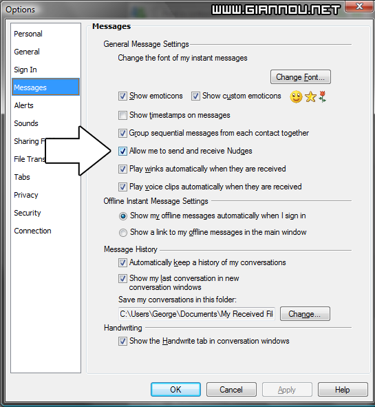

Ναι, μιλώ για την επιδημία που έχει ξεσπάσει τον τελευταίο καιρό (make that 6μηνο plus) με κάτι άκυρα παιδάκια που λένε οτι είναι χάκερ (θα το γράφω έτσι γιατί βαριέμαι να πατάω συνέχεια αλτ + σιφτ για να το γυρίσω στα.. Αγγλικά φυσικά).

  
**Messenger Plus era:**  
Λεπόν, για όλα φταίει αυτό το ΚΑΤΑΡΑΜΕΝΟ Messenger Plus. Το κατεβάζει κάποιος, βρίσκει και ένα σκρίπτ για άπειρα νάτζις και αρχίζει το κοκόρεμα..

**Παράδειγμα**  
Έρχεται, σου μιλάει.. Τον γράφεις (όλοι ξέρουν τι σπασατέτοιος είναι).. Αρχίζει και πατάει συνέχεια το κουμπάκι για την δόνηση (TIP: Γίνεται και με ALT + N, βλακάκο).. Ντάξ, στην αρχή ήταν ενοχλητικό, δε λέω.. Ο ένας, γίνανε δύο (το έιπε ο ένας στον άλλο), οι δύο γίνανε τέσσερις και συνεχίσανε να πολλαπλασιάζονται σαν κύτταρα (ναι, είμαι ΚΑΙ βιολόγος) ώσπου..

Τέλος της Messenger Plus era.

**Wikipedia / Forums / Game Servers era:**  
Γιατί τόσα ονόματα? ΓΙΑΤΙ ΟΛΑ ΤΑ ΠΑΡΑΠΑΝΩ ΔΗΜΙΟΥΡΓΗΣΑΝ ΜΙΑ ΝΕΑ ΕΠΙΔΗΜΙΑ! Τους ξερόληδες. Την αρχή την έκαναν τα forum των διάφορων Game Server (Λάινεϊτζ, Ούοου κτλ) όπου για να δικαιολογήσουν τα κολλήματα στους Server τους, λέγανε διάφορες δικαιολογίες για DDOS από κάποια κακά άτομα (Ου αμ σακινγκ!). Μπούλσιτ. Στο θέμα τώρα, το διαβάσανε αυτό τα παιδάκια μας αφού διαβάσανε στη Wikipedia τι στο καλό είναι αυτό, αυτονομαστίκανε χάκερζ, χρησιμοποιώντας προηγούμενες γνώσεις από το Plus).

> Ο χρήστης &#8212;~\*,&#8230;,\*Bur_b_er\*,&#8230;,\*~&#8212; λέει:  
> ama tha tou ekana , tha tou ekana DDoS 

_Tο έιπε σε ένα φίλο, για &#8216;μένα_

TeloC, προσοχή σε αυτά τα άτομα! Είναι ικανά να κάνουν οτιδήποτε!!! Φυσικά και κάνω πλάκα, διότι, κάποιος που ξέρει αυτά τα κόλπα, δε μιλάει. Προτιμά να μένει κρυφός..  
Ελπίζω να βάλετε μυαλό. Τα λέμε μέχρι τότε.
