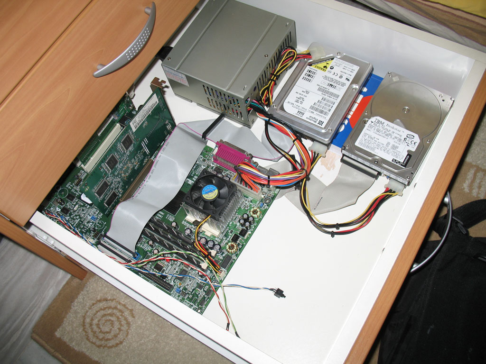
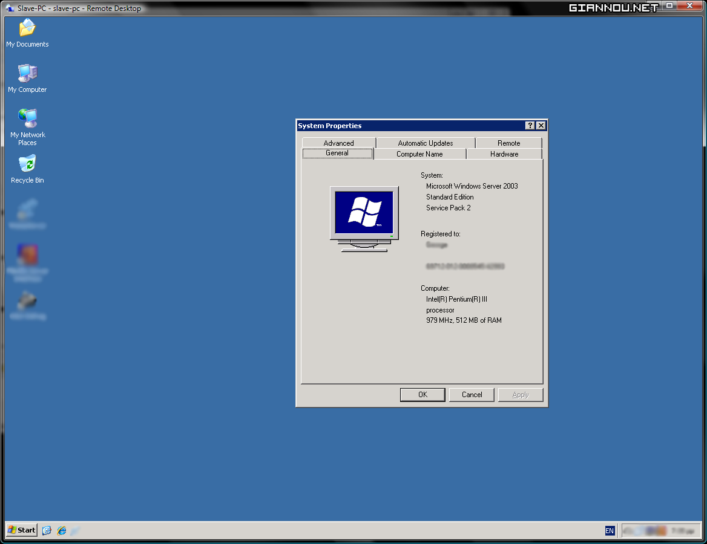

Υπήρχε κάποτε ένα PC, το όνομά του &#8220;Download-PC&#8221; (έχω μια τάση να κοτσάρω ένα -PC στο όνομα των μηχανημάτων μου). Δούλευε σαν σκλάβος, όλη νύχτα, κατεβάζοντας διάφορες σαχλαμάρες που το πρόσταζα. Torrent κυρίως, καθώς είναι και τα πιο αργά, σχετικά. Αυτά σε εποχές 768kbps, που το download έπαιρνε ages.. Από οταν έβαλα 24mbit, βγήκε στη σύνταξη, όπου και παρέμεινε για κάτι μήνες.

  
Πριν 1.5 μήνα περίπου, μετά από μια συζήτηση με τον φίλο Σπύρο, αποφάσισα να το κάνω Serverόπισο. Μα τι τραγικά που τα λέω, έλεος. Τέλος πάντων το έχωσα σε ένα συρτάρι, για λόγους φασαρίας κυρίως.

Λίγα λόγια για το.. συρτάρι.. Είναι ένα απλό συρτάρι, απλά έγινε [Rack Mount](http://images.google.com/images?q=rack+mount). Μαζί με τα άλλα 3 συρτάρια φτιάχνουν ένα [Server Rack](http://images.google.com/images?q=server+rack). Έαν δεν έπιασες το αστείακι&#8230; είσαι χαζός και εγώ [Datacenter](http://images.google.com/images?q=datacenter) owner!!..

Έτσι για να γουστάρουμε, ορίστε μια pic από το Rack (βλέπε προηγούμενο αστειάκι):  

_Ναι, αυτή είναι η τσάντα μου, για το σχολείο. Πάντα γεμάτη και έτοιμη για να με ακολουθήσει στο δρόμο για την αναζήτηση της γνώσης._

Λίγα λόγια για το μηχάνημα τώρα (Hardware). Είναι ένα μικρό μηχάνημα. Την δουλειά του σαν Web Server όμως την κάνει και με το παραπάνω! Έχει ένα ταπεινό Pentium III στα 980Mhz με 512mb RAM. Έχει και μια GeForce 2 GTS με 32mb RAM, καθαρά για λόγους boot (TIP: Κανένα PC δεν bootάρει χωρίς κάρτα γραφικών), αφού μπαίνω με Remote Desktop.  

Από πλευράς Software, τρέχει Windows Server 2003. Ναι, δοκίμασα λίνουξ, λάινουξ η όπως τέλος πάντων το λές στο χωριό σου. Εμείς εδώ το λέμε Λίνουξ και τέλος. Δοκίμασα Ubuntu 8.04 Desktop Edition, Ubuntu 8.04 Server Edition, CentOS 5.. όλα είχαν το ίδιο πρόβλημα.. Δεν δέχονταν στατική IP στο LAN. Κάποιος driver ήταν ή κάποιο bug. Τέσπα, Windows for the win. Κανένα πρόβλημα και όλα είναι άψογα! Από Web Server τρέχει Apache 2.2.8 με PHP 5.2.6 καπάκι. Για FTP χρησιμοποιώ το FileZilla και για Database την mySQL σε εκδόσεις που δεν σε ενδιαφέρουν 🙂

Γραμμή φυσικά έχει του σπιτιού μου <del datetime="2008-06-04T17:47:22+00:00">(ε τι μπορεί να είχε)</del> {όχι τώρα που το ξανασκέφτηκα μπορεί να έπαιρνα από κανένα γείτονα, κλασικά πράγματα}. Upload, που μας ενδιαφέρει, 1mbps και Download, που δεν μας ενδιαφέρει, 24mbit.

Αυτά για το συρταρόπισο, ίσως κάνω κανένα ακόμα post για τις modifες που έχει φάει.  
Τα λέμε!
