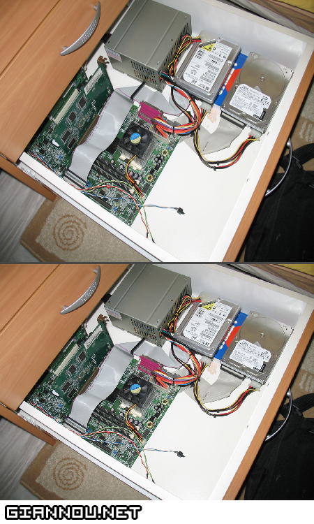

Εντάξει ίσως είναι κάπως άνιση μάχη γιατί έχω Internet Explorer 7 και Firefox RC1 (Έλεος, πήγα στο Help να δω τι έκδοση ήταν και κατεβάζε την RC2. Αυτά είναι!).. Και μέχρι να τελειώσω το άρθρο βγήκε η Final xD

Έχω φρικάρει!! Προσπαθούσα να βάλω εικόνα (το πορτοφολί) στην σελίδα &#8220;Πορτοφόλιο&#8221; και ο mister Ιντερνετ Εξπλόρερ έβγαζε μήνυμα οτι και καλά είχε πρόβλημα το JavaScript της σελίδας!!!  
Έβγαλα ΕΝΑ-ΕΝΑ ΤΑ PLUGIN ΠΟΥ ΕΧΩ ΒΑΛΕΙ ΓΙΑΤΙ ΝΟΜΙΖΑ ΠΑΙΖΟΤΑΝΕ ΜΑΛΑΚΙΑ.. όσοι ασχολούνται ξέρουν. Ηρεμία.. Ούφ πάει και αυτό. Πως μου ήρθε flashιά και το δοκίμασα με Firefox.. Πάει πέρασε.

  
**Firefox &#8211; Internet Explorer 1 &#8211; 0**

ΌΛΑ ΜΑ ΟΛΑ είναι πιο στρογγυλά απ&#8217; τον Firefox. Τα κουμπιά κυρίως. Εεε, μόνο για το WordPress μιλάω.  
Κάνει και τις εικόνες καλύτερα resize (κρατάει το aspect ratio).. Και για του λόγου το αληθές (και γιατι δεν τα πάω καλά με τα λόγια)

**Firefox &#8211; Internet Explorer 2 &#8211; 0**

Γενικά δεν είναι εύκολο να συνηθίσεις τον Firefox άμα είσαι τόσα χρόνια παρεάκι με τον Internet Explorer. Είναι πολύ διαφορετικός στις λειτουργίες του.. Άλλη φιλοσοφία.  
Θα τον συνηθίσω, που θα πάει 😛

Τα λέμε!
