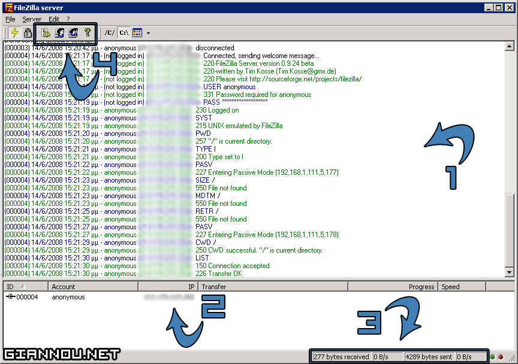
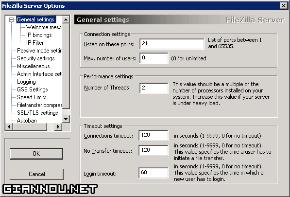
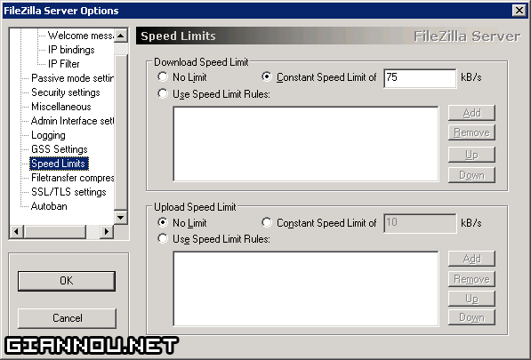
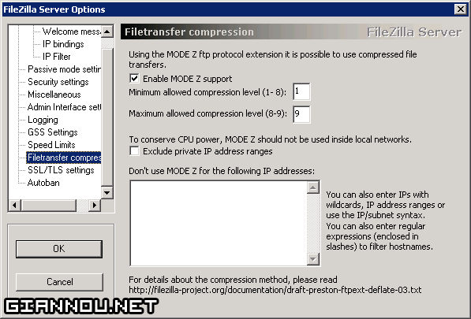
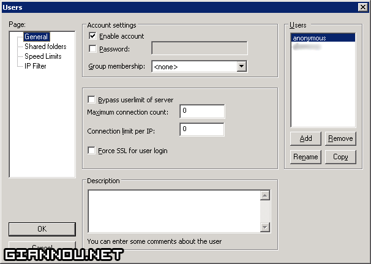
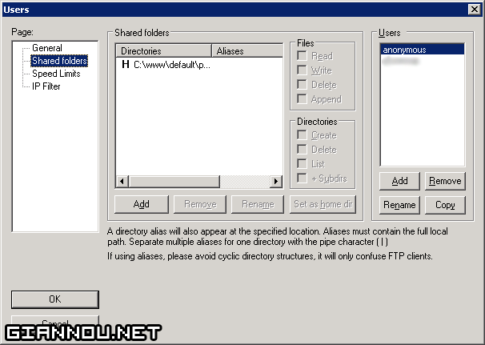
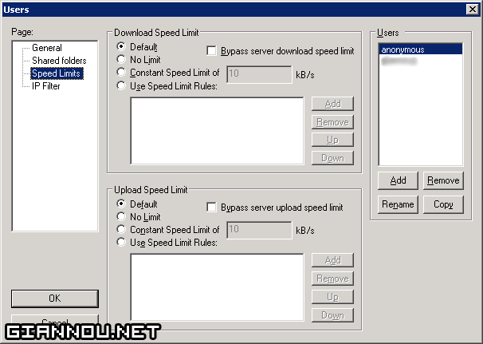

Λοιπόν! Το πρώτο &#8220;How to..&#8221;!  
Θα προσπαθήσω να εξηγήσω όσο καλύτερα μπορώ τις διάφορες ρυθμίσεις του προγράμματος αυτόυ. Να ξεκινήσω λέγοντας οτι ίσως δεν θα είναι το καλύτερο How to που υπάρχει για αυτό το πρόγραμμα / server, σίγουρα όμως θα είναι μια καλή προσπάθεια! Α, για να συνεχίσεις να διαβάζεις, πρέπει να ξέρεις τι είναι το FTP (όχι αυτό το ηλίθιο Φορ Δε Πουτσ που λένε κάτι μαλακιστήρια), πως λειτουργεί και προαιρετικά ένα εγκαταστημένο FileZilla.  
  
Το FileZilla είναι ένα πρόγραμμα μεταφοράς αρχείων ή αλλιώς ένας FTP Server. Μπορείς να το κατεβάσεις από [εδώ](http://filezilla-project.org/download.php?type=server) δωρεάν (είναι open source). Υπάρχει και FileZilla FTP Client, όμως εγώ θα ασχοληθώ μόνο με το server.

Το FileZilla αποτελείται από 2 &#8220;προγράμματα&#8221;. Για την ακρίβεια ο server είναι service.

> **Τι είναι τα services?**  
> Είναι προγράμματα που εκτελούνται στο background. Ο χρήστης δεν έχει καμία άμεση επικοινωνία με αυτά, you know, να πειράξεις τις ρυθμίσεις κτλ. Περισσότερα μπορείς να βρείς [εδώ](http://en.wikipedia.org/wiki/Windows_service).

Το δεύτερο πρόγραμμα από το οποίο αποτελείται το FileZilla είναι το FileZilla Server Interface. Όπως πολύ πιθανό να κατάλαβες, αυτό είναι το interface του service για το οποίο λέγαμε πριν. Εδώ έχει όλο το ζουμί. Από εδώ διαχειρίζεσαι τον server.

_Εντάξει, δεν είναι καλή η εικόνα. Έκανα οτι καλύτερο μπορούσα 😛_

  * 1. Το log των συνδέσεων του server. Με μπλέ εμφανίζονται οι εντολές που στέλνει ο client (ο χρήστης), ενώ με πράσινο αυτές που στέλνει ο server στον client. Τεκ σταφ, ρίλι.
  * 2. Εδώ φαίνονται οι συνδέσεις που υπάρχουν στον server αυτή τη στιγμή. _Thanks to Σέργιος για την σύνδεση στην pic._
  * 3. Το σύνολο των kilobyte που έχουν ανέβει και κατέβει από τον server καθώς και η ταχύτητα των αρχείων που μεταφέρονται αυτή τη στιγμή.
  * 4. Βασικά κουμπιά. Το πρώτο ανοίγει τις ρυθμίσεις του server, το δεύτερο τις ρυθμίσεις χρηστών ενώ το τρίτο τις ρυθμίσεις των γκρουπ χρηστών. Το τέταρτο είναι το Help του προγράμματος. Its obvious, isn&#8217;t it? 🙂

Μερικές συμβουλές σε κάποιες ρυθμίσεις. Αυτές θεωρώ είναι οι πιο σημαντικές, τώρα αν θες κάτι παραπάνω, κάνε comment 🙂

  * **Listen on these ports** &#8211; Καλό θα ήταν να μην το πειράξεις. Αλλάζει την port στην οποία ακούει ο server. Βοηθάει μόνο εάν ο ISP έχει κλειστή την port 21 ή αν θες 2 FTP server.
  * **Max. number of users** &#8211; Ορίζει πόσοι χρήστες θα συνδέονται ταυτόχρονα στον server.
  * **Number of Threads** &#8211; Τι είναι thread μπορείς να διαβάσεις [εδώ](http://en.wikipedia.org/wiki/Thread_(computer_science)). Καλό θα ήταν να μη το πειράξεις αν δεν έχεις πολλά άτομα στον server ταυτόχρονα.
  * **Connections timeout** &#8211; Ορίζει σε πόσα δευτερόλεπτα θα διακόπτεται η σύνδεση με τον Client από την στιγμή της αρχικής σύνδεσης.*
  * **No Transfer timeout** &#8211; Ορίζει στα πόσα δευτερόλεπτα θα γίνεται timeout στη σύνδεση κάποιου client που δεν στέλνει ή παίρνει δεδομένα (αρχεία).
  * **Login timeout** &#8211; Ορίζει πόσα δευτερόλεπτα έχει ένας χρήστης μέχρι να κάνει login στον server. Το account anonymous θεωρείται ως logged in.

_*Χρειάζεται checkάρισμα!_

Εδώ ορίζεις το μέγιστο upload και download από τον server (των χρηστών δηλαδή). Αυτό επηρεάζει όλους τους χρήστες εκτός εάν έχεις επιλέξει κάτι διαφορετικό, για παράδειγμα καθόλου όριο στο δικό σου account κύριε admin. Αναλυτικότερα παρακάτω ;). Στην εικόνα έχει οριστεί μέγιστο όριο στο download στα 75kb/s. Πατώντας στο &#8220;Use Speed Limit Rules&#8221; μπορείς να ορίσεις πιό αναλυτικά, μέρες, ώρες, το όριο του upload ή του download.

Ένα απ&#8217; τα καλύτερα features του FileZilla! Κάνει compress τα αρχεία που κάνει κάποιος download από αυτόν. Ιδιαίτερα χρήσιμο σε Home Server όπου το bandwidth είναι περιορισμένο (1mbit κυρίως) και η επεξεργαστική ισχύς άπλετη. Ναι τρώει CPU, γιατί πολύ απλά συμπιέζει τα αρχεία που είναι για μεταφορά. Φαντάσου να είναι 650mb τα αρχεία.. Θα φάει αρκετή απ&#8217; την πολύτιμη, αλλά και ταυτόχρονα άπλετη επεξεργαστική ισχή 😛

Κι άλλο παράθυρο επιλογών με &#8220;ζουμί&#8221;! Εδώ, προφανώς, φτιάχνεις account χρηστών. Φυσικά αυτό δεν είναι υποχρεωτικό εάν δεν θες ο καθένας να έχει τον δικό του φάκελο, να μην επηρεάζεται από τα όρια κτλ. Εδώ λεπόν έρχεται το anonymous αccount. Φτιάχνοντας χρήστη με όνομα anonymous και χωρίς κωδικό ΚΑΘΕ άτομο, μαλάκας, whatever, έχει πρόσβαση στον server. Μπορεί δηλαδή, ανάλογα τα δικαιώματα που έχεις δώσει στο account να ανεβάσει, κατεβάσει, να φτιάξει φακέλους κτλ. Περισσότερα παρακάτω.

Εδώ φαίνεται αυτό που έλεγα πριν. Μπορείς να επιλέξεις τι δικαιώματα θα έχει ο κάθε χρήστης.

**Μια συμβουλή για τον anonymous:** Εάν έχεις επιλέξει (και φυσικά έχεις δώσει δικαίωμα) οι χρήστες με το anonymous account να κάνουν upload σε κάποιο φάκελο ο οποίος χρησιμοποιείται και από κάποιον web server (Apache, lighttpd κτλ) τότε ο server κινδυνεύει.. Πολύ απλά μπορεί κάποιος να κάνει upload κάποιο .php που να σβήνει όλα τα αρχεία απ&#8217; τον C:/ 😛

Ιδιαίτερα χρήσιμο είναι να επιλέγεις το όριο στο download / upload του κάθε χρήστη, ειδικά εάν έχει θέσει γενικό όριο στον server (να το αποφύγει κάποιος χρήστης, εάν θες π.χ.). Εάν έχεις επιλέξει γενικό όριο στον server τότε, λογικά, δεν θα χρειαστεί να πειράξεις το όριο του anonymous. Θα θέλεις όμως να πειράξεις κάποιού άλλου χρήστη (του δικού σου ας πούμε) ή ακόμη να το κάνεις έτσι ώστε να μην τον επηρεάζει (ή εσένα).

Λοιπόν, τέλος! Ελπίζω να βοήθησε κάπου αυτός ο οδηγός.. Οτι απορίες, comment και θα βοηθήσω!  
Τα λέμε!
