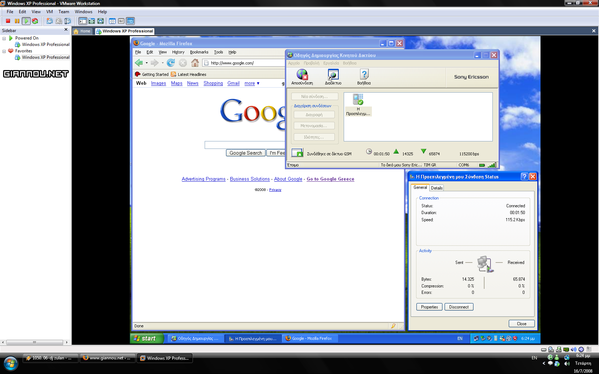

Ναι, πάω χουριό. Τώρα, γιατί μόνο για 3 μέρες (μισή Πέμπτη, Ολόκληρη Παρασκευή & Σάββατο και μισή Κυριακή) μόνο οι γονείς μου το ξέρουν.  
Anyway, σαν (συγ)καμένος PC user που είμαι οφείλω να βρω κάτι να κάνω και εγώ ρε αδερφέ τα μεσημέρια (σε timezone χωριού: 11:30 με 4) όπου η βαρεμάρα και ο ήλιος βαράει στο κεφάλι. Να δω πάλι όλες τις σειρές σε επανάληψη ΔΕ λέει.. \*drum roll\*  

  
Internet από το κινητό!!! Γιέχ! Και ΟΧΙ στο κινητό, στο PC μέσω του κινητού! Ευτυχώς έχουμε και ένα 500άρι PCάκι εκεί.. Όταν επιστρέψω, και αφού _τελειώσω_ τον guide για τα **Ubuntu Server** θα γράψω τι και πως, οπότε αναμονή. Ω! Ακόμη καλύτερα! Θα τον γράψω στο χωριό 😛

Μια γεύση από την επιτυχημένη έρευνα στα **Giannou Laboratories**:  

Α και btw, δεν χρεώνομαι κανονικά. Χρησιμοποιώ το Wind Plus NON-STOP[*] **^^**  
Δυστυχώς im out of time.. Πρέπει να διαβάσω για αύριο για το φροντιστήριο και να βάλω κανά song στο κινητό 🙁

[*]Καλό θα ήταν να προσέχεις άμα δοκιμάσεις κάτι, γιατί μια SIM την έφτασα -6€ από 1€.. Πάει φυσικά για πέταμα αφού με 3€ παίρνεις καινούρια. Thank God αυτή που έκανα δοκιμές ήταν spare! Χε χε!

Λοιπόν καλές μου _ημί_διακοπές!
