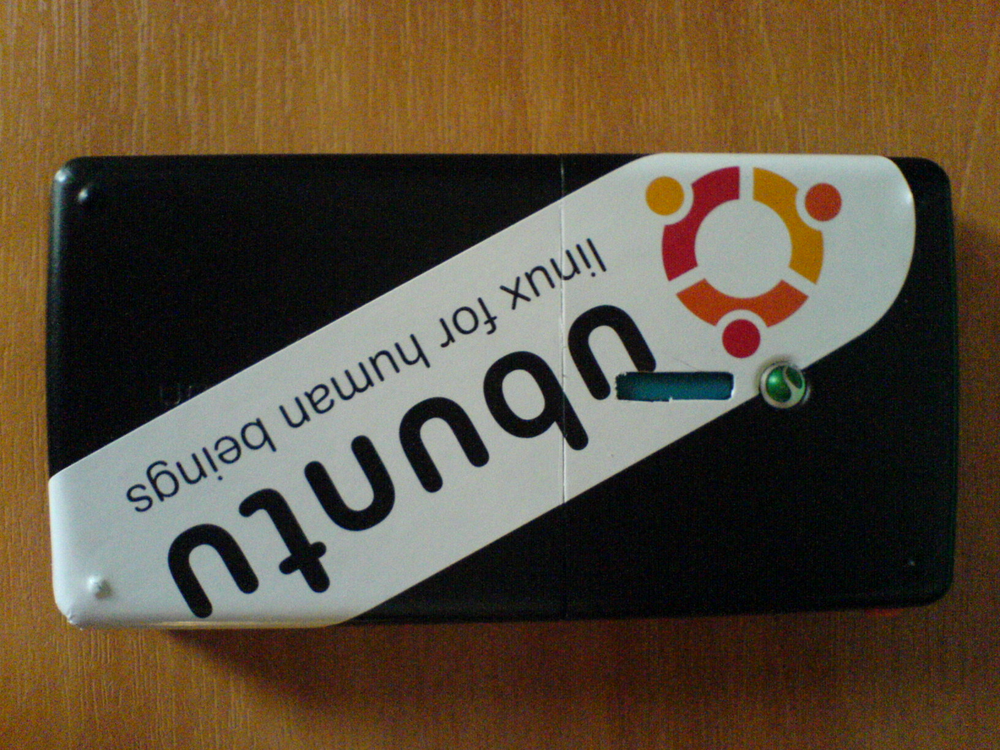
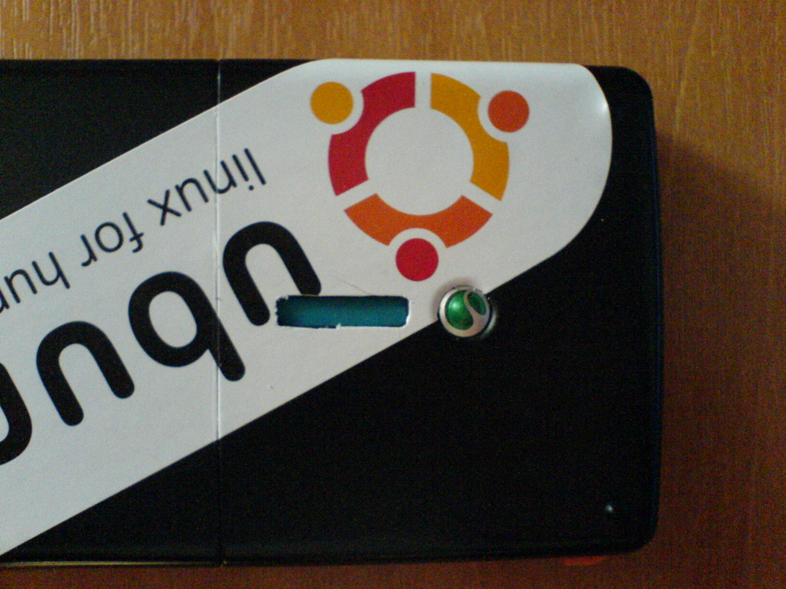
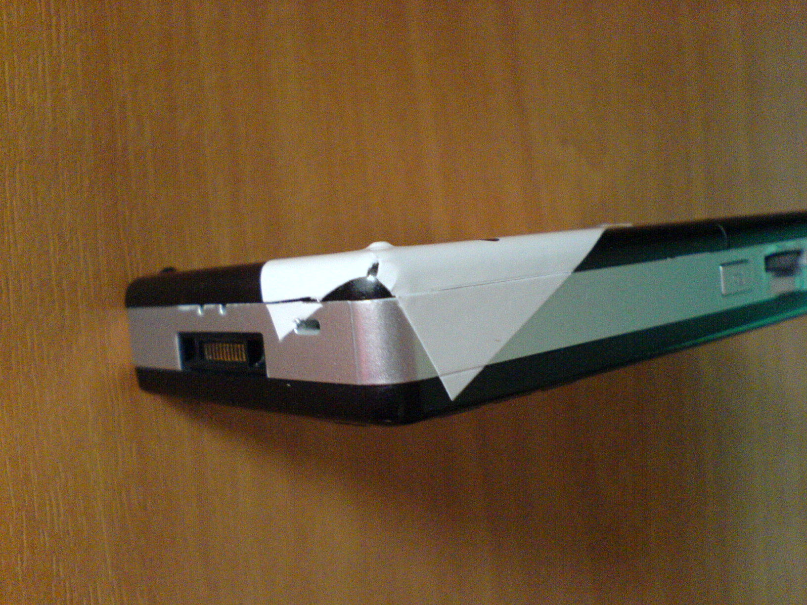
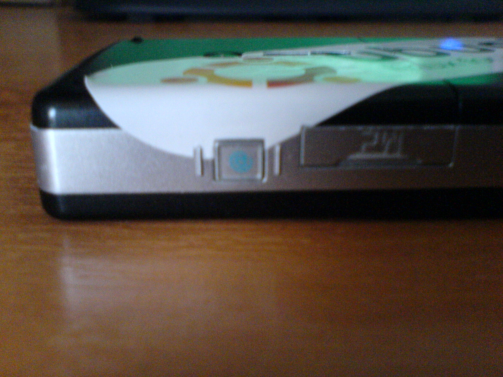
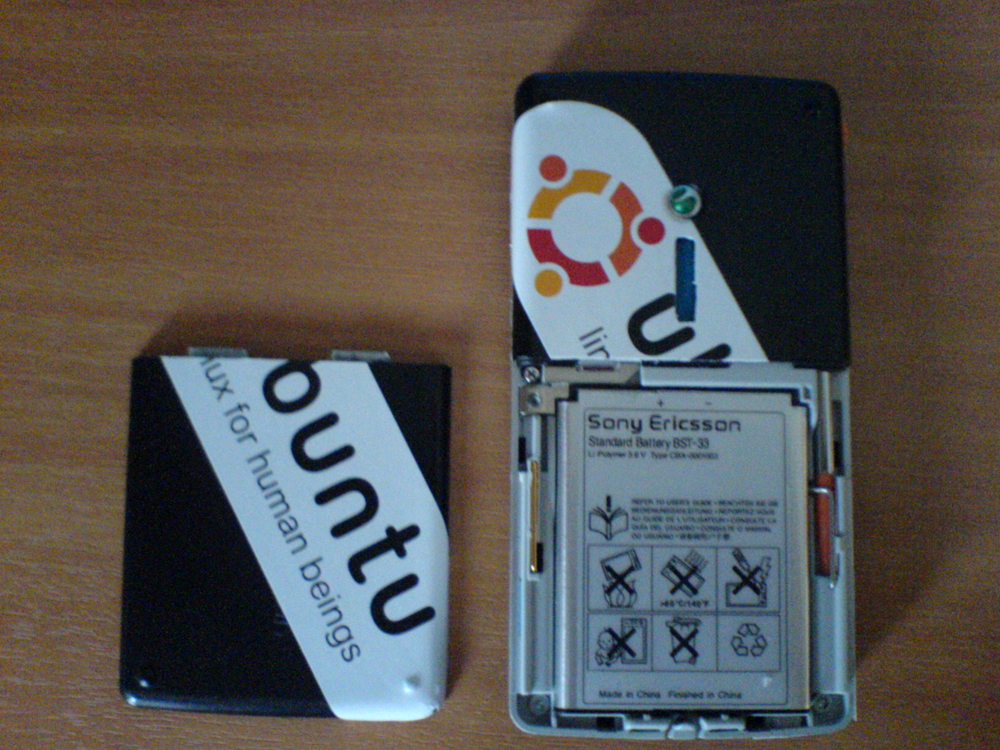

Πριν αρχίσω τις μαλακίες πάλι, να ενημερώσω τους φίλους αναγνώστες:  
Ubuntu Server guide, που μετά μανίας έλεγα οτι θα γράψω, γιόκ. Μισώ τα κολλήματα.. Ίσως κάνω video guide. Όρεξη να &#8216;χουμε..!  

  
Ένα απογευματάκι πριν κανά δυό μέρες εκεί που καθόμουνα και.. χάζευα το κινητό, μου ήρθε ιδέα τρομερή! Θα βάλω στο <a href="http://www.sonyericsson.com/cws/products/mobilephones/overview/m600i?cc=us&lc=en" class="broken_link" rel="nofollow">κινητό</a> αυτοκολλητάκι Ubuntu!  
Έτσι παντοφλοείδες που είναι ταιριάζει αρκετά καλά.

Τα αποτελέσματα:

Δεν μου αρέσει καθόλου το κόψιμο στο ηχείο πίσω.. Άσε που έγδαρα και λίγο το πλαστικό.  
Η επόμενη έκδοση θα είναι καλύτερη πιστεύω! 😛

Το αυτοκόλλητο το πήρα μαζί με τα DVD του Ubuntu 7.10. Τέλος πάντων, όταν ζητάς να σου στείλουνε DVD της έκδοσης, βάζουνε μέσα 4 αυτοκόλλητα. Προσοχή, βγάζουν ΠΟΛΥ κόλλα όπου τα κολλήσεις!! Θέλει πρώτα με πιστολάκι μαλλιών για να ζεσταθεί και να φύγει εύκολα, αλλιώς θα σου βγάλει την πίστη να την αφαιρέσεις όλη..

Αυτά! 🙂