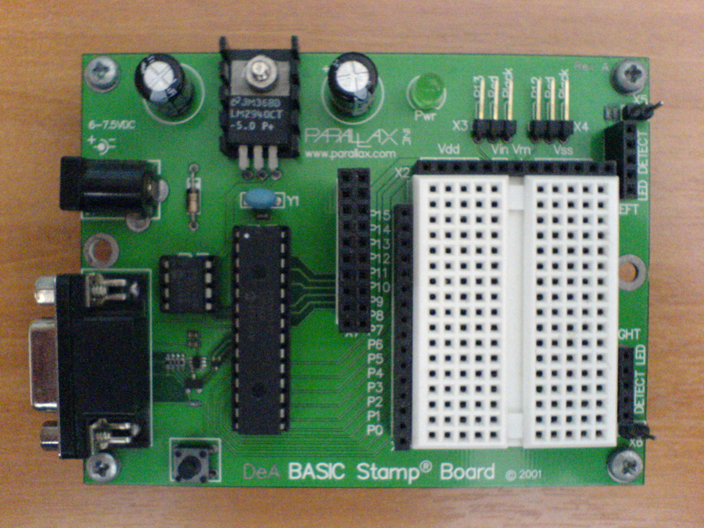
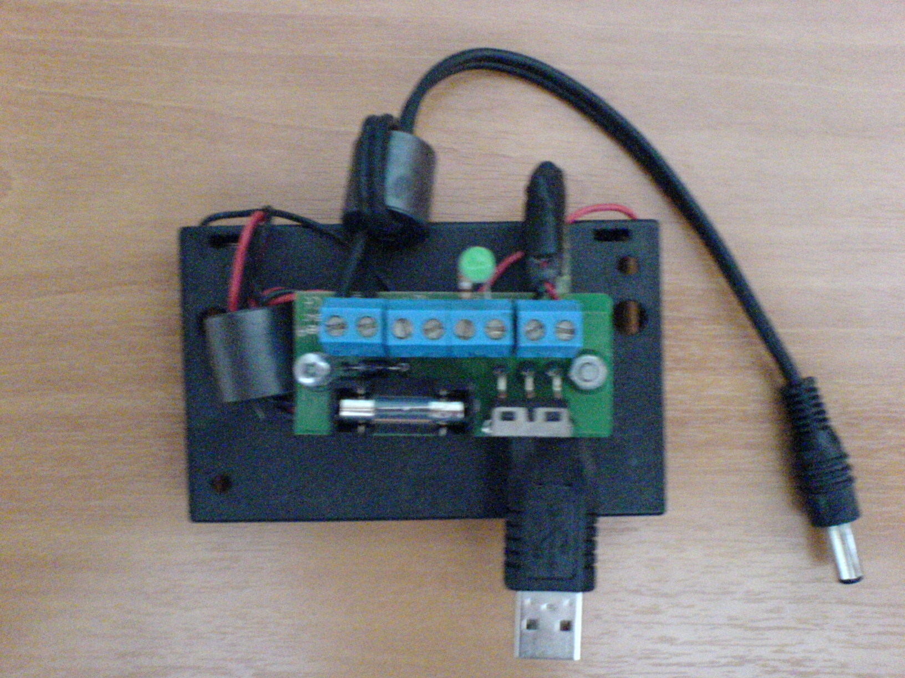
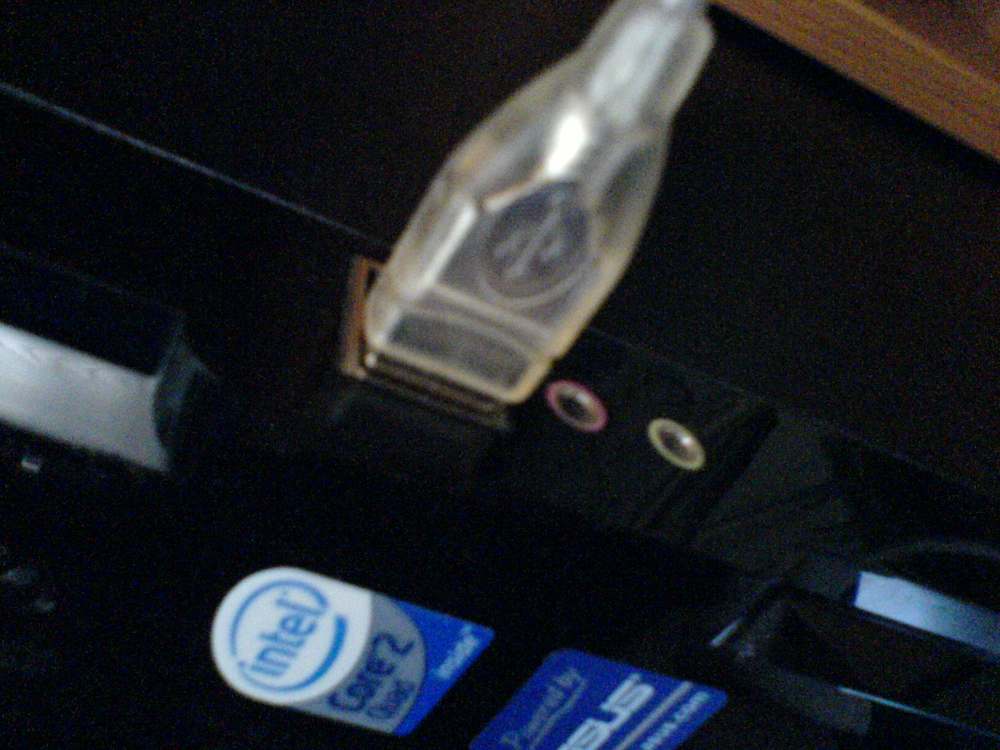
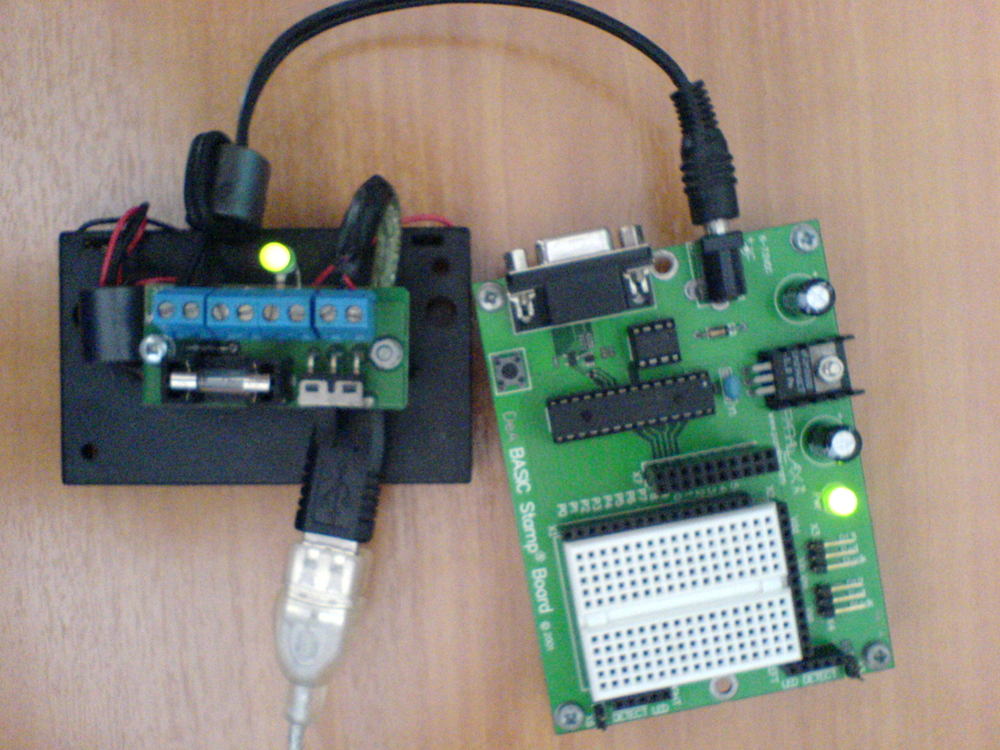
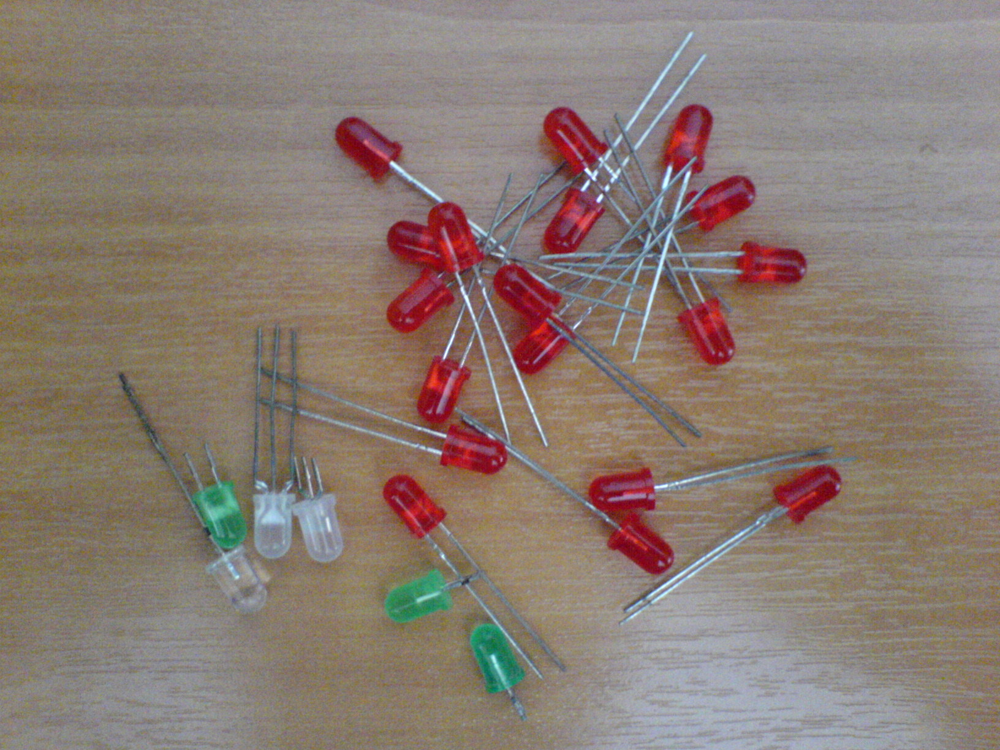
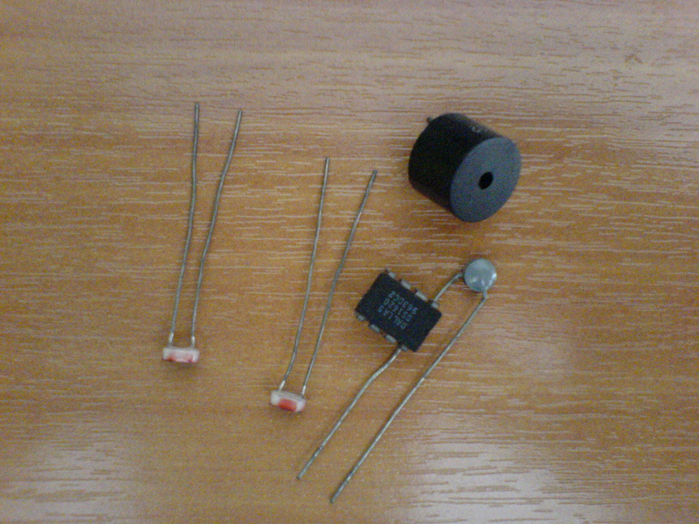

Κάτι που ήθελα να κάνω από καιρό!  
Στα γρήγορα: Θα χρησιμοποιήσω τον <a href="http://www.parallax.com/Store/Microcontrollers/BASICStampModules/tabid/134/ProductID/1/List/1/Default.aspx?SortField=ProductName,ProductName" class="broken_link" rel="nofollow">Basic Stamp 2</a> από την [Parallax](http://www.parallax.com/). Τον πήρα απ&#8217; τη σειρά &#8220;_Κατασκεύασε και προγραμμάτισε το δικό σου Robot_&#8220;, μια απ&#8217; τις πιο ΓΑΜΑΤΕΣ σειρές &#8220;περιοδικών&#8221; της De Agostini, πριν 3-4 χρόνια βέβαια 😛  
Μακάρι να είχα έναν AVR <33  

Υλικά (για όποιον θέλει να τρέξει τα προγράμματα που θα postάρω):

  * Basic Stamp IC  
    (όχι απαραίτητα τον 2, χρειάζονται μικρές αλλαγές στα προγράμματα για να τρέξει σε άλλους)
  * LED (ότι χρώμα θες, αν και κάποια εφέ θα &#8220;παίζουν&#8221; με τα χρώματα)
  * Φωτοκύτταρο (Νύχτα 🙂 )
  * Αμάξι, όρεξη και λεφτά να κατέβεις Κέντρο Αθήνα να βρεις κάτι ολοκληρωμένα γιατί μπορεί να πορωθώ.

Αυτά για αρχή. Από εκεί και πέρα μπορείς να χρησιμοποιήσεις όοοτι άλλο θες! Για παράδειγμα εγώ έλεγα να βάλω και θερμόμετρο (όχι θερμίστορ). Θα δούμε στην πορεία 😛  
Ποίος ψήνεται για Serial Link με το PC? 🙂  
Και Vista gadget με θερμοκρασία δωματίου 😛

Φωτό απ&#8217; τα θύματα υλικά:  

_Tip: Αφήνοντας πάνω το ποντίκι βλέπεις &#8220;σχόλια&#8221; για την κάθε pic!_

Λοιπόν ξεκινάω!

<h3 style="text-align: center;">
  1st milestone: Make some effects!
 
  
  

Υ.Γ.: Το όνομα παίζεται ακόμα 🙁</h3>