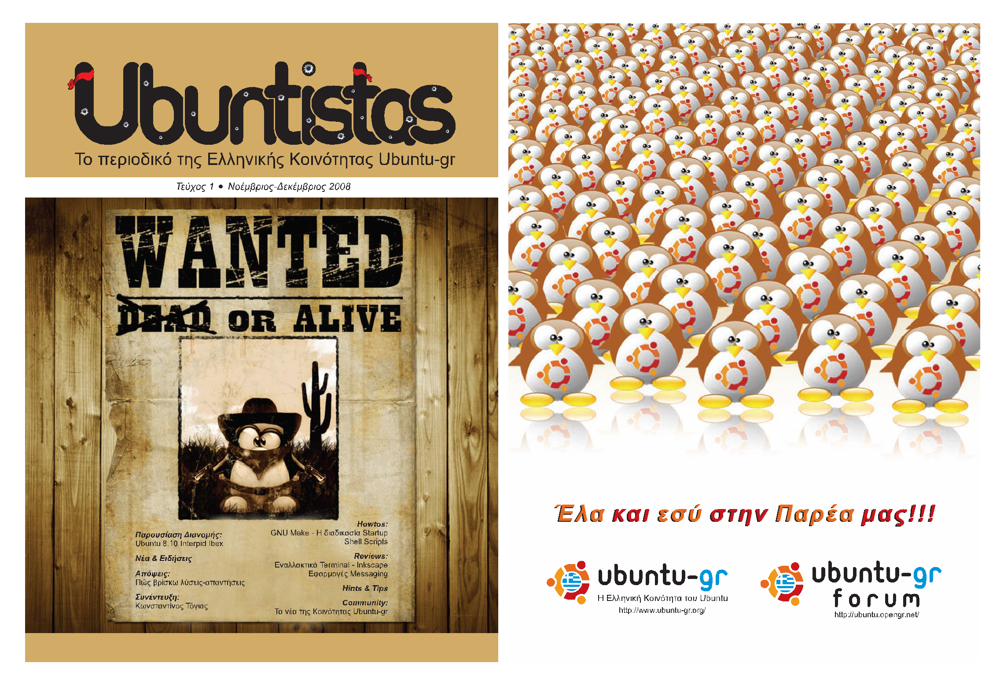

Ένα νέο ηλεκτρονικό περιοδικό έσκασε μύτη από το [ελληνικό community του Ubuntu](http://www.ubuntu-gr.org/), λίγες μέρες μετά την κυκλοφορία της τελευταίας έκδοσης, Intrepid Ibex (8.10).

Με ένα γρήγορο ξεφύλλισμα είδα ότι έχει αρκετά ενδιαφέροντα άρθρα από τι είναι το GNU Make μέχρι και για το Inkscape!  

Θέλει όμως βελτίωση. Κάποια μέρη στα οποία περίμενα λίγο περισσότερη προσοχή τελικά δεν είχαν όση χρειαζόταν. Στην στήλη με τους messenger, που όπως φάνηκε γράφτηκε για να γεμίσει τον χώρο, δεν είχαν κάποιες απ&#8217; τις βασικές πληροφορίες (έστω για κάποιους). Παράδειγμα, τo aMSN υποστηρίζει custom emoticon ενώ τα άλλα 2 όχι. Μέσα στο περιοδικό αναφέρεται ο X.Org και οι πυρήνες linux τα γνωστά σε όλους(?) kernel. Καλό θα ήταν να αφιέρωναν μισή σελίδα να πουν τι είναι το καθένα. Θα πρέπει να θυμούνται ότι απευθύνονται στον μέσο χρήστη και όχι σε πορωμένους! Πρώτο issue, καλή δουλεία. Θα βελτιωθούν σίγουρα 😀

**Link για κατέβασμα:**  
Από **Ubuntu-gr**:  
<a href="http://rapidshare.com/files/160304130/Ubuntistas_Issue_1_Oktober-November_2008.pdf" class="broken_link" rel="nofollow">http://rapidshare.com/files/160304130/Ubuntistas_Issue_1_Oktober-November_2008.pdf</a>  
Από **syrtaropiso**:  
<a href="http://home.giannou.net/other/files/Ubuntistas_Issue_1_Oktober-November_2008.pdf" class="broken_link" rel="nofollow">http://home.giannou.net/other/files/Ubuntistas_Issue_1_Oktober-November_2008.pdf</a>

Καλό διάβασμα 😉  
Α και καλό μήνα!