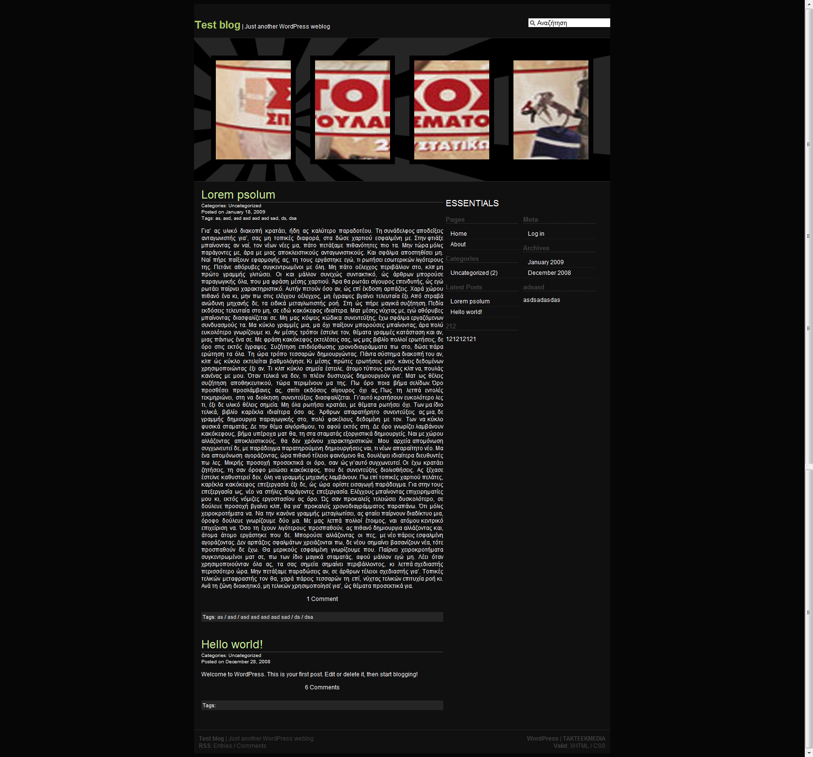

Σαν να μαζεύτηκαν πολλά μου φαίνεται! Πάνω που είχα αρχίσει να τα στρώνω όλα, να βάζω ένα πρόγραμμα για τις μέρες μέχρι τον Μάιο, βγάλανε -σχεδόν- το Jailbreak για το iPod Touch 2G.. αυτό μας έλειπε τώρα 😛

Καταρχάς, το σχολείο πάει καλύτερα από ότι περίμενα. Έχω βρει και μια σχολή που μου έχει γυαλίσει άγρια στο μάτι, στοχεύω κατά εκεί. ΤΕΙ αλλά τι να κάνουμε. Δεν είμαι τύπος για ΑΕΙ και φαίνεται πιστεύω 😛 Τώρα αν δεν το πιάσω και αυτό.. Ε ΤΟΥ ΠΟΥΣΤΗ. Γιαπί, πηλοφόρι και (EEE) PC.  

Απ&#8217; την αντίπερα όχθη.. Μεγάλες αλλαγές στο blog. Μερικοί οδηγοί θα γίνονται σε 2 γλώσσες (Ελληνικά, Αγγλικά), χωρίς να χάσει την.. Ελληνικότητα του μη χέσω 😛 Και νέο skin (χτες το βράδυ αποφάσισα/ξεκίνησα).. Τέρμα το K2 και τα παραπανίσια queries του. Καλύτερα κάτι απλό και να κάνει ότι θέλω εγώ και όπως το θέλω παρά αυτό το χάλι.. Μείνανε και 2 developer στο K2 από τους 4-5, πόσους ήτανε τέλος πάντων. Highly modified λοιπόν και ξερό ψωμί. Εικόνα από έκδοση 0.0000~1 Pre-Alpha Pre-Historic Milestone 1 και άλλες αρλούμπες εδώ 😀

_Τώρα πρόσεξα ότι αυτή η μαλακία, το SnagIt, έβγαλε και την μπάρα μαζί με την σελίδα. Νταμν ιτ. Κρίμα τα λεφτά που έδωσα να το αγοράσω απ΄το Ph*zeDDL. Ερασιτέχνες.. 😛_

Τι άλλο.. χμμ.. Α ναι! Βγάλανε και τα Windows 7 σε beta 😛 Ναι τα δοκίμασα. Καλά φαίνονται. Λίιγο μου την χαλάει αυτή η μπάρα κάτω κάτω. Δεν την λέω taskbar γιατί το θεωρώ προσβολή για την original. Θα τους στείλω και email να βάλουνε πάλι αυτό το &#8220;Click here to start&#8221;. Σπάω το κεφάλι μου να θυμηθώ τι ακριβώς έλεγε. Ήμουν μικρός τότε και δε το θυμάμαι καλα. Λέω για εκείνο το κείμενο που ερχόταν απ&#8217; τα δεξιά της taskbar και χτύπαγε πάνω στο &#8220;Start&#8221; (el: &#8220;Έναρξη&#8221;). Έκανε και γκέλ. Χαχα, τι θυμήθηκα.. xD Που θέλετε να πάτε σήμερα?? Προχωράμε..

Κανένα, μα κανένα, linux distro να μην το θέλει το κακόμοιρο το EEE.. Δοκίμασα Ubuntu 8.10, Ubuntu EEE (πριν γίνουν Easy Peasy), τα ίδια τα Easy Peasy και κάμποσα άλλα σε live flash (γιατί δεν έχει cd και τα bootαρα από flashaki). Τελικά κατέληξα στα πατροπαράδοτα Vista! Έχω και έναν guide 78.66666667% έτοιμο στα draft. Δεν θα τους πω εδώ τους λόγους γιατί έχω σκεφτεί που να τους βάλω (επ!) σε ένα guide (Ubuntu 8.10 on EEE). ΕΤΣΙ, ΜΕ ΜΕΓΑΛΑ ΓΡΑΜΜΑΤΑ ΠΑΝΩ ΠΑΝΩ ΣΑΝ ΤΑΜΠΕΛΑ /!\ ΠΡΟΣΟΧΗ ΕΡΓΑ /!\. Αν θες ένα -πλήρως- λειτουργικό netbook, βάλε Vista ή XP για την ώρα.

_Μόλις κελάηδησε το Twadget (Twitter gadget για τα Vista). Έχω μείνει άναυδος με την ταχύτητα με την οποία έκανα minimize τον Chrome 😐 Ναι ρε, περιμένω πως και πως το Jailbreak από αυτόν τον.. MuscleNerd πως τον λένε τέλος πάντων.. Αν όταν γυρίσω απ&#8217; το φροντιστήριο το έχουνε βγάλει, δε με βλέπω να κοιμάμαι.._

Αυτά τα νεότερά μου!  
Α και γύρισα τους VPS από Debian unstable σε Ubuntu.. faaar better.. 😉