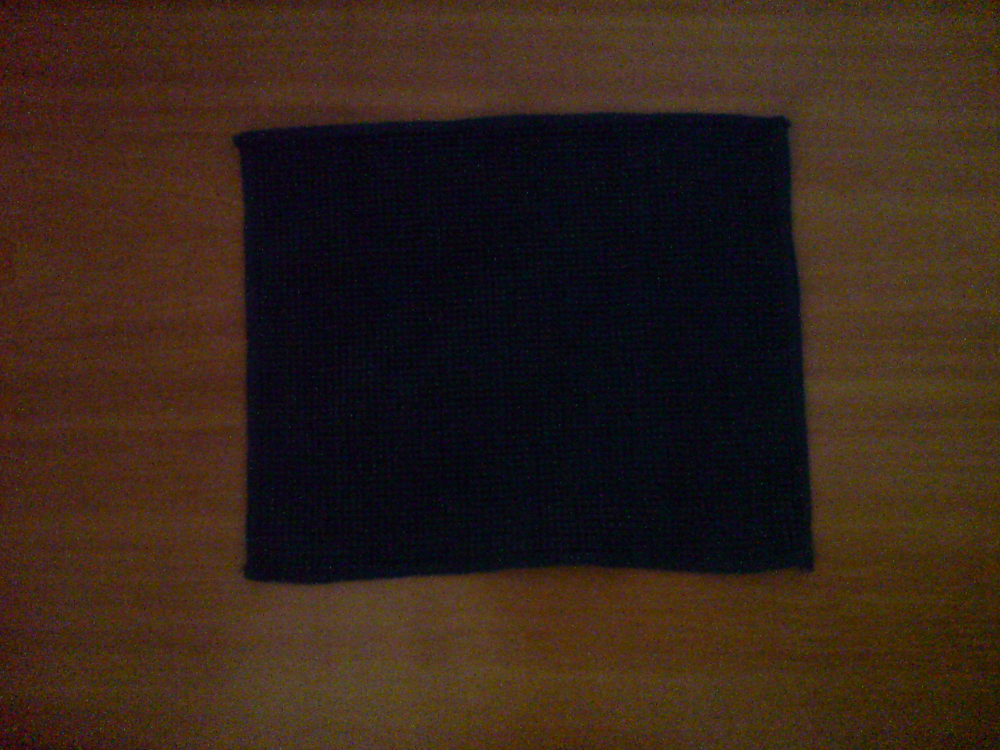
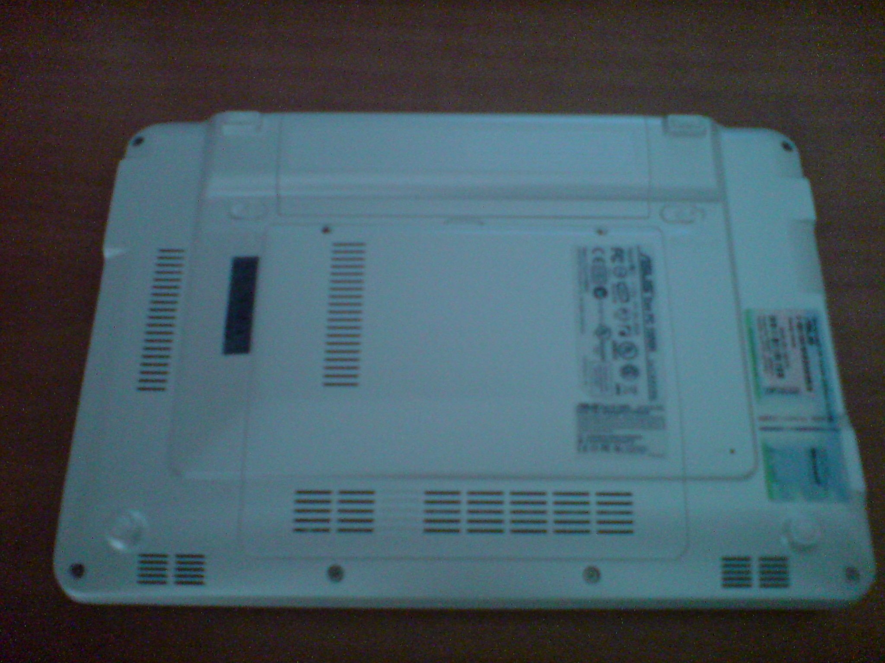
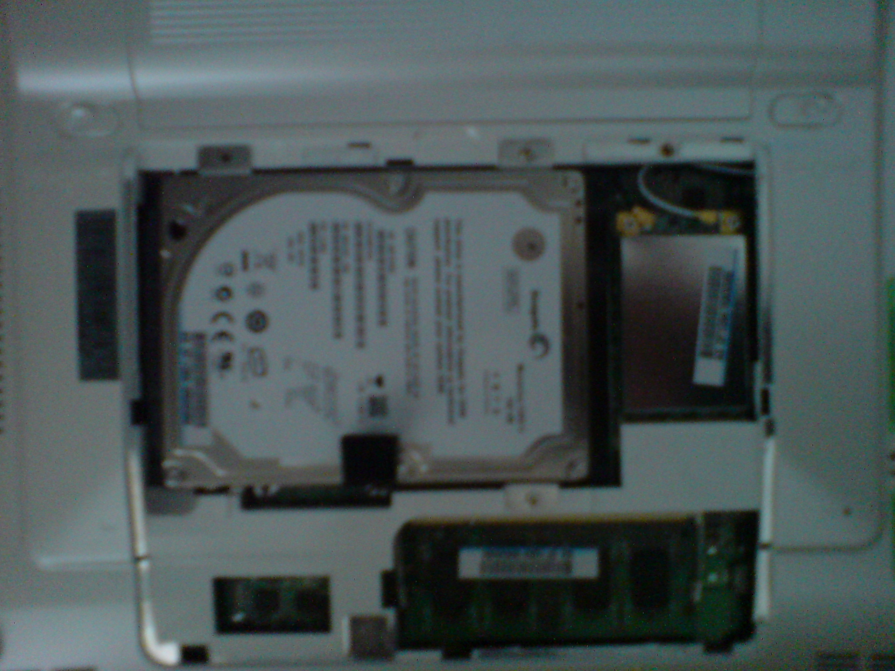
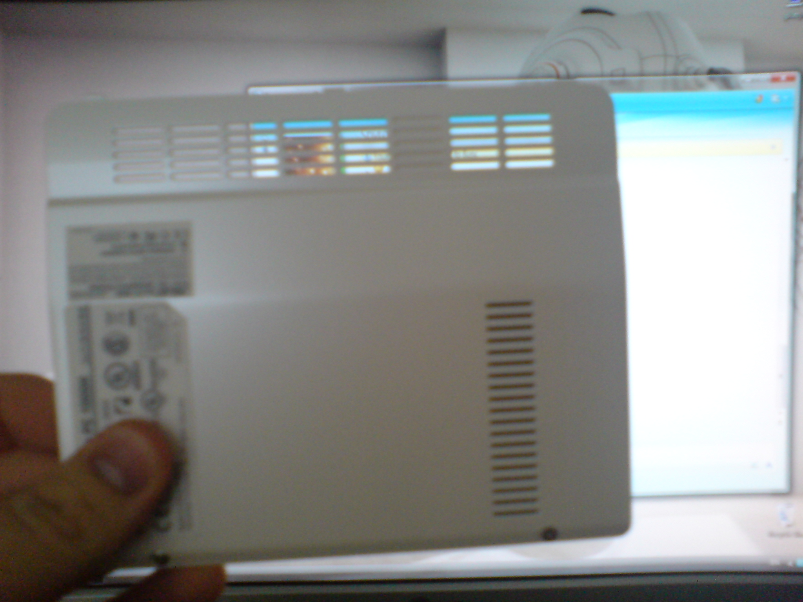
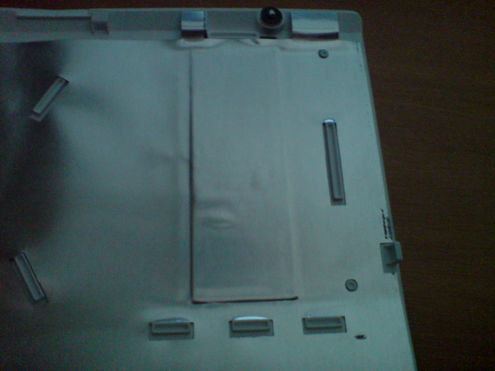
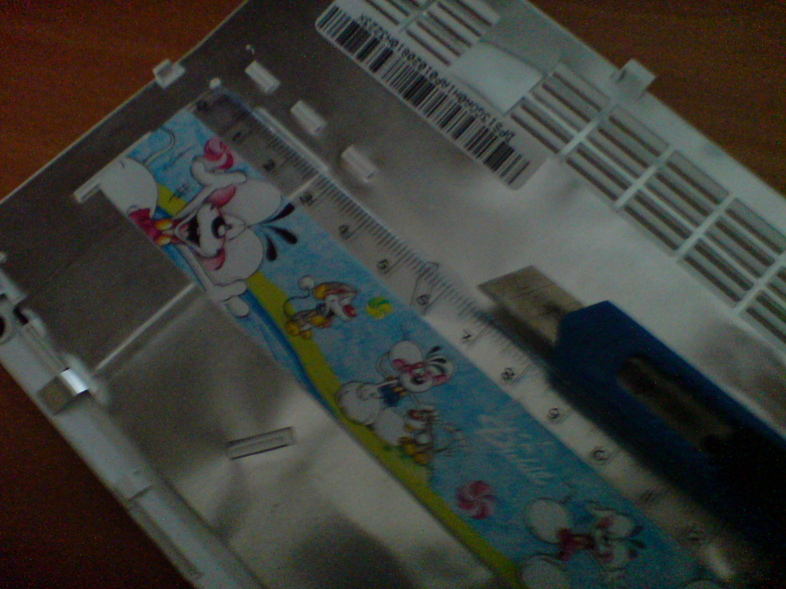

Λοιπόν, εδώ είμαι πάλι με κάτι πέρα απ&#8217; τα συνηθισμένα! 🙂 Το πρώτο guide για hardware mod! 😀 Βασικά για case mod 😐 Τέλος πάντων όπως το πάρει κανείς 😛 <del datetime="2010-04-24T13:11:20+00:00">Ακόμη, αυτό το άρθρο είναι σε 2 γλώσσες, κατέχει και εδώ την πρωτιά 😉</del>

Όσοι έχουνε EEE PC _κατά προτίμηση_ το 1000άρι, γιατί νομίζω ότι ισχύει και για το 900άρι, ίσως έχουνε προσέξει ότι από κάτω στο καπάκι για τον σκληρό, την RAM και την PCIe έχει κάτι σχισμές για &#8220;εξαερισμό&#8221;. Αυτές οι τρύπες είναι καλυμμένες με μονωτικό φύλλο αλουμινίου (είναι το scientific του αλουμινόχαρτου). Κουλό, ναι. Για αυτό είμαστε εμείς εδώ.

Θα το κόψουμε. Γιατί όμως; Πρώτα να πω ότι δεν είναι δικιά μου ιδέα, την είδα σε ένα άρθρο. Αυτές οι &#8220;σχισμές&#8221;, λογικά, δεν υπάρχουν εκεί έτσι για διακοσμητικό! Κάποιο ρόλο παίζουν. Τι ρόλο άραγε? Να &#8220;παίρνει αέρα&#8221; ο σκληρός. Τώρα γιατί τις έχουνε &#8220;ταπώσει&#8221; δεν το ξέρω και ούτε πιστεύω ότι ξέρει κανείς. Μπορώ να φανταστώ μερικούς λόγους βέβαια. Ίσως επειδή το μηχάνημα που κόβει το αλουμίνιο αυτό να μην μπορεί να κάνει τέτοια κοψίματα, ίσως και να θέλουν να μειώσουν το θόρυβο του σκληρού. Το δεύτερο επιβεβαιώνεται εύκολα. Η έκδοση Linux που έχει SSD δίσκο λογικά δεν τις έχει κλειστές. Θα μας έλυνα την απορία εγώ, αλλά τόσο μπροστά που είμαστε στην Ελλάδα, δεν φέρνουμε PC με άλλα λειτουργικά εκτός των Windows&#8230; τέλος πάντων.

Kάτι άλλο που μπορεί να μπερδέψει κάποιον&#8230; Δεν νομίζω ότι θα &#8220;σπάσει&#8221; την εγγύηση. Βασικά είμαι σχεδόν σίγουρος ότι δεν. Όπως και να έχει, στο [eeeuser.com](http://eeeuser.com/) διάβασα ότι η εγγύηση σου επιτρέπει το hardware modding αρκεί να μην το χαλάσεις.

Ξεκινάμε επιτέλους. Τι θα χρειαστούμε:

  * EEE PC με ταπωμένες τις σχισμές στο καπάκι
  * Φαλτσέτα ή αλλιώς _κοπίδι_
  * Ένα μικρό χαρακάκι _(μη δω κανέναν με αυτούς τους χάρακες 50cm)_

Αρχικά και όπως είναι λογικό, γυρνάμε τούμπα το EEE PC και ξεβιδώνουμε το καπάκι του.  
Ιλουστρέιτεντ 😉
 

Καλό θα ήτανε να βάλεις κάτι από κάτω για να μην γδαρθεί και να μην πιεστεί πολύ η οθόνη (προσέχουμε για να έχουμε 😉 ). Δοκίμασε αυτό που έχει μέσα για να καθαρίζεις την οθόνη. Works perfectly 😛

2 βίδες έχει.. θέλει λίγο ζόρι στο τράβηγμα αφού τις ξεβιδώσεις. Εδώ φαίνονται και οι ταπωμένες σχισμές. Αυτές θα ανοίξουμε 😉

Είμαστε έτοιμοι! Εδώ φαίνονται τα 3 parts που μπορείς να αλλάξεις, σκληρός, RAM και η μια PCIe που στην συγκεκριμένη περίπτωση έχουνε βάλει την κάρτα WiFi 🙂

  
Με την βοήθεια του Live messenger βλέπουμε, όχι για πολύ, τις ταπωμένες σχισμές 😛

Εδώ είναι το από πίσω του καπακιού. Αυτό θα κόψουμε. Εκτός απ&#8217; το αλουμίνιο, από κάτω έχει και πλαστικό. Βρες κάτι να πιέσεις το μονωτικό αυτό, ώστε να πάρει το σχήμα του πλαστικού για να είναι ευκολότερο να το κόψεις. Εγώ το έκανα με το νύχι μου. Μην δοκιμάσεις με κατσαβίδι γιατί το μόνο που θα καταφέρεις είναι να το γδάρεις 🙁

 
Παίρνουμε τα σύνεργα και ξεκινάμε το κόψιμο. Προσοχή παρακαλώ, τα χρειαζόμαστε τα δάχτυλα να γράφουμε κώδικες 😛

Λοιπόν, αυτό ήταν! Αν το αφήσεις να δουλέψει πολύ για να ζεσταθεί και βάλεις το χέρι σου θα δεις ότι &#8220;βγαίνει&#8221; ζέστη 😉

Enjoy! 😀

  <strong>24/4/10:</strong> Πέρασα ένα χέρι στόκο το post. Έσβησα και τα Αγγλικά. Πραγματικά, τι σκεφτόμουν;

