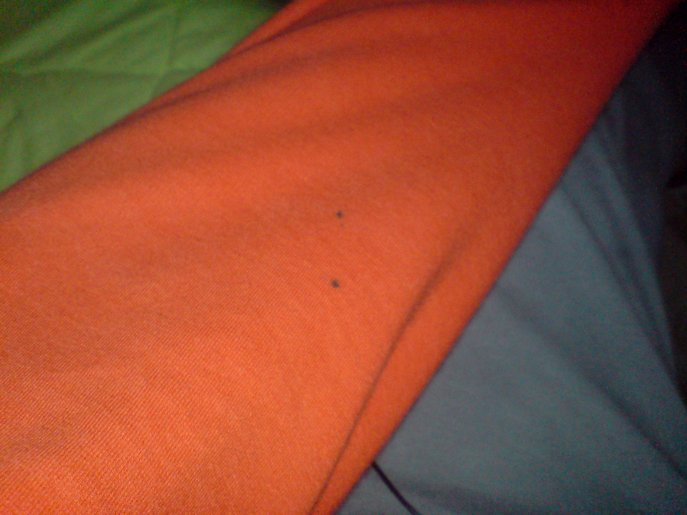
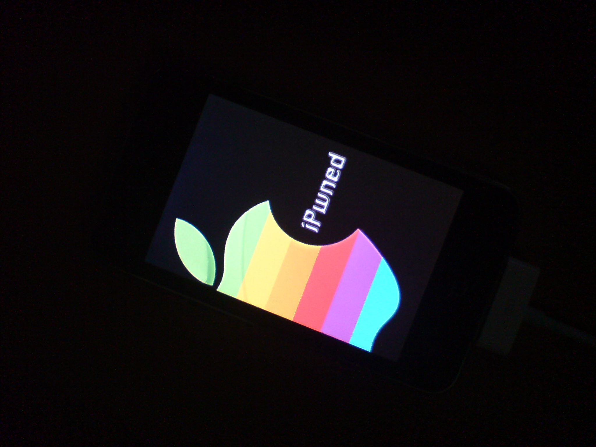

Αποφάσισα να μην postάρω αυτόματα αυτά τα άρθρα. Δεν ξέρω γιατί 😛 Άλλη μια βδομάδα πέρασε σαν νερό και η επόμενη θα περάσει πολύ γρηγορότερα γιατί χάνουμε Τρίτη και Τετάρτη!.. Πανελλήνιες coming closer and closer 😛

Βγήκε ο IE8! OYAOY! Δεν μίλησε **ΚΑΝΕΙΣ**. Ούτε ένα tweet δεν είδα για αυτόν, σε αντίθεση με τον Firefox 3 που κάναν όλοι σαν τρελοί για να τον κατεβάσουν. Να πω την αλήθεια, τώρα τον κατεβάζω και εγώ να δω τι παίζει 😛 Για να δούμε τι θα δούμε.. Τρέχω Chrome 2 την beta btw. Κατέβηκε.. χωρίς υπερβολές, αφήνει μια.. βαρβατίλα. Τον νιώθεις βαρύ, γεμάτο, όχι όπως τον Firefox :/ Άρα έχουμε και λέμε.. σειρά προτίμησης..  

  1. Chrome 2
  2. IE8
  3. Firefox 2 (αναγκαστικά για τα developer plugins του 😛 )

Ανακοινώσανε το iPhone OS 3 ([περισσότερα εδώ](http://away.gr/2009/03/18/apples-iphone-os-3-0-preview/)) 😀 Όχι πολλές αλλαγές, αν ρωτήσεις την γνώμη μου. Τουλάχιστον όχι αρκετές για να την πουν &#8220;**ΕΚΔΟΣΗ 3**&#8220;. 2.5 και πολύ πέφτει. Αν απ&#8217; τα νέα features αφαιρέσεις ότι έχει σχέση με τηλέφωνο (+ μικρόφωνο), δε μένει τίποτα για το iPod Touch. Απογοήτευση. Extra πίκρα, πρέπει να το πληρώσεις το update! $9.95!! Το καλύτερο σε όλη την υπόθεση είναι ότι θα ενεργοποιήσουν το Βluetooth και στο iPod Touch..! Έχω ακούσει ότι το chip για το WiFi ότι πέρα απ&#8217; το Bluetooth έχει και Radio, δεν ξέρω κατά πόσο ισχύει.

Τα παιδάκια κοιμούνται αγκαλιά με τα αρκουδάκια τους. Οι γκόμενοι με τις γκόμενες. Οι παντρεμένοι με τις γκόμενες. Οι καμμένοι με τα στυλό, άθελά τους.

Δεν είναι τυχαίο το χρώμα της πιτζάμας! Είναι για να ταιριάζει με το Favicon 😛 Το στυλό δεν ξέρω πως βρέθηκε αγκαλιά μαζί μου, μάλλον επειδή το είχα πετάξει πάνω στο κρεβάτι όταν γύρισα απ&#8217; το φροντιστήριο. Έχω κοιμηθεί και με μολύβι! Αλλά ευτυχώς δεν βάφει 😛

Στο προηγούμενο post είχα ξεχάσει να γράψω ότι.. ΒΓΗΚΕ ΤΟ FULL JAILBREAK ΓΙΑ ΤΟ iPod Touch 2G. Επιτέεεεεεελους. Φέρτε τα κάστομ μπούτ λόγκος να του αλλάξω τα φώτααααα..

Γίχα!

<del datetime="2009-03-23T11:15:50+00:00">Πρέπει να φτίαξω και το CSS του blog γιατί είναι λίγο.. ασ&#8217; τα να παν&#8217; στο διάλο, όπως φαίνεται απ&#8217; τα κενά πάνω-κάτω στις εικόνες παραπάνω 😛</del>  
Άκυρο, δεν είχα βάλει paragraphs 😛

Λοιπόν.. άλλο ένα update καθηστεριμένο!  
Τα λέμε 🙂  
Για να δούμε τι θα γίνει και αυτή τη βδομάδα.. χεχε..