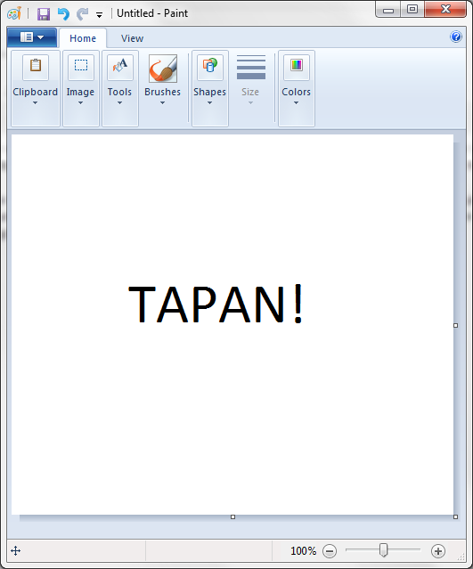
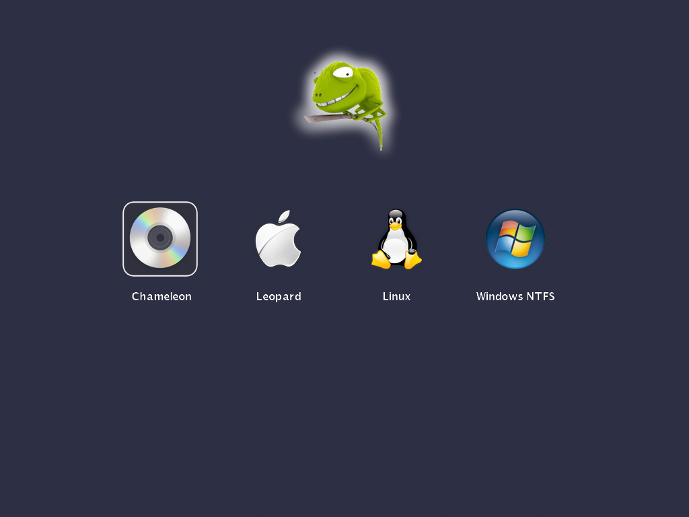

Επιτέλους, κλείσιμο σχολείων. Μένουν 2 βδομάδες (αν πατήσω) για να τελειώσω την ποινή μου στο εκπαιδευτικό σύστημα. Το ότι μπορεί να ξαναδώσω είναι άλλο θέμα και θα αναπτυχθεί όταν βγουν τα αποτελέσματα. Lets hope not. Λοιπόοοον.. Πάει καιρός απ&#8217; το τελευταίο update.. Ούτε που θυμάμαι τι έχει γίνει.

Καταρχάς, έβαλα Windows 7 😛 Έχω κάποια προβλήματα, αλλά δεν ξέρω από που προέρχονται.. **1.** Δεν παίρνω IP με το boot του PC. Χρειάζεται να βγάλω και να βάλω το καλώδιο ή να κάνω restart. **2.** Όταν bootάρει καμιά φορά βγάζει μαύρη οθόνη με τον δείκτη μόνο. Με restart στρώνει. Αυτά βασικά, τίποτα περισσότερο. Τουλάχιστον δεν έχουν bug στο Notepad όπως τα Vista τον καιρό εκείνο 😛 Τα εγκρίνω ανεπιφύλακτα. Κακά νέα για τους παλιούς χρήστες..  
Η ΖΩΓΡΑΦΙΚΗ **ΑΛΛΑΞΕ**.  

Πολύ συγκίνηση, με την κλασική μεγαλώσαμε. Είναι πια παρελθόν. Αλλάξανε που την αλλάξανε, δεν βάζανε layer? 😛 Θα γλιτώναμε το photoshop για τα βασικά. Θα μπορούσα να βάλω πιο μικρή εικόνα, αλλά anyway.

Είπα να κάτσω να φτιάξω το EEE PC όπως θέλω. Αποφάσισα να το κάνω dual boot. Mac OS X και Ubuntu Linux. Αφού το desktop έχει και θα έχει για πάντα Windows, το laptop μπορεί να έχει οτιδήποτε άλλο 😉 Μπορεί επίσης να τρέχει ταυτόχρονα με το PC, συνδεδεμένο με την 2η είσοδο του monitor. Με Synergy γίνεται λουκούμι! 🙂

Έχω βαρεθεί να κάνω format τις τελευταίες 2 μέρες. Τα Mac μου έχουνε βγάλει την πίστη. Άρχισα να κάνω format την πρώτη φορά και στο τέλος θυμήθηκα ότι δεν είχα επιλέξει κάποια kext, αναγκαία πάλι format.. Την δεύτερη φορά είπα να συμβουλευτώ και ένα guide για το ποία kext πρέπει να επιλέξω. Ύψιστη μαλακία.. Καλά θυμόμουνα ότι δεν χρειάζεται το PS2 Fix.. Αποτέλεσμα? Δεν δούλευε το keyboard και το mouse. Τώρα ξεκίνησα την 3η φορά και από ότι βλέπω δεν θα είναι η τελευταία. Αρνείται να κάνει format το partition του! Τα Ubuntu είναι έτοιμα από χτες. Στο καπάκι θα μπει [Chameleon 2](http://chameleon.osx86.hu/articles/introducing-new-features-added-to-next-version-of-chameleon-part-1) 😀

Έαν έχεις κάποιο της σειράς EEE, ψάξε guide να ενεργοποιήσεις το boot booster. Power button to GRUB σε 1 second 😉

Τέλος, Μ. Παρασκευή με Δευτέρα θα είμαι afk γιατί πάω χωριό!  
Τις επόμενες μέρες θα είμαι ακόμη πιο ανενεργός γιατί.. αρχίζει το διάβασμα εν όψη Πανελληνίων.