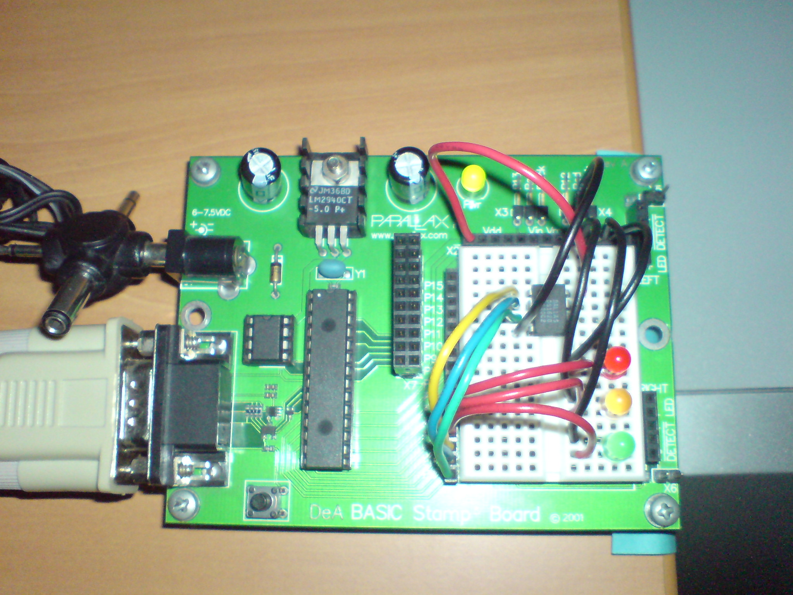
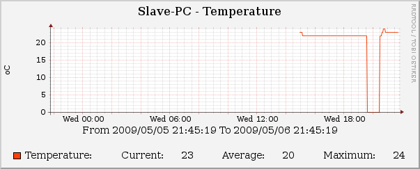
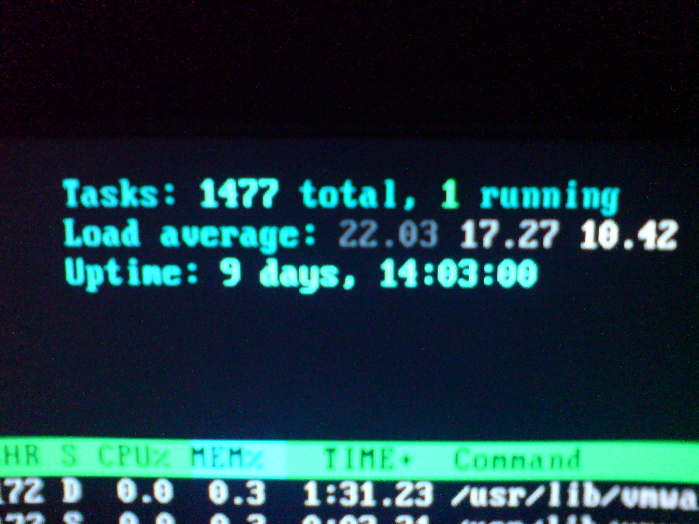

Οι παλιοί-τακτικοί αναγνώστες θα θυμούνται τον παλιό-καλό microcontroller μου, που [τόσα έχω πει για αυτόν](/tags/basic-stamp/). Είχα ξαναπροσπαθήσει να τον &#8220;ζωντανέψω&#8221;, γιατί κρίμα είναι να κάθετε στο συρτάρι, χωρίς επιτυχία. Προχτές, καθώς έπαιζα με το Cacti του home server, μου ήρθε η παρακάτω ιδέα.

Graphs της θερμοκρασίας του δωματίου μου! Είχα και ένα ψηφιακό θερμόμετρο που μου είχε δώσει ένα παλικάρι που είναι πωρωμένος με αυτά, δεν έλειπε τίποτα λοιπόν! Το σύνδεσα, έβαλα και 3 led για &#8220;debug&#8221;. Στην αρχή νόμιζα ότι τσάμπα τα έβαλα, αλλά τελικά αποδείχτηκε ότι είναι πολύ χρήσιμα μιας και δεν βλέπεις τι κάνει το Cacti και τι μπορεί να πάει στραβά. Κατέληξα λοιπόν σε αυτό..  

Το πράσινο led αναβοσβήνει όταν ο Basic Stamp παίρνει την θερμοκρασία απ&#8217; το DS1620, το πορτοκαλί όταν στέλνει τα δεδομένα μέσω της σειριακής θύρας (No USB, man), ενώ το κόκκινο τίποτα. Χρησίμευε στην προηγούμενη έκδοση του προγράμματος του Basic Stamp, όπου άναβε όταν του έδινες λάθος εντολή. Η σωστή ήταν &#8220;G&#8221; και όταν την έδινες απαντούσε με την θερμοκρασία του δωματίου.

Όπως είπα και πριν, τα γραφήματα τα κάνει το Cacti. Πρόγραμμα περίπλοκο μπορώ να πω, για &#8216;μενα τουλάχιστον 😛 Μετά από λίγο παίδεμα, ορίστε το αποτέλεσμα 🙂

Η &#8220;βουτιά&#8221; στους 0 βαθμούς έγινε επειδή το αποσύνδεσα από τον home server. Έπρεπε να του περάσω το νέο firmware που είχα γράψει και να το testάρω. Δεν έχει μαζέψει πολλές θερμοκρασίες, όπως φαίνεται ούτε 1 μέρα, αλλά τι να κάνουμε, υπομονή 😛

Όσοι με ακολουθούν στο Twitter, ίσως είδανε χτες ότι τράβαγα ζόρια με τον home server. Δεν μπόρεσα να καταλάβω ακριβώς τι έφταιξε γιατί είχε παγώσει όλο το μηχάνημα, αλλά από μερικές πεταχτές ματίες στο top, είδα ότι είχε γεμίσει php cli και python processes. Ο λόγος ήταν το python script μου, που παίρνει τα δεδομένα και τα στέλνει στο Cacti. Αυτό, περίμενε να λάβει δεδομένα στην σειριακή. Έλα όμως που εγώ το είχα κλείσει. Είπα πριν τι έγινε 😛 Γεμίσαμε processes..

Μπορεί να κάνει κι άλλα &#8220;πραγματάκια&#8221;, όπως να αναβοσβήνει ένα led για να δείξει ότι έχω νέο email, ότι μου μιλάει κάποιος στο MSN και πολλάα, πραγματικά πολλάααα άλλα.. Υπάρχει ένα πρόβλημα που μένει να βρω λύση. Πως το κάνω να μην σταματάει και να περιμένει μέχρι να διαβάσει κάτι απ&#8217; την σειριακή πόρτα. Μπορώ να του στέλνω ένα byte για να συνεχίζει την κύρια επανάληψη, είδομεν..

Για την ώρα.. αυτά 🙂
