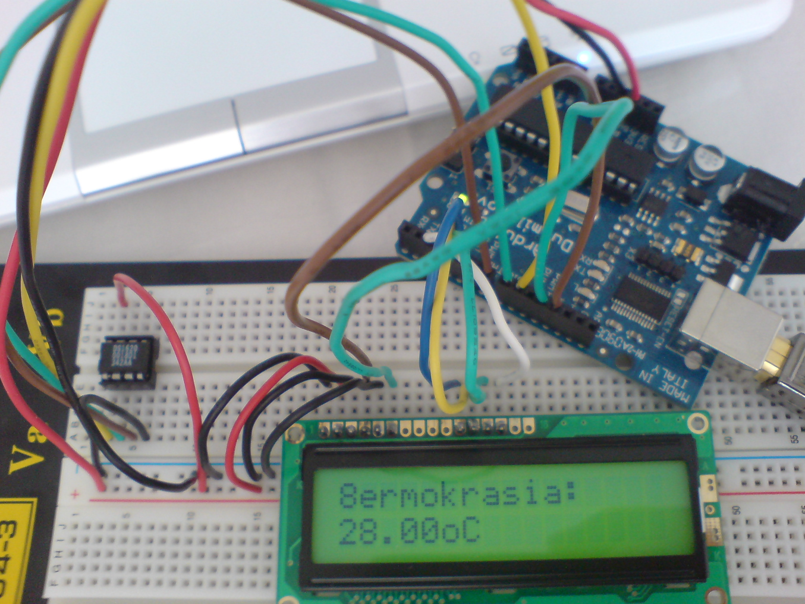

Να κάτι που έφτιαξα σήμερα το μεσημέρι, το δεύτερο &#8220;ολοκληρωμένο&#8221; πρόγραμμα για το Arduino 🙂

Για να το φτιάξεις χρειάζεσαι ένα Arduino board (γύρω στα 25-30€), ένα ψηφιακό θερμόμετρο DS1620 (1-2€.. Δεν θυμάμαι!) και μια LCD οθόνη όσων γραμμών και χαρακτήρων θες.. Εγώ χρησιμοποιήσα μια 16&#215;2 που είχα πρόχειρη (6€)!

Ο κώδικας χρησιμοποιεί 2 βιβλιοθήκες (από &#8216;δω και πέρα library), μια για την LCD οθόνη (την περιέχει το Arduino IDE) και μια για το θερμόμετρο. Μπορείς να τις βρείς [εδώ](http://arduino.cc/en/Reference/LiquidCrystal) και [εδώ](http://rubenlaguna.com/wp/2009/03/18/ds1620-temperature-sensor-library-for-arduino/) 😉

Ο κώδικας είναι αυτός:

#include <stdlib.h>  
#include <math.h>  
#include <LiquidCrystal.h>  
#include "ds1620.h"

LiquidCrystal lcd(12, -1, 11, 5, 4, 3, 2);  
Ds1620 ds1620 = Ds1620(7/*rst*/,8/*clk*/,9/*dq*/);

void setup() {  
lcd.begin(2, 16);  
lcd.print("8ermokrasia:");  
ds1620.config();  
}

void loop() {  
lcd.setCursor(0, 1);

ds1620.start_conv();  
int raw_data = ds1620.read_data();  
ds1620.stop_conv();  
float temp = raw_data / 2.0;

lcd.print(temp);  
lcd.print("oC");  
}  


Απλός, λιτός (ζυγίζει 4766 bytes! μαζί με τις library) και με πολύ χώρο για περαιτέρω development! Σε κάποια άλλη έκδοση μπορεί να στέλνει tweet στο twitter με την θερμοκρασία 😉  
Για αρχή όμως πρέπει να φτιαχτεί το σύμβολο των βαθμών και αν είναι εύκολο, να δείχνει με Ελληνικά την λέξη θερμοκρασία. Για την ώρα δύσκολο, μιας και δεν έχω γρήγορο Ιnternet και το datasheet ζυγίζει καμιά 60άρα mb 🙁
