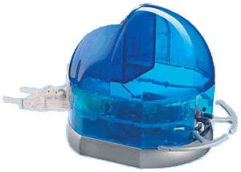

Άλλο ένα πρόγραμμα για το Robot της DeA (αυτό με τον Basic Stamp II). Είναι της εποχής που είχα καεί με τους micro (και ας είχα μόνο έναν 😛 )! Στην ουσία, το robot αυτό μπορείς να το χειρίζεσαι από κάπου απομακρυσμένα και μέσω κάποιας κάμερας, μικροφώνου και ηχείων, είναι σαν να βρίσκεσαι ο ίδιος εκεί.

Τι είχα κάνει.. 😛 Πατέντες. Είχα πάρει το μισό &#8220;κουτί&#8221; του robot της DeA, από την σειρά &#8220;Κατασκεύασε και προγραμμάτισε το δικό σου Ρομπότ&#8221;. Έτσι είναι συναρμολογημένο πλήρως..

  
Είχα βγάλει δηλαδή το πάνω-πάνω πλαστικό. Πάνω εκεί είχα βάλει ένα βιβλίο, ήταν σαν &#8220;τραπεζάκι&#8221; ένα πράμα. Πάνω σε αυτό έβαζα το πιστό και πολύ αγαπημένο μου EEE PC 1000H, το οποίο έτρεχε Skype και ένα serial to tcp προγραμματάκι (θα εξηγήσω στη συνέχεια). Έτσι λοιπόν μπορούσα να χειριστώ το robot μέσω Internet και να βλέπω που πάει μέσω της κάμερας του netbook! Ε και φυσικά να ακούω και να μιλάω 🙂 Δεν το δοκίμασα ποτέ εκτός σπιτιού, μόνο από διαφορετικά δωμάτια, αλλά τέλος πάντων 😛

Όπως είπα το netbook έτρεχε Skype και ένα πρόγραμμα.. Για να χειριστείς το robot έπρεπε να στείλεις κάποιες &#8220;εντολές&#8221; σε αυτό μέσω σειριακής θύρας. Αυτό γίνεται μόνο απ&#8217; το ίδιο PC. Εδώ έρχεται το serial to tcp που σου επιτρέπει να χειριστείς (να στείλεις και να λάβεις δεδομένα) απ&#8217; την σειριακή πόρτα ενός υπολογιστή μέσω δικτύου! Κάτι σαν γέφυρα ένα πράμα 😉 😛

Το πρόγραμμα που είχα γράψει για το robot είναι αυτό. Μέσα σε ένα απόγευμα όλα αυτά. Εκτός από μερικά κομμάτια του κώδικα!


' Program: Remote Presence Bot  
' Author : giannoug  
' - email: giannoug@gmail.com  
' - site : www.giannou.net  
' Version: v18.2.2009  
'=====-=====-=====-=====-=====-=====-=====-=====-=====-=====-=====-  
' {$STAMP BS2}  
' {$PBASIC 2.5}  
'=====-=====-=====-=====-=====-=====-=====-=====-=====-=====-=====-  
' Σταθερές / Μεταβλητές | Constants / Variables  
'=====-=====-=====-=====-=====-=====-=====-=====-=====-=====-=====-  
turns VAR Nib  
cmd VAR Word

SrvLStop CON 765 'Σε αυτή την τιμή οι  
SrvRStop CON 750 'servo είναι νεκροί.  
Gear1 CON 25 '"Ταχύτητες" για τους servo.  
Gear2 CON 50 'Για μελλοντική χρήση και αν.  
Gear3 CON 75  
Gear4 CON 100  
Gain CON 50  
'=====-=====-=====-=====-=====-=====-=====-=====-=====-=====-=====-  
' Pins  
'=====-=====-=====-=====-=====-=====-=====-=====-=====-=====-=====-  
ServoL PIN 13  
ServoR PIN 12

'=====-=====-=====-=====-=====-=====-=====-=====-=====-=====-=====-  
' Αρχικοποίηση | Startup  
'=====-=====-=====-=====-=====-=====-=====-=====-=====-=====-=====-

'Κανά τσέκ αν θες.  
DEBUG "D"

'=====-=====-=====-=====-=====-=====-=====-=====-=====-=====-=====-  
' Κύριο πρόγραμμα | Main program  
'=====-=====-=====-=====-=====-=====-=====-=====-=====-=====-=====-

DO  
DEBUGIN cmd

IF cmd = "F" THEN  
GOSUB ForwardPulse  
ELSEIF cmd = "B" THEN  
GOSUB BackwardPulse  
ELSEIF cmd = "L" THEN  
GOSUB LeftPulse  
ELSEIF cmd = "R" THEN  
GOSUB RightPulse  
ENDIF

LOOP

'=====-=====-=====-=====-=====-=====-=====-=====-=====-=====-=====-  
' Υπορουτίνες | Subroutines  
'=====-=====-=====-=====-=====-=====-=====-=====-=====-=====-=====-

ForwardPulse:  
FOR turns = 0 TO 10  
PULSOUT ServoL, SrvLStop + Gear4  
PULSOUT ServoR, SrvRStop - Gear4 - Gain  
NEXT  
RETURN

BackwardPulse:  
FOR turns = 0 TO 10  
PULSOUT ServoL, SrvLStop - Gear4  
PULSOUT ServoR, SrvRStop + Gear4 + Gain - 90  
NEXT  
RETURN  
LeftPulse:  
FOR turns = 0 TO 10  
PULSOUT ServoL, SrvLStop - Gear4  
PULSOUT ServoR, SrvRStop - Gear4 - Gain  
NEXT  
RETURN

RightPulse:  
FOR turns = 0 TO 10  
PULSOUT ServoL, SrvLStop + Gear4  
PULSOUT ServoR, SrvRStop + Gear4 - Gain  
NEXT  
RETURN

'=====-=====-=====-=====-=====-=====-=====-=====-=====-=====-=====-  
' Τέλος | End  
'=====-=====-=====-=====-=====-=====-=====-=====-=====-=====-=====-  


Αυτό ήταν.. Άλλη μια καμμενο-πρότζεκτ παρουσίαση έλαβε τέλος 😛