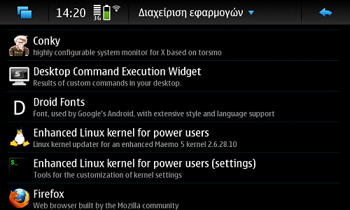

Να το αφήσει, να το αφήσει. Από default το Nokia N900 τρέχει στα 600Mhz, lame. Ώρα για λίγο tweaking. Θα υποθέσω ότι ξέρεις λίγα πράματα από Linux command line και φυσικά έχεις βάλει τα extras-testing και extras-devel repo στο apt της συσκευής. Ωραία μέχρι εδώ; Καταρχάς πρέπει να εγκαταστήσεις το custom kernel του Titan. Μιας και μου αρέσει το tap tap, πήγαινε στον App Manager, πήγαινε στα πακέτα και βρες το &#8220;Enchanced Linux kernel for power users&#8221; και το &#8220;Enchanced Linux kernel for power users (settings)&#8221;. Ακόμη θα χρειαστούμε το rootsh για root terminal.



Αυτό θα κατεβάσει και θα περάσει νέο kernel με αρκετά καλούδια. Μερικά από αυτά είναι (copy &#8211; paste απ&#8217; το description της εφαρμογής):

> IPv6, packet filtering, QoS, NAT, tunneling, kernel configuration, Wifi mesh networking, builtin ext3 for booting from other media, ext4, XFS, reiserfs, NTFS read support, ISO9660, UDF, CIFS, automounter, squashfs, unionfs, device mapper and dm-loop, cryptography, cryptoloop, EFI partitions, UTF8 codepages, mouse+joystick input, PPP, PPTP, serial support, USB/IP and generic USB device drivers, battery info, WLAN monitoring, overclocking, kexec support

Ακούγονται geeky, τα περισσότερα είναι άχρηστα αλλά γαμάει. Λοιπόν. Αφού το εγκαταστήσεις θα πρέπει να κάνεις reboot την συσκευή για να ξεκινήσει το νέο kernel. Ανοίγεις terminal, γράφεις sudo gainroot και μετά reboot. Όταν ξαναξεκινήσει, τρέχοντας uname -r θα δεις την έκδοση του kernel. Αυτή την στιγμή η latest έκδοση είναι η 2.6.28.10power37 οπότε κάτι παρόμοιο θα πρέπει να λέει και εσένα.

Στο ζουμί τώρα. Το πακέτο &#8220;Enchanced Linux kernel for power users (settings)&#8221; έχει κάποια έτοιμα config για το kernel εγκατεστημένα στο _/usr/share/kernel-power-settings/_. Το καλύτερο από όλα είναι το ideal, αλλά μπορείς να πειραματιστείς και με τα υπόλοιπα. Για αρχή θα το αντιγράψουμε στο _/etc/default/kernel-power_ που είναι η default θέση που ψάχνει για ρυθμίσεις το kernel (μετά από reboot κτλ).

Τρέχουμε:


  Nokia-N900:~# cp /usr/share/kernel-power-settings/ideal /etc/default/kernel-power


Ήρθε η ώρα για λίγο tweaking&#8230; Με αυτή την ρύθμιση το kernel θα θέτει συχνότητες από 500Mhz μέχρι 600Mhz. Lame. Αν ανοίξεις το _/etc/default/kernel-power_ θα δεις κάτι τέτοιο:

```
Nokia-N900:~# cat /etc/default/kernel-power
# DO NOT EDIT THIS FILE - CREATE A COPY OF IT FOR CUSTOMIZATION
# minimum frequency to use
MINFREQ=500
# maximum frequency to use
MAXFREQ=1150
# list of frequency configurations: each "frequency:volt,dsprate"
FREQS="500:30,360 550:33,400 600:38,430 700:45,430 750:45,430 805:48,430 850:48,500 900:54,500 950:54,500 1000:60,500 1100:72,520 1150:72,520"
SMARTREFLEX_VDD1=0
SMARTREFLEX_VDD2=0
GOVERNOR=ondemand
UP_THRESHOLD=75
SAMPLING_RATE=150000
IGNORE_NICE_LOAD=1
POWERSAVE_BIAS=0
```

Για αρχή δεν χρειάζεται να πειράξεις τίποτα άλλο παρά μόνο το MAXFREQ. Καλό θα ήταν να δοκιμάζεις διάφορες συχνότητες και διάφορα config. Εμένα δουλεύει μια χαρά με το ideal στα 1150Mhz χωρίς κολλήματα. Αυτό βέβαια δε σημαίνει ότι θα δουλέψει και σε άλλες συσκευές με τον ίδιο τρόπο&#8230; Περισσότερο διάβασμα μπορείς να ρίξεις [εδώ](http://wiki.maemo.org/Overclocking) και [εδώ](http://wiki.maemo.org/Kernel_Power).

Κάτι τελευταίο, μέχρι τώρα δεν έχει καεί καμία συσκευή και -θεωρητικά- δεν πρόκειται. Στην χειρότερη θα κλείσει και θα εμφανιστεί το μήνυμα στην πρώτη εικόνα, πάνω-πάνω. Καλού κακού όμως, δεν ευθύνομαι για τίποτα, ούτε και κανείς άλλος εκτός από εσένα.

Squeeze those silicons 🙂