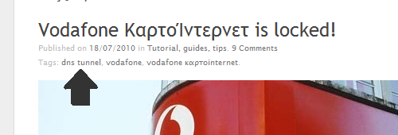

### Εισαγωγή

Πριν αρχίσουμε τα desclaimer και τα γνωστά, ας κάνω μια επανάληψη για τους νέους στο κόλπο αλλά και για αυτούς που δεν κατάλαβαν ακριβώς πως δουλεύει το πακέτο. Το πακετάκι αυτό, αγοράζοντας το σου δίνει πρόσβαση στο Internet χωρίς να πληρώσεις, χωρίς τίποτα. Όταν πας να ανοίξεις κάποια σελίδα σου ζητάει να δώσεις κωδικό, τον οποίο αγοράζεις με τις κάρτες που πουλάει η εταιρία και ισχύει για όσο λέει η κάρτα πάνω (πχ 20€ για 11 μέρες). Για να μην πολυλογώ, έχει την ίδια λογική με τα WiFi HotSpot.

Όταν κυκλοφόρησε λοιπόν αυτό το πακέτο ήταν τελείως ξεκλείδωτο. Μπορούσες να κάνεις οτιδήποτε άλλο ήθελες στο Internet, απλά για να περιηγηθείς στο web χρειαζόταν να βάλεις τον κωδικό της κάρτας που αγόραζες. Βάζοντας τον &#8220;άνοιγε&#8221; το δίκτυο. Το προηγούμενο hack βασιζότανε σε αυτή την αδυναμία του δικτύου και περνούσε όλα τα δεδομένα που έκοβε η Vodafone μέσα από τις ήδη ανοιχτές πόρτες. Βέβαια, μετά από κάποιες μέρες το κλείδωσαν. Εδώ έρχεται το νέο hack.

Αν σκοπεύεις να κλέψεις Internet να σε προειδοποιήσω ότι αργεί περισσότερο και απ&#8217; τον θάνατο. Είναι απίστευτα αργό, αλλά δουλεύει και αυτό είναι που μας νοιάζει. Στις δοκιμές που έκανα χρειάστηκαν κάτι λιγότερο από 2 λεπτά για να ανοίξει αυτή η σελίδα. Με λίγο tweaking στις ρυθμίσεις σίγουρα θα αυξηθεί η ταχύτητα αλλά αυτό είναι άλλη ιστορία και δεν μας ενδιαφέρει αυτή την στιγμή. Την συγκεκριμένη στιγμή εννοώ 😛

Για να κλείσω την εισαγωγή, ρίχνω δύο νέα που έχω για αυτή την υπηρεσία. Πρώτον, **χρειάζεται** να δηλώσεις την sim. Δεν ξέρω γιατί δεν το είπαν όταν την αγόραζα, αλλά αν μπεις τώρα στο site (εκεί που κάνεις login για το ΚαρτοInternet) έχει ανακοίνωση ότι πρέπει να δηλωθεί. Ακόμη, **ΔΕΝ** χρειάζεται καν να αγοράσεις κάποιο από αυτά τα πακέτα για να έχεις πρόσβαση στην υπηρεσία <del>(και να παίξεις με το tunnel)</del>. Αρκεί να χρησιμοποιήσεις το _web.session_ σαν APN, χωρίς username και password σε όποια Vodafone sim έχεις.

### Το κόλπο

  Disclaimer: Οτιδήποτε διαβάσεις εδώ ΔΕΝ πρέπει να χρησιμοποιηθεί για κανένα άλλο σκοπό πέρα του να μάθεις κάποια πράματα για τα tunnel και το πως μπορείς να αποφύγεις τα firewall. ΔΕΝ ευθύνομαι για οτιδήποτε μπορεί να συμβεί, είτε αυτό είναι διακοπή της υπηρεσίας, είτε κρύο νερό όταν κάνεις ντούζ ή και βρώμικες κάλτσες στον καναπέ. Προσωπικά δεν το έχω χρησιμοποιήσει για να κλέψω και θα σε συμβούλευα να κάνεις το ίδιο. 20€ για 11 μέρες δεν είναι πολλά λεφτά και η υπηρεσία είναι απ&#8217; τις καλύτερες, αρκεί να αναφέρω ότι πιάνω 4.67mbit downstream και 1.44mbit upstream εδώ που είμαι.

Πριν, όπως είπα, χρησιμοποιούσαμε μια απ&#8217; τις ξεκλείδωτες πόρτες του δικτύου για να περνάμε τα δεδομένα μας σε κάποιον δικό μας server. Αυτός με την σειρά του έβλεπε τι ζητάμε και μας το πέρναγε πάλι πίσω. Αφού πλέον το κλείδωσαν όπως θα έπρεπε, δεν γίνεται να περάσουμε δεδομένα μέσα από αυτές τις πόρτες και φυσικά πλέον δε δουλεύει. Υπάρχει όμως ένας ακόμη τρόπος, για το οποίο είχα δώσει ένα hint στο προηγούμενο post.

Καλά κατάλαβες, λέγεται DNS tunnel. Πως δουλεύει; Μέσα απ&#8217; τον DNS server της Vodafone θα περνάμε δεδομένα πάλι σε δικό μας server. Σε αυτό το post δεν μας νοιάζει ο τρόπος, ο οποίος είναι αρκετά περίπλοκος, αλλά το θέμα είναι ότι δουλεύει. Ο server αναλύει το DNS ερώτημα που του στέλνουμε και μας απαντάει ανάλογα. Όλη την δουλειά την κάνει το _iodine_ το οποίο μπορείς να κατεβάσεις από [εδώ](http://code.kryo.se/iodine/). Θα χρειαστεί να κάνεις compile το πρόγραμμα μιας και η έκδοση που υπάρχει στα repository γνωστών distro είναι, αν όχι προϊστορική, παλαιολιθική και **ΔΕΝ** δουλεύει. Για την ιστορία, η τελευταία έκδοση αυτή την στιγμή είναι η _0.6.0-rc1_. Υπάρχουν και άλλα παρόμοια εργαλεία αλλά το συγκεκριμένο, πιστεύω, είναι κορυφή.

> iodine lets you tunnel IPv4 data through a DNS server. This can be usable in different situations where internet access is firewalled, but DNS queries are allowed. 

Όπως είχα πει και στο πρώτο πρώτο post, αν ο DNS κάνει resolve τα domain ελεύθερα τότε μπορούμε εύκολα να τον κοροϊδέψουμε. Το iodine κάνει την βρώμικη δουλειά, μιας και ο DNS της Vodafone μετά χαράς μας κάνει resolve τα domain που του ζητάμε, παρόλο που δεν έχουμε δώσει τον κωδικό της κάρτας. Αν περιμένεις κάποιον οδηγό για το πως θα το στήσεις, δεν πρόκειται να τον βρεις σίγουρα εδώ. Όπως είπα δεν αξίζει γιατί αργεί αρκετά. Βέβαια οι δοκιμές έγιναν με server στην Αμερική και τις default ρυθμίσεις αλλά κάνουμε τα στραβά μάτια. Θα ήταν ενδιαφέρον να βρεθούν οι ιδανικότερες ρυθμίσεις για αυτό το πρόγραμμα.

### Τέλος

Αυτό ήταν. Δεν υπάρχει τρόπος από την μεριά της Vodafone να κλειδωθεί και αυτό το κόλπο. Στην πραγματικότητα υπάρχουν δύο αλλά δε λέω τίποτα για την ώρα, σε περίπτωση που αποφασίσουν να τα κλειδώσουν όλα μαζί. Άσε να υπάρχει και κανένας άλλος τρόπος για να έχω κάτι να ασχολούμαι και εγώ σε περίπτωση που το φτιάξουν και αυτό :p