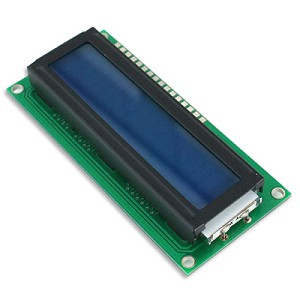

Καλός τίτλος; Σαν workshop! Τι θα φτιάξουμε σήμερα&#8230; Όπως είναι γνωστό, ένας server (συνήθως) δεν έχει οθόνη συνέχεια συνδεδεμένη πάνω του. Πως μπορούμε να βλέπουμε ότι ζει αλλά και ταυτόχρονα να παίρνουμε κάποιες πληροφορίες για την λειτουργία του; Εδώ έρχεται το LCD4Linux με μια πληθώρα plugin για ότι τύπο οθόνης LCD μπορείς να φανταστείς! Δεν μιλάμε για κανονική οθόνη LCD αλλά για αυτές τις μικρές, όπως έχουν τα DVD player και διάφορες άλλες συσκευές. Στην εικόνα παρακάτω είναι η LCD που θα χρησιμοποιήσουμε.

Που μπορείς να βρεις μια τέτοια οθόνη; Την συγκεκριμένη την είχα αγοράσει πέρσι το Καλοκαίρι απ&#8217; τον Φανό ([Σολωμού 40 Αθήνα](http://maps.google.com/maps?q=%CE%A3%CE%BF%CE%BB%CF%89%CE%BC%CE%BF%CF%8D+40+%CE%91%CE%B8%CE%AE%CE%BD%CE%B1)) γύρω στα 6€. Είναι 16 χαρακτήρων και 2 γραμμών (16&#215;2) με driver το HD44780 (κάποιο clone του για την ακρίβεια). Στο άρθρο αυτό θα ασχοληθούμε μόνο με αυτόν τον controller μιας και αυτός μας κάνει, αφού θα χρησιμοποιήσουμε την άχρηστη παράλληλη θύρα της motherboard. Τι θα χρειαστούμε:

  * LCD οθόνη με το HD44780 (δε μας νοιάζει το μέγεθος, μπορεί να είναι και περισσότερων χαρακτήρων)
  * Ένα καλώδιο εκτυπωτή μαζί με το βύσμα για την motherboard
  * Κολλητήρι, όρεξη και ότι άλλο χρειάζεται ένα project που περιέχει ηλεκτρονικά 😉

Επειδή το κολλητήρι εμένα βρίσκεται στο υπόγειο και τόσους ορόφους κάτω δεν πιάνει το WiFi, έφτιαξα μια σελίδα A4 με ότι χρειαζόμουν για να συνδέσω κατάλληλα τα pin της οθόνης με τα pin της θύρας. Το έφτιαξα λίγο για public χρήση και μπορείς να το κατεβάσεις (\[download id=&#8221;5&#8243;\] (updated 3/7/11!)). Θα χρειαστούμε και +5v τα οποία ΔΕΝ μπορεί να δώσει η παράλληλη θύρα (το backlight τραβάει περισσότερα από όσα μπορεί να δώσει). Ένα απλό workaround είναι να κόψουμε ένα καλώδιο USB και να συνδέσουμε το VCC (ή αλλιώς το +) με το VCC της οθόνης και ΌΛΑ τα GND (τα -) μαζί. Όταν λέω όλα, εννοώ της οθόνης, της παράλληλης και της USB θύρας. Δεν θα δουλέψει αλλιώς και ίσως δεις πυροτεχνήματα!

Αφού τελειώσεις με τις κολλήσεις σύμφωνα με το pdf, σύνδεσε πρώτα την USB θύρα. Να είσαι έτοιμος να το αποσυνδέσεις γιατί αν δεν ανάψει το backlight της οθόνης σημαίνει ότι κάτι έχει βραχυκυκλώσει (ή στην καλύτερη κάτι ξέχασες). Ανάλογα την motherboard, ίσως σβήσει, αλλά υπάρχουν motherboard που δεν σκαμπάζουν και αν δεν είσαι γρήγορος θα δεις καπνούς και καλώδια να λιώνουν 😛 Η δικιά μου οθόνη είναι μια αναβαθμισμένη έκδοση, μιας και είχα φτιάξει κάτι παρόμοιο κάνα χρόνο πριν. Σήμερα διόρθωσα το pinout, κόντυνα αρκετά το καλώδιο και έφτιαξα τις κολλήσεις.

Αυτά για σήμερα, κάποια από τις επόμενες μέρες θα μιλήσω για το πως ρυθμίζουμε το πρόγραμμα στο Linux (ίσως και Windows) μηχάνημά μας για να μιλάει στην οθόνη 😉 Μπορείς να γραφτείς στο RSS feed αυτού του blog για να είσαι σίγουρος ότι δεν θα το ξεχάσεις! Περισσότερο διάβασμα μπορείς να κάνεις στο κεντρικό site του <a href="http://ssl.bulix.org/projects/lcd4linux/" class="broken_link" rel="nofollow">LCD4Linux</a>.