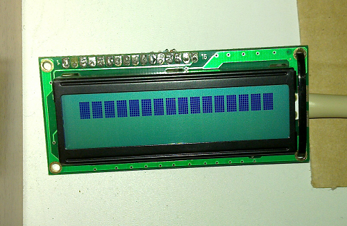
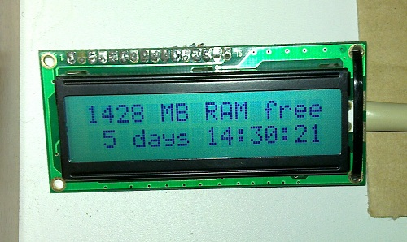

Πριν μερικές μέρες μιλήσαμε για το πως μπορούμε να φτιάξουμε το hardware για το LCD4Linux ([Εισαγωγή στο LCD4Linux](/introduction-to-lcd4linux/)). Ακολουθήσαμε την απλή και γρήγορη οδό, μια character LCD με driver το αρκετά διαδεδομένο HD44780 και την, άχρηστη μέχρι σήμερα, παράλληλη θύρα του server (ή και γιατί όχι, του desktop) μας. Σήμερα θα μιλήσουμε για το πως μπορούμε να ρυθμίσουμε το μηχάνημά μας για να μπορεί να μιλάει στην οθόνη, αλλά και να μας δείχνει κάποιες πληροφορίες. Φυσικά και όλα αυτά είναι παραμετροποιήσημα από εμάς!

Για αρχή, θα πρέπει να βεβαιωθούμε ότι η παράλληλη θύρα είναι ενεργοποιημένη απ&#8217; το BIOS του συστήματός μας. Το πως γίνεται αυτό δεν μας ενδιαφέρει σε αυτό το άρθρο, αν και είναι αρκετά εύκολο. Στην συνέχεια θα πρέπει να σιγουρευτούμε ότι το λειτουργικό βλέπει την θύρα και έχει φορτώσει τα κατάλληλα module. Σε Ubuntu, που βασίζεται αυτό το άρθρο, είναι όλα έτοιμα για εμάς και δεν χρειάζεται να κάνουμε τίποτα. Για να σιγουρευτούμε όμως μπορούμε να τρέξουμε την παρακάτω εντολή.


ls /dev/parport*


Σαν αποτέλεσμα θα πάρουμε κάτι σαν το παρακάτω.


giannoug@Slave-PC:~$ ls /dev/parport*  
/dev/parport0  
giannoug@Slave-PC:~$  


Λίγο δύσκολο η motherboard να έχει πάνω από μια παράλληλη θύρα, οπότε το αποτέλεσμα θα είναι το ίδιο. Αν δεν εμφανιστεί τίποτα, σημαίνει ότι το σύστημα δεν βλέπει καμία θύρα και ότι κάτι δεν έχουμε κάνει σωστά. Για αρχή τσεκάρουμε το BIOS και αφού σιγουρευτούμε κοιτάμε τα modules στο λειτουργικό μας. Αν όλα πήγαν καλά μέχρι εδώ, μπορούμε να συνεχίσουμε με την εγκατάσταση και ρύθμιση της οθόνης μας. Περισσότερες πληροφορίες, για καλύτερο troubleshooting, μπορούμε να βρούμε <a href="http://ssl.bulix.org/projects/lcd4linux/wiki/HD44780" class="broken_link" rel="nofollow">στην σελίδα του controller της character LCD στο site του LCD4Linux</a>.

Για αρχή ας σιγουρευτούμε ότι είναι συνδεδεμένη στην motherboard μας. Το backlight και η πρώτη σειρά χαρακτήρων (row) θα πρέπει να ανάψουν.

Στην συνέχεια θα χρειαστεί να δημιουργήσουμε ένα αρχείο ρυθμίσεων για το LCD4Linux. Αυτό θα βρίσκεται στο _/etc/lcd4linux.conf_ και θα χρειαστεί να προσθέσουμε σε αυτό το παρακάτω.


Display HD44780 {  
Driver &#8216;HD44780&#8217;  
Model &#8216;generic&#8217;  
Port &#8216;/dev/parport0&#8242;  
Size &#8217;16&#215;2&#8217;  
}

Widget RAM {  
class &#8216;Text&#8217;  
expression meminfo(&#8216;MemFree&#8217;)/1024  
postfix &#8216;MB RAM free&#8217;  
width 16  
precision 0  
update 1000  
}

Widget Uptime {  
class &#8216;Text&#8217;  
expression uptime(&#8216;%d days %H:%M:%S&#8217;)  
width 16  
align &#8216;R&#8217;  
update 1000  
}

Layout Default {  
Row1 {  
Col1 &#8216;RAM&#8217;  
}  
Row2 {  
Col1 &#8216;Uptime&#8217;  
}  
}

Display &#8216;HD44780&#8217;  
Layout &#8216;Default&#8217;  


Αν όλα πάνε καλά, θα χρειαστεί να επανεκκινήσουμε το LCD4Linux για να διαβάσει τις νέες ρυθμίσεις. Αυτό μπορούμε να το κάνουμε τρέχοντας την παρακάτω εντολή.


/etc/init.d/lcd4linux restart


Αν οι συνδέσεις μας είναι σωστές, τότε η οθόνη θα εμφανίσει &#8220; _\* LCD4Linux \*_ &#8221; για μερικά δευτερόλεπτα και στην συνέχεια ότι του έχουμε ρυθμίσει εμείς στο αρχείο ρυθμίσεων. Η δομή του αρχείου είναι απλή. Το μόνο που χρειάζεται να δηλώσουμε είναι την οθόνη, ένα layout και μερικά widget. Το παραπάνω αρχείο ρυθμίσεων κάνει την οθόνη να εμφανίζει πόση ελεύθερη RAM έχει το σύστημα στην μια γραμμή αλλά και το uptime στην άλλη.

Αυτά για την ώρα! Το πρόγραμμα έχει αρκετές ρυθμίσεις οι οποίες είναι αδύνατο να αναφερθούν εδώ, περισσότερα μπορούμε να διαβάσουμε στο κεντρικό site του project, στην σελίδα με τα <a href="http://ssl.bulix.org/projects/lcd4linux/wiki/Layout" class="broken_link" rel="nofollow">widget και τα layout</a>, τα <a href="http://ssl.bulix.org/projects/lcd4linux/wiki/Plugins" class="broken_link" rel="nofollow">plugin</a> αλλά και του <a href="http://ssl.bulix.org/projects/lcd4linux/wiki/HD44780" class="broken_link" rel="nofollow">controller της LCD</a>.