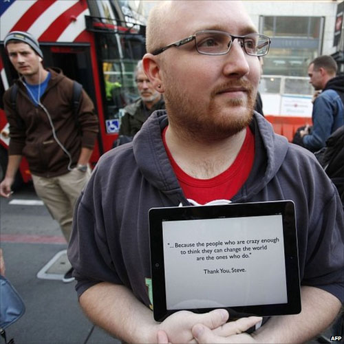

Αν δεν ζεις κάτω από πέτρα ή μέσα σε καμία σπηλιά σίγουρα θα άκουσες ότι ο συνιδρυτής μια απ&#8217; των μεγαλύτερων εταιριών στον χώρο της τεχνολογίας πέθανε πριν μερικές ημέρες. Αιτία του θανάτου του ήταν ο καρκίνος, αναμφισβήτητα ένας απ&#8217; τους χειρότερους τρόπους για να πεθάνεις. Δεν μας νοιάζει αυτό για την ώρα, εξάλλου πολλοί άνθρωποι πεθάνουν και στην τελική όλοι μας θα πεθάνουμε κάποια στιγμή. Μη φρικάρεις, έτσι είναι.

Όπως είπαμε και πριν ο Steve Jobs δεν είναι Θεός, ούτε ήταν και ούτε θα είναι. Εκτός φυσικά και αν χαρακτηρίζουμε κάποιον έξυπνο επιχειρηματία που μπορεί και πουλάει τα προϊόντα της εταιρίας του Θεό. Δεν υπάρχει καινοτομία, δεν υπάρχει τίποτα από όλα αυτά που ακούγονται. Όλα είναι θέμα marketing. Φυσικά δεν μιλάω μόνο για την συγκεκριμένη εταιρία, όλες οι εταιρίες έτσι δουλεύουν. Δεν γίνεται να περιμένουν από τον χρήστη να τις ανακαλύψει και φυσικά δεν γίνεται να πουλήσουν τα προϊόντα του αν το τόσο δεν το κάνουν τόοοοοσο. Ένα καλό παράδειγμα εταιρίας όμως είναι η Apple και ένα καλό παράδειγμα marketista είναι ο Steve Jobs. Τι; Δεν με πιστεύεις; Ας πάρουμε για παράδειγμα το iPad. Τι είναι αυτό; Στην ουσία πρόκειται για ένα τεράστιο iPhone που δεν κάνει κλήσεις, παρόλο που μπαίνει σε δίκτυα κινητής τηλεφωνίας και είναι ικανό να μεταφέρει δεδομένα μέσα από αυτά. Στο παρακάτω βίντεο μπορείς να παρακολουθήσεις την παρουσίαση του πρώτου iPad, πριν 1.5 χρόνο περίπου. Καλά, όχι ακριβώς την παρουσίαση αλλά τα κεντρικά σημεία, αυτά που θα σε κάνουν να το θες κολασμένα παρόλο που όπως είπαμε στην ουσία είναι ένα υπερτροφικό iPhone.

<a href="http://en.wikipedia.org/wiki/Stevenote" title="Stevenote" target="_blank" rel="noopener noreferrer">Magic</a>. Ο Steve Jobs, τονίζει τα αρνητικά σημεία της συσκευής (όπως για παράδειγμα το πληκτρολόγιο στο οποίο είναι αδύνατο να γράψεις πάνω από μια παράγραφο εκτός και αν έχεις λαστιχένια κόκαλα και ζουμερούς μυς) λέγοντας πως είναι AMAZING, AWESOME και GORGEOUS θέλει να σε κάνει να πλάσεις μια θετική εικόνα στο μυαλό σου. Βασική προϋπόθεση φυσικά να τον συμπαθείς και να τον έχεις είδωλο στο μυαλό σου και να πιστεύεις τυφλά ότι και αν πει. Δες το αλλιώς, είναι σαν να σου λέει ο φίλος που ασχολείται με σινεμά πως η πρόσφατη ταινία που χιλιοδιαφημίζεται όπου κολλάει αφίσα πως δεν αξίζει να την δεις. Εσύ θα πας, θα την δεις και παρόλο που όντως είναι και γαμώ τις ταινίες θα σου αφήσει μια πίκρα. Λέγεται πρώτη γεύση και είναι αυτή που χαρακτηρίζει ένα προϊόν, είτε αυτό είναι συσκευή είτε ταινία ή και γιατί όχι, υπηρεσία. Δεν έχει σημασία αν στην πορεία αλλάξεις γνώμη, ίσως από λόγια ανθρώπων που συναναστρέφεσαι, σημασία έχει ότι μια πρόταση του φίλου σου ήταν αρκετή να σου σχηματίσει γνώμη, παρόλο που δεν είχες δει καν την ταινία. Η ικανότητα αυτή του Steve Jobs λέγεται <a href="http://en.wikipedia.org/wiki/Reality_distortion_field" title="Reality distortion field" target="_blank" rel="noopener noreferrer">reality distortion field</a> και την ζηλεύω.

Και όμως πιάνει! Αποτέλεσμα αυτών των κινήσεων; Οπουδήποτε και αν πας θα δεις ότι κάποιος έχει ένα iPhone πάνω στο τραπέζι, κοντά του. Μπορεί να μην ξέρει να το χρησιμοποιεί, μπορεί να μην ξέρει καν τις λειτουργίες και τις δυνατότητες του αλλά αυτό που αρκεί είναι ότι το έχει. Σίγουρα θα έχεις δει αυτοκίνητα με το λογότυπο της εταιρίας κολλημένο στο παρμπρίζ. Τραγικό; Αληθινό. Ο καθένας θέλει ένα προϊόν Apple, πλέον όχι γιατί έχουν μοναδικό design και λειτουργίες, αλλά απλά γιατί είναι μόδα. AND U CAN&#8217;T DENY IT.

Ας πιάσουμε ένα άλλο θέμα τώρα το οποίο με βασανίζει. Ο Steve Jobs δεν ήταν ένας απλός CEO μιας εταιρίας. Ήταν κάτι περισσότερο, χμμ, ας πούμε μασκότ. Μην διαφωνήσεις, ισχύει. Ο χαρακτήρας του, οι κινήσεις του, το ντύσιμο του, δεν είναι ένας απλός διευθυντής που θα συναντήσει κάποιος. Όλοι τον φοβούνταν και όλοι τον θαύμαζαν. Όλοι θέλουν να γίνουν αυτός, για κάποιο λόγο, παρόλο που πραγματικά δεν τον ξέρουν. Όλοι θέλουν να του φιλίσουν το χέρι και να πάρουν την ευλογία του. <a href="http://www.bbc.co.uk/news/world-15195444" title="Tributes for Apple 'visionary' Steve Jobs" target="_blank" rel="noopener noreferrer">Διαφωνείς και πάλι</a>;

Σε ευχαριστώ Steve που πήρες τα λεφτά μου; Πάμε καλά; Πιστεύει ότι άλλαξε τον κόσμο; Πως; Μείωσε την φτώχια; Είναι ο κόσμος μας καλύτερος επειδή το νέο iPhone 4S θα έχει 8MP κάμερα; Απ&#8217; την άλλη δεν μπορώ παρά να συμφωνήσω με το ότι ο Steve Jobs με τις επιλογές του άλλαξε κάποιους τομείς της τεχνολογίας. Θα διαφωνήσω με το ότι αν δεν υπήρχε το iPhone ακόμα θα παίζαμε &#8220;Φιδάκι&#8221; σε ασπρόμαυρες οθόνες. Μπορεί οι συσκευές να ήταν αρκετά καλύτερες από ότι είναι τώρα, ειδικά αν σκεφτείς ότι κινητά της Nokia είχαν κάμερα 5MP λίγα χρόνια πριν βγει το πρώτο iPhone, που σημειωτέον είχε 2MP κάμερα. Α, και ούτε καν 3G. Όσοι ασχολούνται θα θυμούνται. Μπορεί λοιπόν να άλλαξε την τεχνολογία, προς το κακό για τους καταναλωτές. Και μη μου πεις ότι σε χαλάει να έχεις 16MP κάμερα με τα ίδια λεφτά που θα έπαιρνες συσκευή με 5MP.

Τώρα που το σκέφτομαι, ναι, όντως είναι Θεός. Όχι της τεχνολογίας αλλά του marketing.