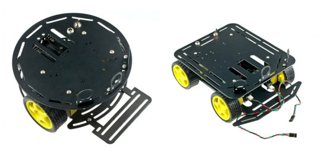
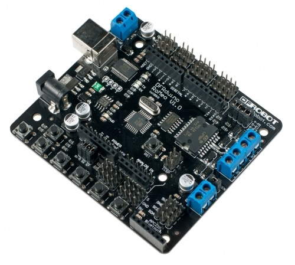
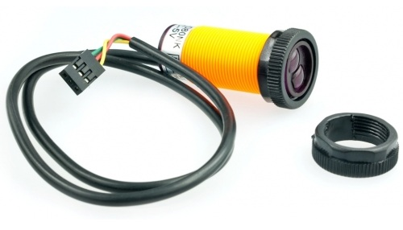

Έρχεται ο χειμώνας με πολλές βροχές, κρύο και βαρεμάρα. Μπορείς να αρχίσεις πλέξιμο, κέντημα, σκι ή οτι άλλο θέλεις. Μπορείς επίσης να φτιάξεις το δικό σου ρομπότ και αυτό θα κάνουμε σήμερα και σε δύο-τρεία ακόμη άρθρα. Ετοιμάστε δάχτυλα και πληκτρολόγια, κολλητήρια και κατσαβίδια, πορτοφόλια και PayPal, γιατί θα φτιάξουμε το ολοδικό μας ρομπότ. Δεν νομίζω να προλάβουμε στο πρώτο άρθρο πολλά αλλά θα δούμε πως θα βγει. Δεν έχω ιδέα από δαύτα. Όχι εντάξει ψυχραιμία κάτι ψιλοξέρω αλλά τα περισσότερα τα μαθαίνω τώρα και στην πορεία. Τα υλικά για το δικό μου ρομπότ είναι στον δρόμο και για να γλυκάνω την αναμονή είπα να ανεβάζω πρόοδο αλλά και πως το σχεδίασα και το έφτιαξα. Φυσικά θα αναλύω αηδιαστικά έτσι ώστε κάποιος με βασικές γνώσεις να πάρει καμιά ιδέα ή και γιατί όχι να φτιάξει και αυτός το δικό του ρομπότ από το μηδέν. Χωρίς πολλά-πολλά, ξεκινάμε;

Για αρχή θα πρέπει να αποφασίσουμε τι θέλουμε να κάνει αυτό το ρομπότ&#8230; Χμμ&#8230; Προφανώς δεν θα μπορεί να κάνει και πολλά και φυσικά δεν θα συγκρίνεται με τον Asimo. Μια καλή αρχή και χωρίς να έχει πολλά έξοδα (αν δεν θες στο μέλλον να εξελιχθεί) είναι ένα ρομπότ που αποφεύγει εμπόδια και ναι, αυτό θα κάνουμε. Για αρχή. Μετά θα έχει και συνέχεια. Μπορείτε να το πάρετε σαν απειλή αυτό. Το ρομπότ αυτό θα είναι ικανό να κινείται (φυσικά!) και μόλις βρεθεί σε κάποιο εμπόδιο να μπορεί να το αποφεύγει, για αρχή λίγο &#8220;χαζά&#8221; αλλά στο μέλλον θα δούμε πως μπορεί να γίνει λίγο εξυπνότερο. Α ναι, θα έχει ρόδες και όχι πόδια.

Θα βασιστούμε πάνω στο Arduino και στις αμέτρητες βιβλιοθήκες και shields που υπάρχουν για αυτό. Το πρόγραμμα μας όπως το υπολογίζω στο μυαλό μου θα είναι γύρω στις 50, το πολύ, γραμμές και με την μισή δουλειά να έχει γίνει από τους διάφορους προγραμματιστές των βιβλιοθηκών. Αυτό βέβαια δε σημαίνει ότι δε θα αναλύσουμε πως λειτουργεί και πως δουλεύει η κάθε βιβλιοθήκη ούτε ότι δε θα το πάμε ένα βήμα πιο πέρα εμείς. Θα προσπαθήσουμε να το κάνουμε λίγο γενικό μιας και υπάρχουν αρκετοί συνδιασμοί hardware και ο καθένας έχει τον δικό του τρόπο λειτουργίας. Ας πάρουμε ένα-ένα όλα τα &#8220;κομμάτια&#8221; που θα χρειαστούμε. Θα προσπαθήσουμε να μην φτιάξουμε τίποτα μόνοι και θα καταφύγουμε σε εύκολες λύσεις. Ναι, ανεβαίνει αρκετά το κόστος αλλά το αποτέλεσμα είναι πολύ καλύτερο από ένα κομμάτι ξύλο με ρόδες και φυσικά θα μπορούμε να αναβαθμίσουμε αρκετά ευκολότερα, αν φυσικά θέλουμε!

Μέχρι τώρα έχω ανακαλύψει δύο μαγαζιά, το ένα είναι το <a href="http://www.dfrobot.com/" title="DFRobot-An Online Opensource Robot and Hardware Shop" target="_blank" rel="noopener noreferrer">DFRobot</a> που έχει κυρίως δικά του προϊόντα, από απλές πλακέτες και ρόδες μέχρι ολόκληρα, επαγγελματικά ρομπότ (με τιμές έως και 4 ψηφία). Από εκεί επέλεξα τα περισσότερα εξαρτήματα για το ρομπότ μου όπως το σασί αλλά και την custom έκδοση του Arduino που θα χρησιμοποιήσω. Το δεύτερο μαγαζί και αυτό που πραγματικά με έσωσε είναι το <a href="http://www.robotshop.com/eu/home.html" title="RobotShop |  Robot Store |  Robots  | Robot Parts  | Robot Kits  | Robot Toys" target="_blank" rel="noopener noreferrer nofollow" class="broken_link">RobotShop της Ευρώπης</a>. Έχει προϊόντα από πάρα (μα πάρα) πολλά μαγαζία και δεν μένει μόνο στα hobby robots, αλλά ξεφεύγει σε αρκετά πολύπλοκα μηχανήματα με αρκετά μηδενικά στις τιμές τους. Με λίγα λόγια είναι μεγάλο και έχει τεράστια ποικιλία. Πρώτο καλό του RobotShop, στέλνει από Γαλλία που σημαίνει ότι γλιτώνεις τραβήγματα με τελωνείο, δεύτερο καλό ότι έχει όλα τα προϊόντα του DFRobot (που βρίσκεται κάπου στην άπω ανατολή) και σε γλιτώνει από ένα μήνα υπομονής αλλά και όπως είπαμε τελωνείο και βόλτες στο αεροδρόμιο.

# 0. Σασί

Όλα όσα φτιάξουμε χρειάζονται μια βάση. Μπορούμε είτε να την φτιάξουμε μόνοι όπως είπαμε πριν, είτε να την αγοράσουμε έτοιμη. Το δεύτερο κατά την γνώμη μου είναι καλύτερο, πιο &#8220;καθαρό&#8221; και φυσικά είμαστε σίγουροι ότι δε θα φεύγουν ρόδες και δε θα διαλύεται κατά την λειτουργία. Επίσης η τιμή ενός έτοιμου σασί είναι αρκετά χαμηλή, οπότε δεν βρίσκω λόγο να μην το αγοράσει κανείς. Εξαιρούνται φυσικά όσοι έχουν laser cutter και κόβουν plexiglass και ξύλο, τότε εντάξει. Εδώ έχουμε δύο επιλογές. Θέλουμε το ρομπότ να είναι με δύο ή με τέσσερις ρόδες; Αν θέλουμε ένα απλό ρομπότ που απλώς αποφεύγει εμπόδια, τότε ένα σασί με δύο ρόδες μας αρκεί. Στο DFRobot υπάρχουν αρκετά σασί και ξεκινούν από 20€, στο eBay επίσης υπάρχει αρκετό υλικό (βλ. keyword: robot chassis και τα related του).

Για το δικό μου ρομπότ επέλεξα το σασί με τις τέσσερις ρόδες από το DFRobot. Καθαρά προσωπική επιλογή ή και βίτσιο. Εδώ να σημειώσουμε ότι καλό θα ήταν το σασί να υποστηρίζει wheel encoders, ειδικά αν στοχεύουμε σε μελλοντική εξέλιξη και αναβάθμιση. Με τα wheel encoders, το ρομπότ θα μπορεί να καταλάβει πόσο έχουν γυρίσει οι ρόδες του με ακρίβεια. Για παράδειγμα αν προχωράει μπροστά, μέσα από τους wheel encoders θα μπορεί να βρει ότι μετακινήθηκε 10 εκατοστά. Ξαναλέω, αν κοιτάμε για ένα απλό ρομπότ δεν μας ενδιαφέρουν αυτά, αφού απλώς θα κουτουλάει στον τοίχο.

# 1. Μυαλό

Όπως είπαμε θα χρησιμοποιήσουμε το Arduino σαν κεντρικό επεξεργαστή. Προσωπικά επέλεξα το DFRobot RoMeo που πρόκειται για μια custom έκδοση της πλακέτας του Arduino με διάφορα εξαρτήματα για ρομπότ ενσωματωμένα πάνω στην πλακέτα. Επιπλέον έχει θέσεις για βύσματα όπου μπορείς να συνδέσεις όλα τα εξαρτήματα που θα έχεις στο ρομπότ σου. Δεν θα χρειάζεται δηλαδή να μπλέκεις με breadboard, καλώδια που πετάνε, βγαίνουν και άλλα τέτοια ωραία.

Φυσικά μπορούμε να χρησιμοποιήσουμε το κλασικό Arduino αλλά θα χρειαστούμε μια &#8220;motor shield&#8221;. Shield στο Arduino είναι οι πλακέτες που μπαίνουν πάνω από αυτό και του προσθέτουν δυνατότητες. Τα μοτέρ είναι αρκετά &#8220;βαριά&#8221; εξαρτήματα και έτσι το Arduino χρειάζεται εξωτερικό hardware για να τα ελέγχει. Η &#8220;motor shield&#8221; κάνει αυτή ακριβώς την δουλειά. Η πρώτη &#8220;motor shield&#8221; και αυτή που θα χρησιμοποιήσουμε σχεδιάστηκε από την γνωστή ladyada και στο eBay μπορούμε να βρούμε κλώνο της γύρω στα 8€. Το DFRobot RoMeo όπως είπαμε έχει ενσωματωμένο αυτό το hardware οπότε γλιτώνουμε ήδη μια shield!

# 2. Αισθητήρες

Αφού το ρομπότ μας απλά θα αποφεύγει εμπόδια (ξαναλέω για 12338η φορά: ΓΙΑ ΑΡΧΗ!), δεν χρειάζεται να έχει περίεργους αισθητήρες. Αν επιλέξουμε κάποιο από τα προηγούμενο σασί του DFRobot, τότε υπάρχουν ήδη θέσεις για συγκεκριμένους αισθητήρες υπερύθρων. Τους παρακάτω αισθητήρες μπορούμε να τους βρούμε και στα δύο μαγαζία που είπαμε πριν αλλά και στο eBay σε χαμηλότερη τιμή και με δωρεάν έξοδα αποστολής. Επίσης, ο τρόπος που μπορούμε να ελένξουμε αν έχουν εντοπίσει κάποιο εμπόδιο είναι κάτι παραπάνω από γελοίος, με μια απλή κλήση στην συνάρτηση `digitalRead()` του Arduino.


int read_sensor(int sensor_pin) {  
  // Extra stuff here, debouncing, etc.  
  return digitalRead(sensor_pin);  
}  


Τέλος, να σημειώσω ότι επιπλέον δίνουν την δυνατότητα να ρυθμίσεις μέχρι ποιά απόσταση θες να εντοπίζουν εμπόδια, από περίπου 3 έως 80 εκατοστά! Τους συγκεκριμένους τους παρήγγειλα από έναν πωλητή στο eBay και έφτασαν προ ολίγων ημερών. Μπορώ να πω ότι έπαθα πλάκα και από ποιότητα κατασκευής αλλά και από τρόπο λειτουργίας! Είχα τραυματικές εμπειρίες με αισθητήρες υπερύθρων στα παιδικά μου χρόνια, οπότε ναι, ενθουσιάζομαι εύκολα.

Αυτό ήταν, θέλατε και άλλο; Το μόνο που θα πρέπει να προσέξουμε είναι όλα τα εξαρτήματα που θα επιλέξουμε να ταιριάζουν μεταξύ τους ή με κάποιο τρόπο να τα ταιριάξουμε εμείς και φυσικά να επικοινωνούν μεταξύ τους (ένα απλό Google search θα δώσει άμεση απάντηση). Ο κώδικας και η συναρμολόγηση σε λίγες εβδομάδες, όταν αρχίσουν να καταφθάνουν τα εξαρτήματα του ρομπότ μου. Για την ώρα, όλα εξαρτώνται από το RobotShop που δεν έχει stock το DFRobot RoMeo.