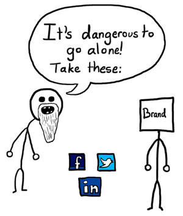

Είτε πρόκειται για προσωπική σελίδα είτε για την σελίδα της μεγαλύτερης πολυεθνικής σε όλο το διαγαλαξιακό βασίλειο, τα social media sharing κουμπιά παίζουν αρκετά μεγάλο ρόλο στην κίνηση και στην αλληλεπίδραση των επισκεπτών με αυτό. Είναι ένας τρόπος να σπαμμάρεις τον κόσμο γύρω σου για το νέο άρθρο που ανέβασες, να μοιραστείς ιδέες και άλλα τέτοια ωραία που ως απώτερο σκοπό, κακά τα ψέματα, έχουν να ανεβάσουν τις επισκέψεις. Αυτή είναι η μόνη ευχαρίστηση εξάλλου.

Τρία είναι κατά την γνώμη μου τα μόνα κουμπιά που χρειάζεται κάθε site. Ένα για το Facebook, ένα για το Twitter και φυσικά για το νέο Google Plus που μετράει γενικότερα για το Google. Κάθε εταιρία δίνει τον δικό της τρόπο για να ενσωματώσεις το κουμπί του στο site σου. Είναι λίγο μπέρδεμα και απαιτεί αρκετές γνώσεις για να το κάνεις να δουλέψει όπως θες εσύ, ειδικά αν θες να το ενσωματώσεις σε blog ή κάποιο CMS. Το πρόβλημα που αντιμετώπισα εξ αρχής ήταν με το Like button του Facebook που πάει όπου αυτό θέλει και αρνείται να στοιχειθεί με τα υπόλοιπα κουμπιά (Twitter και +1 παίζουν καλά μεταξύ τους). Επίσης χρειάζονται άπειρο κώδικα το καθένα και μπλα μπλα μπλα&#8230; Ξενέρωσα.

Την λύση την έδωσε το AddThis, το οποίο αναλαμβάνει να ενσωματώσει σε οποιαδήποτε σελίδα εσύ θες, όποια κουμπιά εσύ θες, από οποιοδήποτε sharing site, με λίγες γραμμές κώδικα. Επιπλέον παρέχει στατιστικά για το πως οι επισκέπτες χρησιμοποιούν τα sharing κουμπιά του site που προσωπικά δεν με ενδιαφέρει, αλλά σίγουρα κάποιος θα το βρει χρήσιμο, ειδικά αν θέλει να δει ποιες υπηρεσίες χρησιμοποιούνται περισσότερο. Τι να το κάνεις το Stumble κουμπί αν δεν το πατάει κανείς;

Για αρχή πηγαίνουμε στην σελίδα του <a href="https://www.addthis.com/" title="AddThis - Get Your Button" target="_blank" rel="noopener noreferrer">AddThis</a>. Πρώτη μούρη είναι κατευθείαν ο κώδικας HTML που θα χρειαστεί να προσθέσουμε στην σελίδα μας. Επιπλέον, στα αριστερά, υπάρχουν αρκετές επιλογές για το πως θέλουμε να εμφανίζονται τα κουμπιά. Προσωπικά επέλεξα την κλασική εμφάνιση των κουμπιών χωρίς τα πειράγματα που έχουν κάνει αυτοί και έβγαλα το τέταρτο που εμφανίζει το menu του AddThis. Έμεινε κάπως έτσι ο κώδικας μου δηλαδή.


<!-- AddThis Button BEGIN -->  

  
  
  

<!-- AddThis Button END -->


Στην συνέχεια το μόνο που χρειάζεται είναι να τον τοποθετήσουμε σε οποιοδήποτε μέρος της σελίδας μας θέλουμε, είτε αυτή είναι μια απλή στατική HTML είτε το πιο ακριβό CMS του κόσμου. Περισσότερο πείραγμα στα κουμπιά μπορούμε να κάνουμε διαβάζοντας <a href="https://www.addthis.com/help/custom-buttons" title="AddThis - Help - Custom Buttons" target="_blank" rel="noopener noreferrer">το καταπληκτικό documentation της υπηρεσίας</a>. Εδώ να πω πως ακόμη δεν είμαι ευχαριστημένος καθώς το κενό μεταξύ κουμπιών και πάλι κάνει κάτι τρελά αν έχεις το Facebook στα Ελληνικά αλλά τουλάχιστον είναι πολύ καλύτερα από πριν. Τα κουμπιά είναι και στοιχισμένα αλλά γλιτώσαμε και καμιά σαρανταριά γραμμές κώδικα!