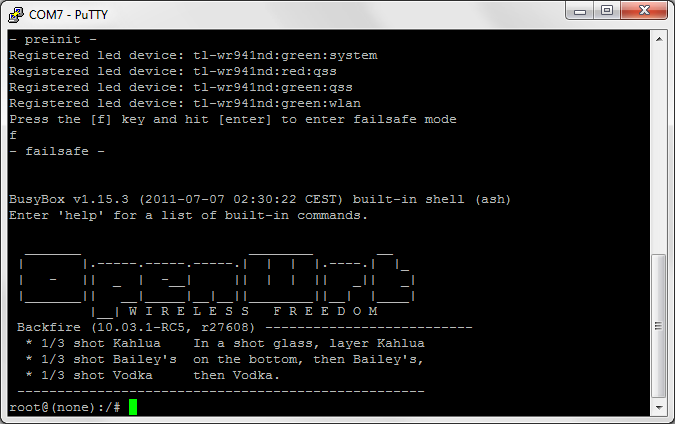
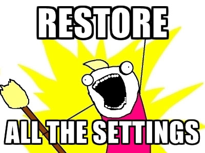

Some say that you learn by your mistakes. Well, yes, that time I learned I shouldn&#8217;t mess with routing on a router. Some weeks ago I was trying to convert a TP-Link TL-WR841ND I own to a pure network bridge. NOT routed mode, just forwarder. Well, evething was fine in my brain until I managed to configure the router the way I had imagined. After some lines of iptables rules everything worked perfectly and I was happy with it until I realized I was locked out of the router itself. Everything coming from the WAN port was blindly forwarded to the LAN ports (WiFi was off because it is off by default). I could not longer access the router&#8217;s web UI and SSH server and all I got was a simple network hub with two antennas for decoration.

I forgot to mention that the router runs OpenWRT and that I had previously been under the covers as I was trying to add USB functionality to it. What does that mean? I had spotted where the TTL serial pads are and I was ready for everything. A router&#8217;s serial interface is the last possible way for you to communicate with it. Well, before JTAG, but who has the necessary hardware at home for it?

# 30/30/30 reset

This is the first attempt to reset the hardware if you get locked out or if you misconfigure the router. The 30/30/30 reset is supported by almost any router. Actually, I&#8217;m not really sure if that is 100% correct but it doesn&#8217;t take much time to test and that&#8217;s why I tried it and I&#8217;m posting it here. It&#8217;s called the 30/30/30 reset because you will need to press the router&#8217;s reset button for thirty seconds for three period. Firstly, while the router is plugged in and running, press the reset button and keep pressing for thirty seconds. After the thirty seconds pass, remove the power jack but **keep pressing the reset button**. After another thirty seconds, plug in the router and **keep the button pressed** for another thirty seconds. If you do this correctly, the router should be reseted and ready to be bricked again. As I mentioned earlier, I didn&#8217;t have any success with this method so I&#8217;m just referencing. It defenitely works the try.

# Easy failsafe mode

Every OpenWRT router has a failsafe mode. In failsafe, the router attempts to bypass almost all configuration in favor of a few hard coded defaults, resulting in a router that boots up as 192.168.1.1/24. Yes, that was a verbatim copy of the official explanation. So, if we boot our router in failsafe mode, will we be able to recover it? Yes.

Entering the recovery mode is done by simply pressing a hardware button on the device during bootup. In the TP-Link TL-WRxxx series it is done by holding the QSS button while the system is booting (while the System LED is flashing). If done correctly, the System LED will start blinking alot faster and the device should be pingable on 192.168.1.1. No DHCP and sorcery here, you will need to set your computer manually to IP 192.168.1.2 (or anything else in the /24 subnet), subnet mask 255.255.255.0 and gateway as the router&#8217;s IP. If everything went right, from entering the failsafe mode to manually assinging the IP to your computer, the router should be pingable and telnet-able over it&#8217;s IP. Skip to &#8220;Using failsafe mode&#8221;, you are so unlucky you are not going to see the insides of your router!

# Hard failsafe mode

This is the hardest and last way to communicate with the router. You will need to open the router housing, some soldering skills (level 70 or more), a TTL adapter and lots of luck. I assume you have opened your router, if you haven&#8217;t, ask a younger relative to do it for you, they are seem to be able to crack things open alot faster than adults.

Locate the four pads to the left of the PCB, a little higher from the WiFi module (that big metal thing is the RF shield of the WiFi module). Now forget about the pads, we are not going to use them. Locate the resistors R356 and R537 bellow them, you should attach two cables on them. It is extremely difficult but possible if done correctly. Also attach a cable on the WiFi shield, we are going to use it as GND.

I forgot to mention that my router is V3.4 (that&#8217;s printed on the label) with a board version that I can&#8217;t recall right now. I couldn&#8217;t find information about that specific PCB version on the Internet. If your router is another version, more likely V5.0 and above, you should consult the official OpenWRT documentation. The only thing that differs is the location of the TTL pads.

Connect the three wires to your TTL adaptor. The cable from R356 is router&#8217;s TX line and should go to adaptor&#8217;s RX line. Resistor R537 is router&#8217;s RX and should go to adaptor&#8217;s TX. GND should be the same on both sides. 

Connect the adaptor to your computer and start your favorite serial monitor. I used PuTTY. When the router boots, U-boot begins transmiting at 9800 8N1 and then kernel switches to 115200 8N1. You should set PuTTY to 115200 baudrate. You won&#8217;t be able to see the U-boot boot sequence but that doesn&#8217;t matter, it&#8217;s cool though. Boot the router and soon a lot of messages will show up on the window. You will have to be quick, press &#8216;f&#8217; and then Enter. The router should start at failsafe and you will be given a root shell to it.

## Using failsafe mode

Now that you have access to your router and feel the warmth of the root console, it&#8217;s time to revert the changes that have been made. I won&#8217;t go into much detail because I suppose one can figure out how to revert the wrong settings. In my case, I just wiped the whole JFFS2 partition. That can be easily done by running the following commands.


mount_root
firstboot


The first one will mount the JFFS2 partition of the router and the second one will restore all the settings. Finally, either run reboot -f or unplug the power to reboot the router. The device now is in it&#8217;s initial state with all the settings reset. Have fun!

