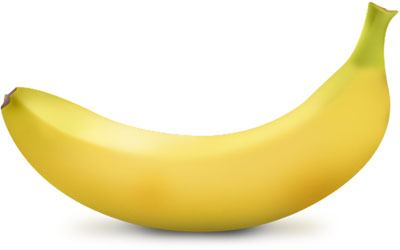
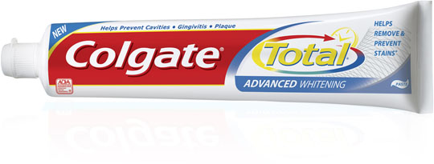
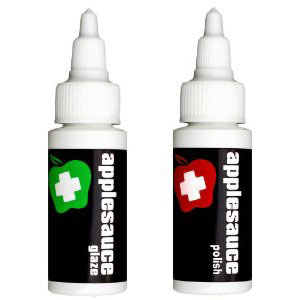
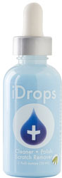
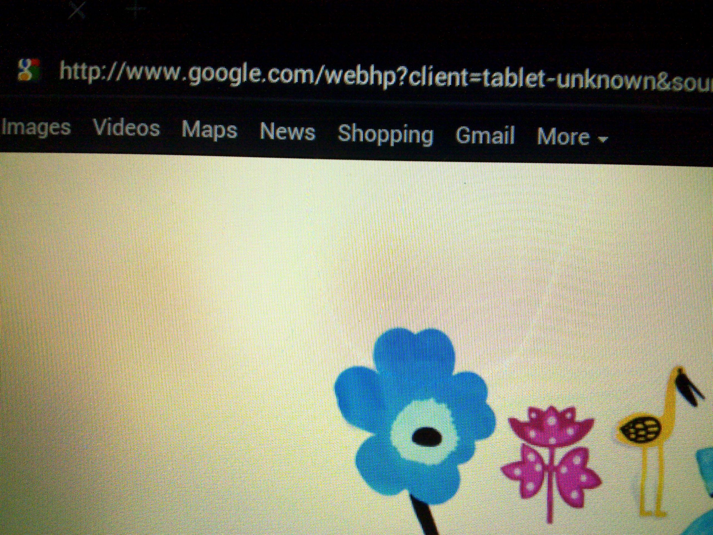
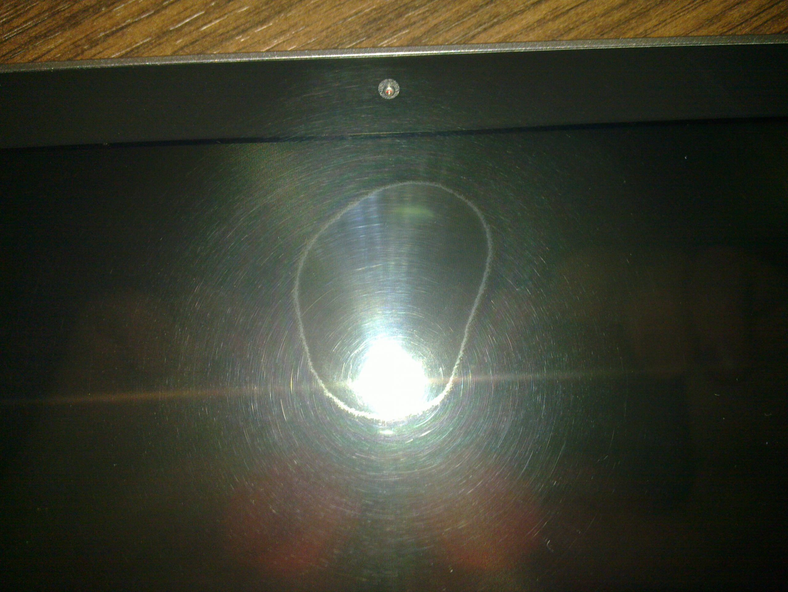

Πριν μερικές εβδομάδες και ένα ωραίο πρωινό έπρεπε να ξυπνήσω για να παρακολουθήσω την έκθεση της Nokia στο Mobile World Congress. Νύσταζα πολύ μιας και έχω να σηκωθώ πριν τις εννιά εδώ και μερικά χρόνια. Σαν καλός τεμπέλης λοιπόν, άρπαξα το καινούριο τότε tablet μου και ξεκίνησα να διαβάζω τα νέα της έκθεσης από τις διάφορες καλύψεις που κάνουν τα ξένα μεγάλα site μέσα από τα ζεστά σκεπάσματα του κρεβατιού μου. Σε ένα από τα refresh που έκανα γιατί ως συνήθως το autorefresh σε αυτά τα site είτε κολλάει είτε δε δουλεύει χρειάστηκε να κάνω scrolldown αρκετά κάτω.

Δε ξέρω αν παίζει ρόλο η γκαντεμιά μου, η ποιότητα του πλαστικού ή ότι είμαι απλά χαζός αλλά κατάφερα να κάνω μερικές αρκετά μικρές αλλά ενοχλητικές γρατζουνιές στο πλαστικό της οθόνης απλά με το νύχι μου. Μετά τα κατάλληλα καντήλια, κατάρες και μερικά post για τα νέα της Nokia στο <a href="http://pestaola.gr/" title="pestaola.gr blog, ελληνικό blogging στα καλύτερα του" target="_blank" rel="noopener noreferrer nofollow" class="broken_link">pestaola.gr</a>, αποφάσισα να δω τι μπορώ να κάνω. Δεν με πείραζε η γρατζουνιά σαν γρατζουνιά αλλά αυτό που πραγματικά με ενοχλούσε ήταν το ότι ανάβοντας το backlight φαινόταν ενοχλητικά πολύ και ήταν ακριβώς στο κέντρο της οθόνης. Δεν μου έχει ξανατύχει ποτέ κάτι παρόμοιο οπότε ξεκίνησα με σπιτικές λύσεις.

# Η μέθοδος της μπανάνας

Όσο αστείο και αν ακούγεται, δουλεύει. Τρίβοντας λίγο από την σάρκα της μπανάνας και στην συνέχεια με το εσωτερικό της φλούδας καταφέρνεις να &#8220;γεμίσεις&#8221; την γρατζουνιά. Δεν είχα τι να κάνω εκείνο το μεσημέρι, μπανάνες Τσικίτα φρέσκες είχαμε και έτσι το δοκίμασα. Προς μεγάλη μου έκπληξη, δούλεψε! Γέμισε ο τόπος μπανανόζουμα αλλά η γρατζουνιά έφυγε. Η χαρά μου βέβαια κόπηκε απότομα μόλις καθάρισα την οθόνη. Η μπανάνα και τα ζουμιά της έφυγαν και ξαναήρθαμε στην αρχική κατάσταση. Φυσικά δε θα άφηνα την οθόνη με τις μπανάνες και τα ζουμιά πάνω για μια γρατζουνιά οπότε χρειαζόμουν κάτι καλύτερο.

# Η μέθοδος της οδοντόκρεμας

Ακόμη μια παράδοξη μέθοδος αφαίρεσης γρατσουνιών την οποία δε δοκίμασα. Λειτουργεί με ακριβώς τον ίδιο τρόπο και ξεκίνησε και αυτή για να διορθώνονται γρατσουνιές σε CD και DVD. Η οδοντόκρεμα και καλά γεμίζει την γρατζουνιά και τελικώς δε φαίνεται. Στην αρχή νόμιζα πρόκειται για πλάκα μιας και οι οδοντόκρεμες μέσα έχουν, δε μου έρχεται η λέξη, κάτι σαν άμμο οπότε πίστευα θα γίνει χειρότερα (σαν να τρίβεις γυαλόχαρτο). Αυτός ήταν και ο λόγος που δε το δοκίμασα βασικά. Παρόλα αυτά η προφητεία λέει πως αν βρεις λευκή οδοντόκρεμα, πάστα, θα δουλέψει. Σαν την μπανάνα; Μεχ. Πάμε σε άλλες, πιο βαρβάτες λύσεις.

# Applesauce Polish

Τι μαλακία προϊόν. Δε μου δούλεψε και μου στοίχισε ο κούκος αηδόνι. Το είχε μόνο ένα Ελληνικό μαγαζί στην Βέροια και ήθελε γύρω στα 9€ μεταφορικά (7€ το κούριερ αν θυμάμαι καλά και 2€ επιπλέον η αντικαταβολή). Παρόλα αυτά το είχα μέσα σε δύο ημέρες. Μπορεί βέβαια να έκανα κάτι λάθος στην χρήση του αν και διάβασα πολλές φορές τις οδηγίες. Ήταν μαλακία γενικότερα η εμπειρία μου. Το ματζούνι αυτό εχει δύο μπουκαλάκια, το ένα κόκκινο και το άλλο πράσινο. Πρώτα περνάς το κόκκινο, που ονομάζεται Polish, τρίβεις για ώρα με πολλές επαναλήψεις και μέχρι να σβηστούν οι γρατσουνιές. Στην συνέχεια και όταν είσαι ευχαριστημένος με το αποτέλεσμα περνάς το πράσινο, που έχει όνομα Glare, ρίχνεις και δύο ευχές και βλέπεις αποτελέσματα. Ίσως να μην ήταν για τον τύπο την οθόνης μου αλλά το δεύτερο άφηνε μια αηδιαστική γλίτσα επάνω. Ένιωθες λες και είχε γεμίσει λάδι μηχανής και επιπλέον μύριζε σαν Play-Doh. Ναι το θυμάμαι πως μύρισε τόσα χρόνια μετά. Το μόνο αρκετά θετικό ήταν πως μέσα στην συσκευασία είχε τρία μεγάλα κομμάτια βαμβακερό ύφασμα τα οποία με λίγο ξέβγαλμα ήταν ξανά έτοιμα για χρήση.

# iDrops

Η λύση στο πρόβλημα! Σχεδόν, δηλαδή. Το iDrops έδωσε λύση στο πρόβλημα μου με λίγο περίεργο τρόπο. Σύμφωνα με τις οδηγίες, για να δεις αποτέλεσμα θα χρειαστεί να τρίβεις επί 15 με 45 λεπτά ρίχνοντας μερικές σταγόνες κάθε 10 με 15 δευτερόλεπτα. Επιπλέον, σε αντίθεση με το Applesauce Polish, απαιτεί την άσκηση μέτριας πίεσης. Στις πρώτες δύο εφαρμογές δεν ασκούσα πολύ, παρόλα αυτά η γρατζουνιά γέμισε και δεν ήταν ορατή στην συσκευή. Όλα καλά μέχρι που άνοιγε το backlight και ήταν σαν να μην είχα κάνει τίποτα. Στην τρίτη εφαρμογή και με αρκετή ξενέρα αποφάσισα να προσθέσω πολύ περισσότερη πίεση για να δω τι θα γίνει μιας και η γρατσουνιά φαινόταν ότι θόλωνε περιμετρικά. Μετά από 20 με 30 λεπτά είδα τα αποτελέσματα και ομολογώ ενθουσιάστηκα. Οι γρατσουνιές άρχισαν να σβήνουν με ένα μικρό τίμημα. Άρχισε να τρώγεται κατά πολύ το πλαστικό της οθόνης.

    
Από το πολύ τρίψε-τρίψε άρχισε να θολώνει γενικότερα, πράγμα που δε με ενοχλεί καθόλου καθώς δεν εμποδίζει στην λειτουργία του tablet. Αντί δηλαδή να φαίνεται η γρατσουνιά κατά την λειτουργία, φαίνεται μια θολούρα όταν είναι κλειστό το backlight. Fair enough. Συνέχισα μέχρι να σβηστούν τελείως οι γρατσουνιές και μπορώ να πω έγινε σαν καινούριο. Η τελευταία κίνηση ήταν να &#8220;καθαρίσω&#8221; λίγο την θολούρα και αμέσως μετά να βάλω το προστατευτικό οθόνης. Επιπλέον το προστατευτικό κρύβει την θολούρα που δημιούργησε το iDrops σε εκείνο το σημείο το οποίο κάνει να φαίνεται σαν καινούριο. Νίκησα!