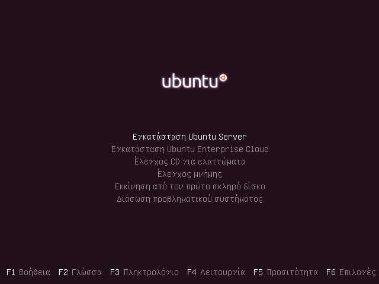
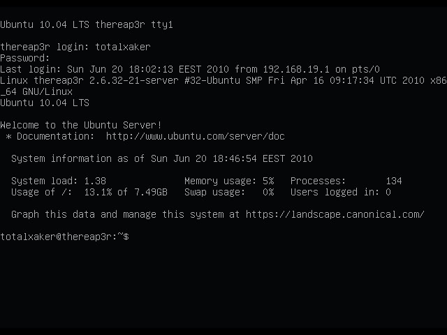
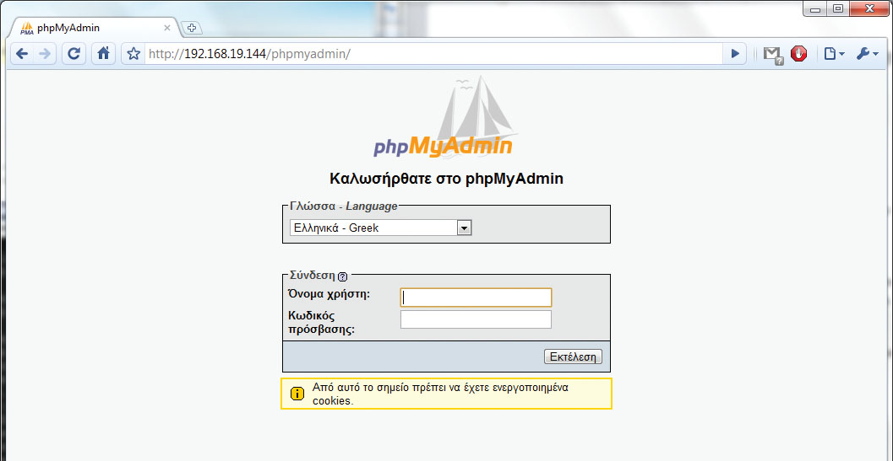
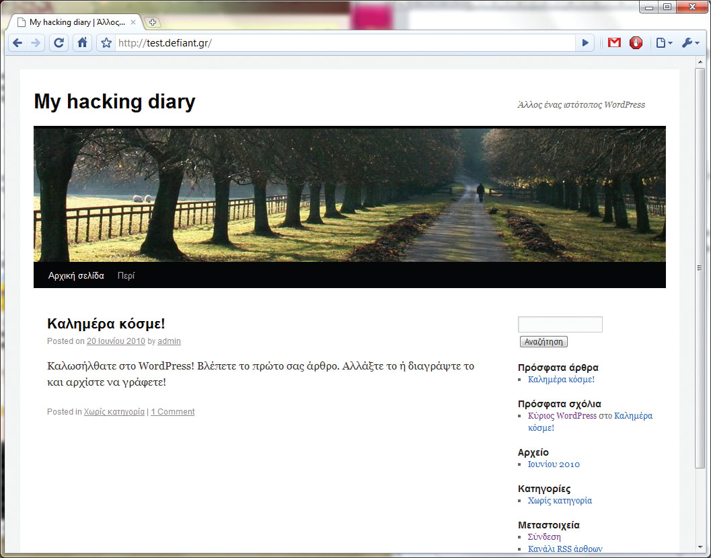

Σίγουρα όλοι έχουμε κάποιον παλιό υπολογιστή που \*δεν\* πολυχρησιμοποιούμε&#8230; Αν τον χρησιμοποιούμε και καθόλου! Μηχανάκια που έχουν γλιτώσει από το μικρό μας ξαδερφάκι και που συνήθως δεν είναι ικανά ούτε πασιέντζα να σηκώσουν. Πριν ξεκινήσετε να διαβάζετε αυτό το άρθρο, θα χρειαστεί να βρείτε εκείνο το παλιό μηχάνημα, λοιπόν, και να σιγουρευτείτε ότι δουλεύει. Στη συνέχεια, ακολουθώντας τα βήματα που θα παραθέσουμε θα καταφέρετε να το κάνετε τον προσωπικό σας, απλό web server, στον οποίο θα μπορέσετε να φιλοξενήσετε ένα πειραματικό ή επίσημο blog ή άλλες ιστοσελίδες!

Οποιοδήποτε μηχάνημα κάνει, αρκεί να ’χει τουλάχιστον 256MB RAM. Ένας server δεν χρειάζεται τίποτα παραπάνω από ένα σκληρό δίσκο, μία κάρτα δικτύου και μία (απλή) κάρτα γραφικών. Συσκευές ανάγνωσης ή εγγραφής οπτικών δίσκων χρειάζονται μία φορά κατά την εγκατάσταση του λειτουργικού: ύστερα μπορούν ν’ αποσυνδεθούν. Αν σιγουρευτούμε ότι οι ανεμιστήρες και οι ψύκτρες δεν έχουν σκό- νη, θα καταφέρουμε να κάνουμε καλύτερη τη ροή του αέρα μέσα απ’ αυτές. Έτσι, το μηχάνημα δεν θα ζεσταίνεται τόσο και τα αφτιά μας δεν θα ενοχλούνται από το μόνιμο ήχο των ανεμιστήρων. Οποιαδήποτε άλλη πατέντα ή και η λογική αφαίρεση μερικών ανεμιστήρων απ’ το κουτί είναι δεκτή! Χρειάζεται ακόμη να βρούμε ένα ωραίο μέρος για το νέο μας server. Κάτω απ’ το γραφείο, κάτω απ’ το κρεβάτι, μέσα στην ντουλάπα – οι μόνοι μας περιορισμοί είναι τα καλώδια ρεύματος και δικτύου. Ο γράφων έχει βρει την καλύτερη θέση για home server, μέσα στο συρτάρι του γραφείου του!

# Προετοιμασίες

Πριν ξεκινήσουμε τη διαδικασία της εγκατάστασης θα χρειαστεί να μπούμε στο BIOS του συστήματος. Εκεί θα βρούμε αρκετές ρυθμίσεις. Οι περισσότερες, για την ώρα, δεν μας ενδιαφέρουν. Μια καλή ιδέα είναι να απενεργοποιήσουμε τυχόν άχρηστες συσκευές, όπως, π.χ., onboard κάρτες ήχου, θύρες FireWire, σειραϊκές ή παράλληλες πόρτες και γενικά ό,τι θεωρούμε πως δεν μας χρειάζεται. Ακόμη, αφού τελειώσουμε με την εγκατάσταση του λειτουργικού, στη σειρά boot των συσκευών του BIOS καλό θα ’ταν να θέσουμε πρώτο το σκληρό. Έτσι κερδίζουμε γύρω στα 2 με 3 δευτερόλεπτα στο χρόνο εκκίνησης του μηχανήματος. Αφού τελειώσουμε όλα αυτά, μπορούμε να προχωρήσουμε στην εγκατάσταση! Ένας χάκερ που σέβεται τον εαυτό του δεν επιλέγει πάντα το φανταχτερό δρόμο. Έτσι κι εμείς θα εγκαταστήσουμε Ubuntu Server Edition, μια και η εκδοχή Desktop έχει αρκετά άχρηστα καλούδια που, στην περίπτωσή μας μόνο μνήμη και σκληρό καταλαμβάνουν. Γιατί Ubuntu, όμως; Είναι από τις πιο διαδεδομένες διανομές Linux αυτή τη στιγμή, με τεράστια υποστήριξη από την κοινότητά του αλλά κι από την Canonical. Ίσως υπάρχουν και καλύτερες διανομές, αλλά το Ubuntu είναι ό,τι πρέπει για την περίπτωσή μας. Μπορούμε να κατεβάσουμε την τελευταία έκδοση της εκδοχής Server από το www.ubuntu.com/server/get-ubuntu/download.

**Προσοχή:** Μια και μιλάμε για παλιό μηχάνημα, το πιθανότερο είναι είτε να μη μας κάνει η 64bit version είτε να είναι απλά περιττή. Με άλλα λόγια, το πιθανότερο είναι ότι θα πάμε με τo 32μπιτο Ubuntu Server – και, μάλιστα, δεν θα το μετανιώ- σουμε ποτέ. Αφού κατεβεί το αντίστοιχο ISO θα χρειαστεί να το γράψουμε σ’ ένα άδειο δισκάκι CD. Μπορούμε να χρησιμοποιήσουμε οποιοδήποτε εργαλείο, υπάρ- χουν πολλά εκεί έξω! (Βλ., π.χ., το ImgBurn για Windows, www.imgburn.com.)

# Εγκατάσταση συστήματος

Παρ’ όλο που ένας server δεν χρειάζεται συνέχεια οθόνη και πληκτρολόγιο, κατά την εγκατάσταση αυτά θα μας χρειαστούν. Αν δεν υπάρχει κάποιο extra σετ μπο- ρούμε να δανειστούμε οθόνη και πληκτρολόγιο από το κύριο μηχάνημά μας. Έχετε υπόψη ότι η εγκατάσταση δεν θα διαρκέσει πάνω από 30 λεπτά! Αφού λοιπόν βεβαιωθούμε ότι το BIOS είναι ρυθμισμένο ώστε το PC να ξεκινά από την οπτική μονάδα, βάζοντας το CD θ’ αρχίσει η διαδικασία της εγκατάστασης. Αμέσως θα μας υποδεχτεί με ένα μενού επιλογής γλώσσας. Εδώ έρχεται το πρώτο δίλημμα: ελληνικά ή αγγλικά; Αν και τα αγγλικά είναι η καλύτερη επιλογή, θα επι- λέξουμε ελληνικά. Δεν υπάρχει λόγος ανησυχίας, μια κι αργότερα παρέχεται δυνα- τότητα αλλαγής. Στη συνέχεια, επιλέγουμε «Εγκατάσταση Ubuntu Server»<a href="#footnote1">1</a>. Στη νέα οθόνη –βασιζόμενο στην προηγούμενη επιλογή μας για τη γλώσσα– το πρόγραμ- μα της εγκατάστασης θα μας ρωτήσει αν μένουμε Ελλάδα ή Κύπρο. Επιλέγουμε ανάλογα. Στην επόμενη οθόνη θα μας ζητηθεί να ρυθμίσουμε το πληκτρολόγιο. Πατώντας «Ναι» θα χρειαστεί να πατήσουμε μερικά πλήκτρα για να αναγνωρίσει ο installer τι πληκτρολόγιο έχουμε. Αφού λοιπόν το κάνουμε, αυτόματα θα καταλάβει ότι το πληκτρολόγιό μας είναι ελληνικό και η εγκατάσταση θα συνεχιστεί. Παρακάτω επιλέγουμε με ποιο συνδυασμό πλήκτρων θέλουμε ν’ αλλάζουμε γλώσσα ή αφήνουμε τον πλέον κλασικό, τον [Alt+Shift]. Πατώντας [Enter] θ’ αρχίσει το φόρτωμα κάποιων απαραίτητων πακέτων για τη συνέχιση της εγκατάστασης κι όταν ολοκληρωθεί θα μας ζητηθεί κάποιο hostname για το μηχάνημά μας. Εδώ θέλει λίγη φαντασία. Υπάρχει μια τάση να δίνονται στους server ονόματα αρχαίων θεών, όπως zeus, osiris, iris και διάφορα άλλα. Αυτό βέβαια δεν σημαίνει ότι υπάρχει πρόβλημα αν, π.χ., αποφασίσουμε να ονομάσουμε τον server μας tinkerbell ή pocahontas! Αφού αποφασίσουμε, πάλι βασισμένος στην πρώτη μας επιλογή ο installer θα μας ρωτήσει αν η ζώνη ώρας μας είναι η «Europe/Athens» ή η αντίστοιχη για την Κύπρο.

Ήρθε η ώρα να χωρίσουμε το δίσκο σε διαμερίσματα. Δεν χρειάζεται να παιδευτούμε χωρίζοντάς τον μόνοι μας. Επιλέγοντας το «Καθοδηγούμενη διαμέριση – χρήση ολόκληρου του δίσκου» ξεμπερδέυουμε μια και καλή. Ο εγκαταστάτης θ’ αναλάβει μόνος του να χωρίσει τον σκληρό και να δεσμεύσει συγκεκριμένο χώρο για την αντιμετάθεση (swap<a href="#footnote2">2</a>). Θα μπορούσαμε να πατήσουμε «Διαχείριση με το χέρι» για να χωρίσουμε ακριβώς όπως θέλουμε το δίσκο, αλλά για τη δουλειά που θέλουμε το μηχανάκι ειλικρινά δεν αξίζει να μπούμε στον κόπο. Όταν τελειώσουμε και με το partitioning, θα ξεκινήσει η αντιγραφή αρχείων στο δίσκο. Στο τέλος της διαδικασίας θα ζητηθεί όνομα χρήστη. Μπορούμε να δώσουμε τ’ όνομά μας. Φυσικά, θα χρειαστεί να δώσουμε και το username που προτιμάμε για να συνδεόμαστε. Ήρθε η ώρα για τον κωδικό πρόσβασης. Όσοι έρχονται από άλλα λειτουργικά θα νομίζουν ότι αυτός είναι ο κωδικός του διαχειριστή (root). Δεν ισχύει το ίδιο στο Ubuntu. Ο χρήστης που δημιουργείται κατά την εγκατάστα- ση έχει τον κλασικό κωδικό του αλλά \*και\* δικαιώματα διαχειριστή, μέσω των εντολών sudo και su (Σ.τ.Α. Χρησιμοποιείται κυρίως η πρώτη). Ο λογαριασμός root στο Ubuntu –και σ’ άλλες διανομές Linux που βασίζονται σ’ αυτό– είναι απε- νεργοποιημένος. Θα ερωτηθούμε αν θέλουμε να κρυπτογραφείται ο προσωπικός μας κατάλογος. Ξέρετε, αυτός της μορφής /home/username. Για διάφορους λόγους δεν θα επιλέξουμε να γίνεται κρυπτογράφηση των αρχείων. Προχωράμε! Καλό θα ’ταν να επιλέξουμε την αυτόματη εγκατάσταση ενημερώσεων ασφαλείας. Με απλά λόγια, ενημερώσεις που αφορούν στην ασφάλεια του συστήματος θα εγκαθίστανται αυτόματα. Εντάξει, δεν φτιάχνουμε server εταιρείας, αλλά καλό είναι να ’χουμε πάντα τις τελευταίες ενημερώσεις, ειδικά τώρα που αυτές γίνονται αυτόματα! (Αν είστε τακτικοί αναγνώστες του περιοδικού σίγουρα θα ξέρετε πόσο σημαντικό είναι να ’χουμε τις πλέον πρόσφατες ενημερώσεις ασφαλείας, για όλα τα προγράμμα- τα του υπολογιστή μας και μάλιστα ανεξαρτήτως λειτουργικού συστήματος.) Στην επόμενη καρτέλα υπάρχουν κάποιες επιλογές για το ποια services θα ενερ- γοποιηθούν στο νέο μας μηχάνημα. Στη συνέχεια του άρθρου θα μιλήσουμε πιο αναλυτικά γι’ αυτά και θα τα εγκαταστήσουμε με το χέρι. Τέλος, πατώντας «Ναι» θα εγκατασταθεί το Grub, ο bootloader για το νέο μας OS. Αυτό ήταν! Ο installer θα εξαγάγει το δισκάκι CD από τον οδηγό και θα κάνει επανεκκίνηση. Αν όλα πήγαν καλά, το Ubuntu Server θα ξεκινήσει και θα περιμένει να κάνουμε login.

# Φέρνοντας το σύστημα στα μέτρα μας

Αφού εγκαταστήσαμε το λειτουργικό ήρθε η ώρα να ρυθμίσουμε κατάλληλα τον server μας για τις δουλειές που τον θέλουμε. Για αρχή, πρέπει να αναβαθμίσουμε τα πακέτα των προγραμμάτων του, μια και το CD περιέχει τις εκδόσεις από την ημερομηνία που δημιουργήθηκε το αντίστοιχο ISO image. Για να το κάνουμε αυτό, πληκτρολογούμε τις δύο παρακάτω εντολές<a href="#footnote3">3</a>.


sudo apt-get update  
sudo apt-get upgrade  


Αυτές οι δύο εντολές αναλαμβάνουν ν’ αναβαθμίσουν το λειτουργικό. Πιο συγκεκριμένα, η πρώτη ενημερώνει μια βάση δεδομένων που περιλαμβάνει πακέτα κι αντίστοιχες εκδόσεις, η δεύτερη ενημερώνει τα ίδια τα πακέτα. Πιο απλά, πριν εκτελέσουμε τη δεύτερη εντολή το Ubuntu έχει μάθει, χάρη στην πρώτη εντολή, αν υπάρχουν ή όχι νέα πακέτα 😉 Σ’ αυτό το σημείο –κι αφού έχει τελειώσει η αναβάθμιση των πακέτων– καλό θα ’ταν να κάνουμε επανεκκίνηση στο μηχάνημα για να ξεκινήσει με το νέο πυρήνα (kernel), ο οποίος μόλις εγκαταστάθηκε! (Προφανώς, αυτό δεν σημαίνει ότι σε κάθε αναβάθ- μιση αλλάζει ο πυρήνας και χρειάζεται επανεκκίνηση.) Αφού ξεκινήσει ξανά το λει- τουργικό, κάνουμε ξανά login. Θα εγκαταστήσουμε τώρα έναν SSH server, το γνωστό σε όλους μας OpenSSH. Αυτός μας επιτρέπει να συνδεόμαστε στον server μας από οποιοδήποτε υπολογιστή, χρησιμοποιώντας ένα ασφαλές, κρυπτογραφημένο κανάλι. Για να εγκαταστήσουμε το OpenSSH δίνουμε την παρακάτω εντολή.

sudo apt-get install openssh-server

Είμαστε έτοιμοι! Τώρα μπορούμε να χρησιμοποιούμε το putty για Windows (http://bit.ly/getPuTTY) ή οποιονδήποτε άλλον SSH client θέλουμε, προκειμένου να συνδεόμαστε απομακρυσμένα στο μηχάνημά μας! Μέσω SSH μπορούμε να μεταφέρουμε κι αρχεία, όπως θα κάναμε και με το πρωτόκολλο FTP, αλλά τώρα μέσω ασφαλούς καναλιού. Για μεταφορά αρχείων από Windows δύο επιλογές είναι τα FileZilla (http://filezilla-project. org) και WinSCP (http://winscp.net). Θα χρειαστεί να επιλέξουμε το κατάλληλο πρω- τόκολλο, πριν συνδεθούμε! Φυσικά, αμφότερα τα προγράμματα διατίθενται δωρεάν! Υπάρχει τώρα ένα πρόβλημα που μένει να λύσουμε, ώστε να αποσυνδέσουμε μια και καλή οθόνη και πληκτρολόγιο. Το μηχάνημά μας πρέπει να παίρνει πάντα στα- τική IP, στο δίκτυο του σπιτιού μας. Γιατί αυτό; Αργότερα θα χρειαστεί ν’ ανοίξουμε κάποιες πόρτες στο router μας. Αν η IP του server αλλάζει συχνά, προφανώς θα υπάρχει πρόβλημα. Ακόμη, αν αλλάξει δεν θα μπορούμε να τη βρίσκουμε –τουλά- χιστον όχι εύκολα– για να συνδεόμαστε μέσω SSH. Έχουμε δύο λύσεις στη διάθεσή μας. Η μία είναι να θέσουμε συγκεκριμένο IP στον server απευθείας από το router μας, με βάση το MAC address της κάρτας δικτύου του πρώτου. Δυστυχώς όμως κάθε router δεν είναι ίδιο, ενώ μερικά δεν έχουν καν αυτή τη δυνατότητα. Ο δεύτερος τρόπος είναι να πούμε στο Ubuntu να ζητά πάντα ένα σταθερό IP. Θα χρειαστεί να πειράξουμε ένα αρχείο. Οι νεοφερμένοι δεν χρειάζεται να πανικοβάλονται. Εισπνοή-εκπνοή, ρυθμικά. Ξεκινάμε<a href="#footnote4">4</a>;

sudo nano /etc/network/interfaces

Μπροστά μας βλέπουμε τα περιεχόμενα του interfaces, ένα αρχείο με ρυθμίσεις για τα «δικτυακά ενδιάμεσα» του λειτουργικού μας. Δίνουμε προσοχή στο eth0: Αυτή είναι η πρώτη μας κάρτα δικτύου. Αν υπάρχει και δεύτερη αυτή θα ονομάζεται eth1. Θα χρειαστεί να θέσουμε με το χέρι τις ρυθμίσεις που υπό άλλες συνθήκες το λειτουργικό παίρνει αυτόματα από τον DHCP server του router. Αντικαθιστούμε το

iface eth0 inet dhcp

με το παρακάτω

  
iface eth0 inet static  
address 192.168.x.x  
netmask 255.255.255.0  
network 192.168.x.0  
broadcast 192.168.x.255  
gateway 192.168.x.x  


Όπου υπάρχει το «x» θα χρειαστεί να βάλουμε κάτι που να έχει νόημα για το δίκτυό μας. Αυτές τις ρυθμίσεις μπορούμε πολύ απλά να τις βρούμε με το πρόγραμμα ifconfig ή απλά αντιγράφοντάς τις από κάποιον άλλο υπολογιστή, στο ίδιο δίκτυο. Με λίγα λόγια, address είναι η IP που θέλουμε να έχει το μηχάνημα ενώ το netmask είναι σχεδόν πάντα το ίδιο, σ’ όλα τα δίκτυα. Στο network και στο broadcast απλά πειράζουμε το x ώστε να ’ναι ίδιο με το 3ο πεδίο της διεύθυνσης IP μας, ενώ στο gateway βάζουμε το IP του router μας. Πρέπει να φροντίσουμε ώστε το IP που θα θέσουμε στο μηχάνημα να μη δίνεται σ’ άλλες συσκευές από τον router. Με άλλα λόγια, να βρίσκεται εκτός του εύρους IP που μοιράζει ο DHCP server. Αλλά ας αφήσουμε τη φλυαρία κι ας δώσουμε

ifconfig

Αφού βεβαιωθούμε ότι είναι όλα σωστά κι αποθηκεύσουμε πατώντας [CTRL+ X], θα χρειαστεί να κάνουμε restart το δικτυακό υποσύστημα:

sudo /etc/init.d/networking restart

Αν δούμε τίποτα παράπονα σημαίνει ότι κάτι έχουμε κάνει λάθος στις ρυθμίσεις. Τώρα μπορούμε να δοκιμάσουμε να συνδεθούμε απομακρυσμένα, από κάποιο Windows box, με τη χρήση του PuTTY που προαναφέραμε πριν. Αν όλα πάνε καλά θα μας ζητηθούν username και password. Τα δίνουμε, συνδεόμαστε, ρίχνουμε μια ματιά τριγύρω και, ΟΚ, τώρα μπορούμε ν’ αποσυνδέσουμε οθόνη και πληκτρολό- γιο από τον server μας, μια και καλή!

# Εγκατάσταση web server

Θα εργαστούμε απομακρυσμένα, μέσω SSH. Η διαδικασία εγκατάστασης web server είναι απλή και ισχύει και για άλλες δικτυακές υπηρεσίες και προγράμματα. Εξάλλου, το έχουμε κάνει ήδη μια φορά, νωρίτερα σ’ αυτό το άρθρο! Ο διαχειριστής πακέτων του Ubuntu είναι το apt<a href="#footnote5">5</a> και μ’ αυτό γίνονται όλες οι εγκαταστάσεις και απεγκαταστάσεις πακέτων.

Δεν έχουμε και πολλές (σοβαρές) επιλογές για web server. Η μια είναι ο γνωστός- άγνωστος Apache και η δεύτερη ο ελαφρύτερος lighttpd (προφέρεται «lighty»). Ο γράφων για κάποιο λόγο δεν συμπαθεί και πολύ τον πρώτο, αφού είναι βαρύς και λίγο περίεργος με τις ρυθμίσεις του. Απ’ την άλλη, ο lighttpd είναι αρκετά ελαφρύτερος κι έχει ένα μόνο αρχείο για τη ρύθμισή του. Τρέχοντας την παρακάτω εντολή θα εγκατασταθεί όμορφα κι ωραία – μαζί με κάποια άλλα πακέτα που χρειάζονται για τη λειτουργία του:

sudo apt-get install lighttpd

Θα χρειαστούν όμως ακόμη μερικές ρυθμίσεις, ώστε ο web server να δουλεύει όπως θέλουμε εμείς. Για αρχή, χρησιμοποιώντας κάποιον άλλον υπολογιστή μέσα στο ίδιο δίκτυο και τον αγαπημένο μας browser, πρέπει να βεβαιωθούμε ότι ο lighttpd τρέχει. Το μόνο που πρέπει να κάνουμε είναι να γράψουμε την IP του μηχανήματος στην address bar του browser. Αν όλα έχουν πάει καλά θα δούμε ένα μήνυμα που θα μας ενημερώνει ότι δεν έχουμε βάλει σελίδες για σερβίρισμα. Μια χαρά, το μήνυμα αυτό είναι απολύτως φυσιολογικό! Θα ρυθμίσουμε έτσι τον lighttpd ώστε να μπορεί να σερβίρει πολλά domain ταυτόχρονα – κι αυτό χωρίς να χρειάζεται έξτρα ρυθμίσεις για κάθε φορά. Όλη τη βρόμικη δουλειά την κάνει το mod\_simple\_vhost. Εμείς το μόνο που πρέπει να κάνουμε είναι να ορίσουμε κάποιον κατάλογο ως κεντρικό. Μέσα σ’ αυτόν θα δημιουργούμε καταλόγους με τα ονόματα των domain που θέλουμε να σερβίρει ο server μας. Όλα τα υπόλοιπα είναι μαγεία του lighttpd και των module του 😉 Μπορεί ο lighttpd να ’χει ένα μόνο αρχείο για τη ρύθμισή του, αλλά υπάρχει ακόμη ένας μηχανισμός που «σπάει» αυτό το αρχείο σε πολλά μικρότερα. Όλα αυτά όμως ο lighttpd τα θεωρεί ως ένα ενιαίο αρχείο. Το πώς θα το εξηγήσουμε παρα- κάτω. Στον κατάλογο με τις ρυθμίσεις του server, που βρίσκεται στο /etc/lighttpd, υπάρχουν δύο φάκελοι με ονόματα conf-available και conf-enabled. Στο φάκελο conf-available υπάρχουν διάφορα αρχεία με ρυθμίσεις, τα οποία μπορούμε να ενεργοποιήσουμε και ν’ απενεργοποιήσουμε με τις παρακάτω εντολές αντίστοιχα.

  
sudo lighty-mod-enable  
sudo lighty-mod-disable  


Προσέξτε ότι τα υπό συζήτηση αρχεία έχουν ονόματα της μορφής αριθμός-όνομα.conf. Αυτός ο αριθμός δηλώνει με ποια σειρά θα προσπελάζονται από τον web server μας. Δηλαδή, οι ρυθμίσεις στο αρχείο 10-total.conf θα εφαρμόζονται πριν από εκείνες στο 20-xaker.conf. Σ’ ένα τέτοιο αρχείο θα βάλουμε κι εμείς τις δικές μας ρυθμίσεις. Όπως είπαμε, θα ρυθμίσουμε έτσι τον server ώστε να βρίσκει αυτόματα το σωστό φάκελο για οποιοδήποτε από τα domain που εξυπηρετεί. Για παράδειγμα, αν του ζητήσουμε το test.defiant.gr θα καταλάβει μόνος του ότι θα πρέπει να σερβίρει περιεχόμενο από το φάκελο /var/www/test.defiant.gr, αν του ζητήσουμε το txaker.defiant.gr θα σερβίρει από το /var/www/txaker.defiant.gr κ.ο.κ. Υπάρχει ήδη έτοιμο αρχείο γι’ αυτή τη δουλειά. Απλά, εμείς θα το επεξεργαστούμε με τις ρυθμίσεις μας.

  
cd /etc/lighttpd/conf-available  
sudo cp 10-simple-vhosts.conf 10-vhosts.conf  
sudo nano 10-vhosts.conf  


Η πρώτη εντολή θα μας πάει στον κατάλογο μέσα στον οποίο πρέπει να προσθέσουμε το αρχείο με τις ρυθμίσεις. Η δεύτερη θα αντιγράψει το αρχείο και θα το ονομάσει 10-vhosts.conf, ενώ η τρίτη θα το ανοίξει μέσα στο nano, για να το επεξεργαστούμε. Αφού προσθέσουμε τις παρακάτω γραμμές και τις επεξεργα- στούμε κατάλληλα, πατώντας [CTRL + X] το nano θα μας ρωτήσει αν θέλουμε ν’ αποθηκεύσουμε και να κλείσουμε το πρόγραμμα. Πατώντας το [Y] προχωράμε.

  
server.modules += ( "mod\_simple\_vhost" )  
simple-vhost.server-root = "/var/www"  
simple-vhost.document-root = "/"  
simple-vhost.default-host = "defiant.gr"  


Η πρώτη γραμμή ενεργοποιεί το κατάλληλο module. Η δεύτερη θέτει το βασικό κατάλογο μέσα στον οποίο θα υπάρχουν οι υποφάκελοι με τα domain μας, ενώ η τρίτη υποδεικνύει σε ποιο φάκελο μέσα στον υποφάκελο θα υπάρχουν οι σελίδες. Εμείς δεν θέλουμε κάποιον, οπότε βάζουμε το ”/”! Η τελευταία γραμμή δεν κάνει τίποτα άλλο παρά θέτει το default domain το οποίο θα σερβίρεται σε περίπτωση που δεν βρεθεί το domain που θα ζητηθεί. Ας επανέλθουμε στο προηγούμενο παράδειγμα. Αν κάποιος ζητήσει το test.defiant. gr, ο server θα ψάξει στο /var/www/test.defiant.gr/ για την κατάλληλη σελίδα. Αν πάλι δεν υπάρχει αυτό το path, θα μας σερβίρει το default, που στην περίπτωσή μας είναι το defiant.gr! Αν πάλι ζητήσει το txaker.defiant.gr θα του σερβιριστεί το Επί- σημο-Ανεπίσημο blog του περιοδικού, που υπάρχει στο /var/www/txaker.defiant.gr/! Μένει τώρα να ενεργοποιήσουμε τις αλλαγές μας. Όπως είπαμε και πριν, θα χρειαστεί να τρέξουμε το εργαλείο lighty-mod-enable και να του δώσουμε τ’ όνομα του αρχείου με τις ρυθμίσεις. Στην περίπτωσή μας είναι το vhosts. Ακολούθως, θα μας ζητηθεί να δώσουμε την παρακάτω εντολή, ώστε να ληφθούν υπόψη οι νέες ρυθμίσεις. Το κάνουμε χωρίς δεύτερη σκέψη:

sudo /etc/init.d/lighttpd force-reload

Ένας server χωρίς κάποια σκριπτογλώσσα προγραμματισμού είναι φαγητό χωρίς αλάτι. Η πιο διαδεδομένη σε Unixοειδή συστήματα είναι –ποια άλλη– η αγαπημέ- νη μας PHP. Χάρη στους developer του Ubuntu, για την εγκατάστασή της δεν θα χρειαστεί να κάνουμε τίποτα άλλο παρά να τρέξουμε την παρακάτω εντολή:

sudo apt-get install php5-cgi

Τέλος, για να κάνουμε το lighttpd να τη λάβει υπόψη του θα χρειαστεί να ενερ- γοποιήσουμε το config με όνομα 10-fastcgi.conf. Η διαδικασία είναι ίδια με πριν, χρησιμοποιώντας το εργαλείο lighty-enable-mod. Για να σιγουρευτούμε ότι όλα πήγαν καλά μπορούμε να δημιουργήσουμε ένα αρχείο, για παράδειγμα, το test.php, και να το βάλουμε μέσα στο default path για το οποίο μιλάγαμε πριν. Αυτό θα περιέχει τον παρακάτω, απλό κώδικα.

<?php phpinfo(); ?>

Δεν είναι τίποτα άλλο παρά ένα αρχείο PHP που καλεί τη μέθοδο phpinfo της γλώσσας. Αυτή τυπώνει διάφορες πληροφορίες για την ίδια τη γλώσσα αλλά και για το σύστημα πάνω από το οποίο τρέχει. Το αρχείο μπορούμε να το δημιουργήσουμε με χρήση του sudo (αφού ο λογαριασμός μας δεν έχει δικαιώματα εγγραφής στους φακέλους με τις σελίδες) και φυσικά του nano. Αφού εγκαταστήσαμε και την PHP, θα χρειαστούμε και μια (σχεσιακή) βάση δεδομένων. Η πλέον κατάλληλη υποψήφια είναι η MySQL, καθώς είναι και η πιο διαδεδομένη για εφαρμογές web ενώ συνηθίζει να κάνει καλή παρέα και με την PHP. Η εγκατάσταση γίνεται με το γνωστό, πλέον, τρόπο:

sudo apt-get install mysql-server mysql-client

Στην εγκατάσταση θα μας ζητηθεί να δώσουμε έναν κωδικό. Αυτός ο κωδικός είναι για το λογαριασμό του διαχειριστή της βάσης, όχι του συστήματος. Καλό θα ήταν να μην τον ξεχάσουμε ποτέ. (Σ’ αυτό θα μας βοηθήσει ένα στυλό κι ένα φύλλο Α4 ;-). Για την ακρίβεια, με την προηγούμενη εντολή δεν εγκαθιστούμε μόνο τον server της MySQL αλλά \*και\* τον command line client. Δεν θα μας χρειαστεί ακόμη –πιθανόν και καθόλου–, μια και για τη διαχείριση θα εγκαταστήσουμε το phpMyAdmin:

sudo apt-get install phpmyadmin

Κατά την εγκατάσταση θα ερωτηθούμε για το αν θέλουμε αυτόματη ρύθμιση. Θα δεχτούμε κι αμέσως μετά θα μας ζητηθεί ο κωδικός διαχειριστή της MySQL. Τα υπόλοιπα γίνονται αυτόματα, για μας. Αν όλα πήγαν καλά, με τον αγαπημένο μας browser μπορούμε να επισκεφθούμε το εργαλείο phpMyAdmin, απλά γράφο- ντας στην address bar ενός browser το IP του μηχανήματος και δίπλα (κολλητά) το «/phpmyadmin/» (χωρίς τα εισαγωγικά). Δοκιμάστε κάνοντας login με όνομα χρήστη root και κωδικό αυτό που δώσατε κατά την εγκατάσταση της MySQL!

# Εγκατάσταση και ρύθμιση web applications

Μια κι έχουμε ετοιμάσει τον web server για να δεχθεί όλο μας το περιεχόμενο, δε μένει τίποτε άλλο παρά ένα σύστημα που θα το διαχειρίζεται. Καλωσορίστε το WordPress, λοιπόν 😉 Ξεκινώντας, δημιουργούμε ένα νέο χρήστη για τη MySQL: Πρόκειται για το χρήστη που θα διαχειρίζεται το περιεχόμενο που θα αποθηκεύεται στη βάση από το WordPress. Να πούμε εδώ ότι η δημιουργία νέου, εξειδικευμένου χρήστη της MySQL αποτελεί καλή πρακτική ασφαλείας, μιας κι έτσι δυσχεραίνεται πιθανή πρόσβαση σε άλλες βάσεις, π.χ., μέσω SQL injection. Κάθε web εφαρμογή, όπως το WordPress, έχει τη δική της βάση και δεν μπορεί ούτε να γράψει αλλά ούτε και να διαβάσει άλλες βάσεις, άλλων εφαρμογών. Πάμε τώρα στο phpMyAdmin. Αφού κάνουμε login επιλέγουμε «Δικαιώματα» κι αμέσως μετά «Προσθήκη νέου Χρήστη». Θα χρειαστεί να εισαγάγουμε ένα όνομα για το νέο χρήστη, (π.χ., myhackingdiary). Απ’ το dropdown μενού επιλέγουμε «Τοπικό» και μετά πατάμε «Παραγωγή», ώστε να δημιουργηθεί ένας νέος, τυχαίος κωδικός<a href="#footnote6">6</a>! (Περιττό να πούμε ότι καλό είναι να τον σημειώσουμε κάπου.) Ακόμη, βεβαιωνόμαστε ότι είναι επιλεγμένο το «Δημιουργία βάσης δεδομένων με το ίδιο όνομα και με πλήρη δικαιώματα χρήσης». Έτσι, θα δημιουργηθεί μια βάση που θα έχει ίδιο όνομα με το νέο χρήστη και θα ’χει όλα τα δικαιώματα μόνο σ’ αυτή. Σημειώνουμε κάπου τον κωδικό και είμαστε έτοιμοι! Τώρα μπορούμε να κλείσουμε το παράθυρο, ο χρήστης μας έχει δημιουργηθεί. Θα χρειαστούμε τώρα την τελευταία έκδοση του WordPress. Τη στιγμή που γράφεται το παρόν μόλις έχει βγει το ολοκαίνουργιο WordPress 3.0. Μπορούμε να το εγκαταστήσουμε είτε μέσω τερματικού, δηλαδή να κατεβάσουμε και να απο- συμπιέσουμε το αρχείο δίνοντας τις κατάλληλες εντολές. Εναλλακτικά, έχουμε τη δυνατότητα να το κατεβάσουμε στο τοπικό μας μηχάνημα (δηλαδή όχι στον server) και να το μεταφέρουμε στον server μέσω SFTP, π.χ., μέσα από το FileZilla. Δεν χρειάζεται να μπλέξουμε με εντολές, αφού μπορούμε να κάνουμε την ίδια δουλειά γρηγορότερα. (Μην το πείτε παραέξω, όμως! ;-)). Αφού κατεβάσουμε το αρχείο της τελευταίας έκδοσης και το αποσυμπιέσουμε (http://wordpress.org/download), θα πάρουμε ένα φάκελο με τ’ όνομα wordpress. Αυτόν το φάκελο θα τον μεταφέρουμε στο home directory του χρήστη μας, στον server. Αφού το κάνουμε θα πρέπει να μεταφέρουμε \*όλα\* τα περιεχόμενά του εκεί που περιμένει ο lighttpd να τα βρει, δηλαδή για το παράδειγμά μας στο /var/www/test.defiant.gr. Εσείς βέβαια θα χρειαστεί ν’ αλλάξετε το test.defiant.gr με το domain του blog σας! Πληκτρολογούμε τα παρακάτω:


sudo mkdir /var/www/test.defiant.gr
sudo mv -R ~/wordpress/* /var/www/test.defiant.gr/
sudo chown -R www-data:www-data /var/www


Η πρώτη εντολή θα δημιουργήσει τον κατάλογο που θα φιλοξενήσει τα αρχεία του WordPress, ενώ η δεύτερη θα τα μεταφέρει εκεί. Με την τρίτη θα βεβαιωθούμε ότι τα αρχεία ανήκουν στο χρήστη που τρέχει ο web server μας. Έτσι, θα μπορεί να γράφει σ’ αυτά και να τα τροποποιεί. Τώρα, αν επισκεφθείτε το WordPress site σας (ναι, βρίσκεται ακόμα σε πρόωρο στάδιο αλλά υφίσταται) από κάποιο web browser, θα δείτε μια σελίδα για την εγκατάσταση του WordPress. Το μόνο που χρειάζεται είναι να δώσετε το όνομα χρήστη της βάσης που φτιάξατε πριν λίγο, καθώς και τον «τυχαίο» κωδικό που σας δημιούργησε! Αυτό ήταν 😀

# Ανακατευθύνσεις

Κάπως οι υποψήφιοι αναγνώστες μας πρέπει να μπορούν να επισκέπτονται το WordPress site που φιλοξενείται στον server μας, ακόμη κι όταν βρίσκονται \*εκτός\* του τοπικού μας δικτύου, εννοείται ότι οφείλουμε να ρυθμίσουμε κατάλληλα τον ADSL router μας. Ναι, σωστά το μαντέψατε, πρέπει να κάνουμε ρυθμίσεις όσον αφορά στο port forwarding! Επειδή όμως υπάρχουν αρκετές μάρκες κι ακόμη περισσότερα μο- ντέλα router, αν δεν γνωρίζουμε τη διαδικασία για το δικό μας υπάρχει το πολύ καλό www.portforward.com. Εκεί, ακόμα κι αν δεν βρούμε το \*ακριβές\* μοντέλο του router μας σίγουρα θα δούμε κάποιο παραπλήσιο και κάθε απορία μας θα εξανεμιστεί 😉 Αυτό που πρέπει να θυμόμαστε είναι ότι θα χρειαστεί ν’ ανοίξουμε το port 80, ώστε να μπορεί κάποιος να δει το σπιτικό μας web server, ενώ για απομακρυσμέ- νη, ασφαλή πρόσβαση μέσω SSH θα χρειαστεί ν’ ανοίξουμε και το port 22. Για αρχή, τα δύο αυτά ports είναι μια χαρά. Είναι δύσκολο –και συχνά ανέφικτο– να θυμόμαστε απέξω τη δυναμική διεύθυνση IP που παίρνει το router από τον ISP μας. Γι’ αυτό το λόγο θα χρειαστούμε ακόμη μια υπηρεσία. Η πλέον κλασική είναι το No-IP.com, χωρίς αυτό να σημαίνει ότι είναι και η μοναδική (Σ.τ.Α. DynDNS.com comes to mind ;-). Το No-IP προσφέρει δωρεάν subdomain τα οποία «δείχνουν» πάντα τη σπιτική IP. Θα χρειαστούμε έναν (δωρεάν) λογαριασμό στο No-IP καθώς κι ένα προγραμματάκι που θα τρέχει στο background και φροντίζει για την αντιστοίχιση dynamic IP < –> subdomain. Αυτό μπορούμε να το κατεβάσουμε απ’ το ίδιο το site του No-IP. Αν βέβαια το δικό σας router υποστη- ρίζει την υπηρεσία του No-IP, τότε δεν χρειάζεται να εγκαταστήσετε τίποτε. Ψάξτε το λίγο, είναι πιθανό το router σας όντως να γνωρίζει την υπό συζήτηση υπηρεσία. Αν τώρα δεν σας αρέσουν τα subdomain που προσφέρει το No-IP υπάρχει και το FreeDNS, το οποίο παρέχει σχεδόν άπειρα (Σ.τ.Α. πρακτικά απειραριθμήσιμα) δωρεάν domain, απ’ τα οποία μπορείτε να διαλέξετε ένα που θα σας αρέσει καλύτερα. Ακολού- θως θα θέσετε το CNAME record του νέου domain στο No-IP subdomain σας. Όλα τα υπόλοιπα είναι η μαγεία του DNS. Εντάξει, όχι ακριβώς μαγεία, αλλά μη μας το χαλάτε 😉

  <a name="footnote1">1.</a> Η επιλογή «Εγκατάσταση Ubuntu Enterpise Cloud» παραμένει μυστήριο στο γράφοντα, μια και δεν είχε ποτέ την ευκαιρία να τη δοκιμάσει. Για την ώρα την αφήνει στην περιέργειά σας 😉  <a name="footnote2">2.</a> Όπως και στα Windows, έτσι και στο Linux υπάρχει κάποιος χώρος στο σκληρό δίσκο ο οποίος χρησιμοποιείται ως «έξτρα μνήμη» σε περιπτώσεις που η RAM εξαντλείται. Δεν υπάρχει λόγος να επεκταθούμε, αλλά you get the point! 😉  <a name="footnote3">3.</a> Προηγουμένως μιλήσαμε για το λογαριασμό του διαχειριστή. Είπαμε ότι στο Ubuntu ο χρήστης που δημιουργείται κατά την εγκατάσταση έχει δικαιώματα διαχειριστή, αρκεί να χρησιμοποιήσει το εργαλείο sudo. Βάζοντας το sudo πριν από κάποια εντολή κι αφού δώσουμε το password μας, η εντολή θα τρέξει με δικαιώματα διαχειριστή. Έτσι, θα ’χει πρόσβαση σε αρχεία του συστήματος που εμείς δεν έχουμε. Α, όλα κι όλα: Υπερπάντων ασφάλεια!  <a name="footnote4">4.</a> Το nano είναι ίσως ο απλούστερος text editor για το τερματικό. Υπάρχουν κι άλλοι, αρκετά δυνατότεροι editors, αλλά για να εξηγήσουμε το πώς δουλεύουν θα χρειαζόμασταν σχεδόν όλο το περιοδικό!  <a name="footnote5">5.</a> Αν θέλετε περισσότερες πληροφορίες για το apt ή και γενικότερα για κάποιο απ’ τα προγράμματα που συζητάμε / αναφέρουμε εδώ, μπορείτε απλά να τρέξετε man apt ή man και δίπλα τ’ όνομα του προγράμματος. Καλό διάβασμα 😉  <a name="footnote6">6.</a> Εδώ μπορείτε να κοιτάξετε το μηχάνημα και να φωνάξετε «ΤΥΧΑΙΟ; ΔΕ ΝΟΜΙΖΩ!», μια και το πραγματικά τυχαίο απλά *δεν* υφίσταται στον κόσμο των υπολογιστών!

