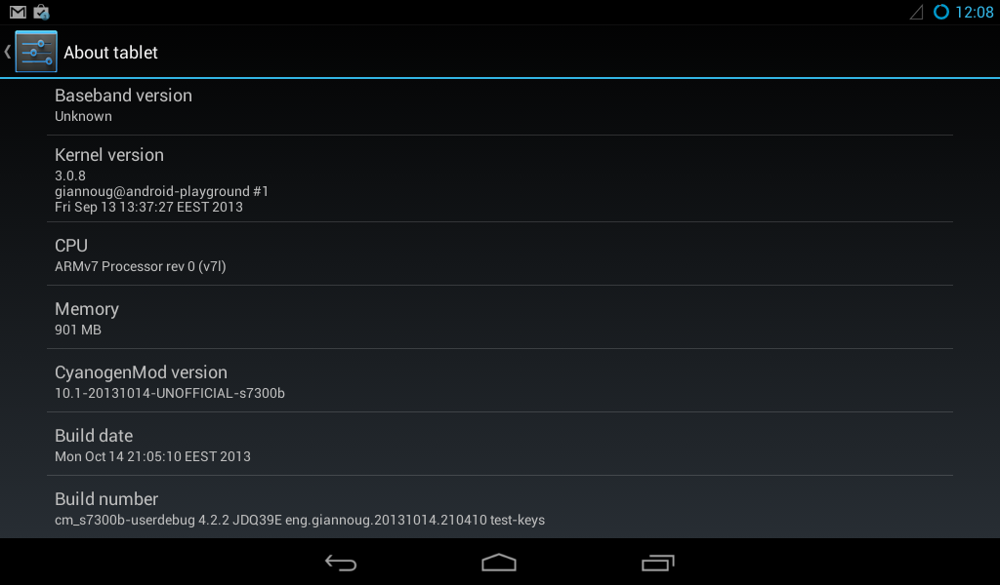

This is a CyanogenMod 10.1 port for the S7300B Android <del>handheld</del> gamepad by JXD. The CyanogenMod port is using parts of the official Android 4.1 code release by the company and doesn&#8217;t rely on firmware binary blobs. Provided that no major changes happen in the Android/CyanogenMod source, we could \*always\* have the latest CyanogenMod (and ParanoidAndroid/Ubuntu Touch/Firefox OS/whatever) version. It&#8217;s a work in progress and my first ever Android ROM/port. This post will always contain the latest release of the CyanogenMod 10.1 port for the JXD S7300B. I&#8217;m releasing the ROM for use mainly because I haven&#8217;t had any progress in the past month. I&#8217;m also planning on releasing the source in the near future (sources are not GPL, sorry).

## What doesn&#8217;t work (aka TODO list)

  * USB storage mounting
  * Camera orientation (it&#8217;s rotated 270&deg;)
  * HW acceleration in videos
  * Surprise me 😀

## How to install

  1. Make sure the device is running the **latest** JXD stock ROM, or at least a ROM based on stock v2.1 or newer!
  2. Download the latest CWM/CM version from below and place it on the root of the external SD card
  3. Boot into CWM by using Volume+ and Power, use the D-pad and A/B buttons to navigate
  4. Important: Choose &#8220;wipe data/factory reset&#8221; first, this will repartition the device to use the new datamedia layout
  5. Navigate to &#8220;install zip&#8221; and apply the zip you downloaded
  6. Optional but recommended: Install latest gapps
  7. Reboot and enjoy!

## Changelog:

14/10/13: First (ever) release

## Downloads

<a href="http://downloads.giannoug.gr/JXD%20S7300B%20CM10.1/14-10-13/uImage_recovery" title="CyanogenMod 10.1 for JXD S7300B" class="broken_link" rel="nofollow">Download CWM (14/10/13)</a>

<a href="http://downloads.giannoug.gr/JXD%20S7300B%20CM10.1/14-10-13/cm_s7300b-ota-eng.giannoug.zip" title="ClockWorkMod recovery for JXD S7300B" class="broken_link" rel="nofollow">Download CM (14/10/13)</a>

## Obligatory &#8220;pics or didn&#8217;t happen&#8221;

Special thanks go to Vektor, ChristianTroy and everyone who helped with testing!
