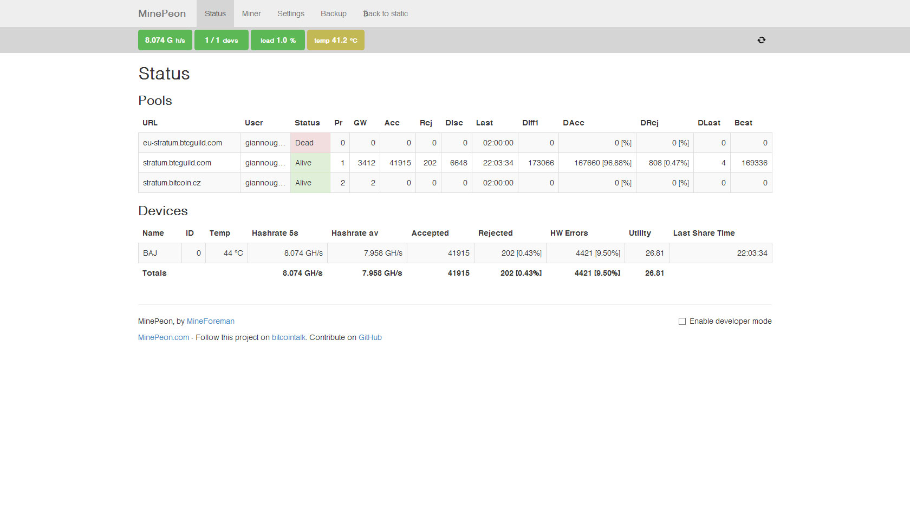

You are not a real geek if you aren&#8217;t mining Bitcoins, even if it costs you more money than you make. OK, I&#8217;m kidding. Near the end of March 2013 I made the decision to invest into mining hardware for the Bitcoin cryptocurrency. First things first, it shouldn&#8217;t cost that much. It should also be future proof, at least for a couple of months. That brings us to the last requirement: it should (hopefully) return it&#8217;s investment.

The new wave of miners was in development during that time, ASIC miners. The new devices generate a lot of hashes per second with very little power. The ButterflyLabs Jalapeno (it&#8217;s first name, now it&#8217;s called BitForce SC if I&#8217;m not mistaken) was the only choice that made sense to me. The first devices were claimed to achieve about 4.5GH/s, which was a lot for that time. It only cost 150 USD, a lot less than any miner, even with today&#8217;s standards. I ordered the device and almost forgot about it. A notice in the ordering process notified that the shipping will occur two or three months after payment. Some months later (after the shipment was delayed) I got an email to upgrade the device to another 2GH/s for another 100 USD. I did 😀

Fast forward many months later and the device finally shipped overseas (over the Atlantic ocean actually). The package was extremely bulky and only took a couple of days to arrive. That might explain the 38 USD shipping rate, though. The first thing I did was to connect the device to my computer and run cgminer. No drivers needed, I went from unpackaging to mining in a couple of minutes. The device started mining right away after I configured the mining pool: 8.282GH/s!

Something wasn&#8217;t right. The device was supposed to mine 6.5GH/s (4.5GH/s initial and 2GH/s extra, with a 10% variance, ±650MH/s). My guess is that I got the latest batch of ASICs and not from the March batch. That&#8217;s not a problem, I got ~2GH/s for free! I thought that it was going to change and stabilize a lot lower, but as of today (15 days after constant mining) it hasn&#8217;t dropped below 7800GH/s. The device gets really hot, cgminer reports 50-52°C and it&#8217;s warm to touch. On the other hand, the built-in fan makes a lot of noise. It a lot louder than any computer fan I have ever heard. The sound reminds me a vacuum cleaner, actually.

Overall I&#8217;m really satisfied with the device. The only thing that I didn&#8217;t like was the long waiting time and the lack of company updates. The first notice said that the device would need about two months to ship, then it moved to three and then I lost count. That delay is enough to let the Bitcoin difficulty raise so much that users (including me) will never generate enough Bitcoins to return the investment we made. The device is now running 24/7 using a Raspberry Pi and the Minepeon distro.
